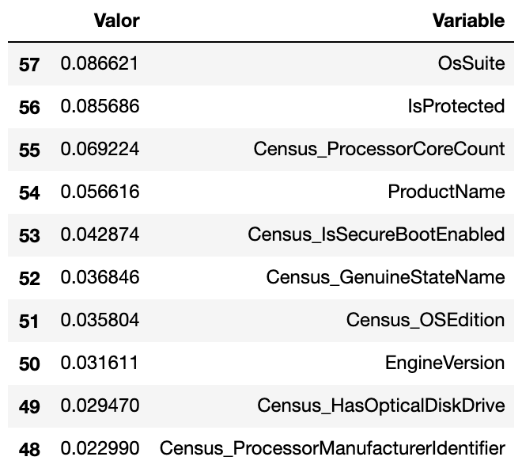

# Trabajo de Fin de Máster

Repositorio para el Trabajo de Fin de Máster (TFM) del Máster Universitario en Tratamiento Estadístico Computacional de la Información (TECI) en el curso 2019/2020, realizado por Gema Correa Fernández.

**Tabla de Contenidos**

- [Objetivo](#id0)
  - [Desafíos](#id1)
  - [Datos](#id2) 
    - [Información de las variables](https://github.com/Gecofer/TFM_1920/blob/master/docs/0-MicrosoftMalwarePrediction-InfoVariables.md)
- [Notebooks](#id3) 
  - [Análisis descriptivo de los datos](https://github.com/Gecofer/TFM_1920/blob/master/notebooks/1-MicrosoftMalwarePrediction-CargarVisualizar.md)
  - [Preprocesamiento de los datos](https://github.com/Gecofer/TFM_1920/blob/master/notebooks/2-MicrosoftMalwarePrediction-Preprocesamiento.md)
  - [Submission en Kaggle](https://github.com/Gecofer/TFM_1920/blob/master/notebooks/3-MicrosoftMalwarePrediction-Kaggle.md)
  - [Modelo de Random Forest](https://github.com/Gecofer/TFM_1920/blob/master/notebooks/4-MicrosoftMalwarePrediction-RandomForest.md)
  - [Modelo de Regresión Logística](https://github.com/Gecofer/TFM_1920/blob/master/notebooks/5-MicrosoftMalwarePrediction-RegresionLogistica.md)
  - [Modelo de Gradient Boosting y xGBoost](https://github.com/Gecofer/TFM_1920/blob/master/notebooks/6-MicrosoftMalwarePrediction-GradientBoosting.md)
  - [Puesta en producción de los modelos](https://github.com/Gecofer/TFM_1920/blob/master/notebooks/7-MicrosoftMalwarePrediction-MLflow.md)
- [Modelos en formato `.pkl`](https://github.com/Gecofer/TFM_1920/tree/master/modelos)
- [Aplicación Web](#id10)
  - [Herramienta MLflow en local](#id11)
- [Referencias](#id20)
  - [Información administrativa sobre el TFM](#id21)
- [Licencia](#id23)

La propuesta del TFM se puede encontrar [aquí](https://github.com/Gecofer/TFM_1920/tree/master/propuesta%20TFM).

  
## Objetivo 

**MLOps y cómo industrializar el uso de Machine Learning: un ejemplo práctico para anticipar el malware en sistemas Windows**

### Desafíos 

En este trabajo se **desarrolla el enfoque actual de MLOps, desde la perspectiva de las empresas en España y su posible introducción al campo académico**. Además, se abordan distintos aspectos metodológicos, se proponen varias alternativas de arquitectura (herramientas y configuración del sistema) para llevar a cabo un MLOps de éxito. En términos generales, MLOps se basa en los principios y las prácticas de DevOps para aumentar la eficacia de los flujos de trabajo en los proyectos de Machine Learning. Asimismo, se presenta MLOps en casos reales de empresas donde el objetivo de negocio es detectar (predecir) la ocurrencia de un evento - como puede ser el fraude de transacciones online o el malware informático, entre otros. Para ello, será necesario mostrar cómo se desarrolla cada una de las etapas del proceso de modelización, incluyendo varias opciones de creación de variables para el modelo y métricas de diagnosis y selección de modelos de clasificación. Además, de introducir MLflow, plataforma que nos permite gestionar todo el ciclo de vida de Machine Learning.

  

  

### Datos 

El objetivo de este dataset es **predecir la probabilidad de que una máquina Windows se infecte por varias familias de malware, en función de las diferentes propiedades de esa máquina**. Los datos de telemetría que contienen estas propiedades y las infecciones de la máquina se generaron mediante la combinación de informes y amenazas recopilados por la solución de protección de Microsoft, Windows Defender. Los datos con los que vamos a trabajar han sido obtenidos de Kaggle (https://www.kaggle.com/c/microsoft-malware-prediction/data). Para poder realizar su extracción, es necesario aceptar las reglas. Cada fila de este conjunto de datos corresponde a una máquina, identificada de forma exclusiva por un identificador `MachineIdentifier`, donde `HasDetections` indica que se detectó malware en la máquina (0 FALSO, 1 VERDADERO). Usando la información y las etiquetas en `train.csv`, se debe predecir el valor de `HasDetections` en una máquina nueva.

La detección de malware es un problema propio de series temporales, pero se complica al introducir nuevas máquinas, conexiones entre máquinas, máquinas con parches, máquinas con programas beta, máquinas con nuevos sistemas operativos, etc. Es importante, destacar que este conjunto de datos no es representativo de las máquinas de los clientes de Microsoft en la naturaleza; ya que está muestreado para incluir una proporción mucho mayor de máquinas de malware.

## Notebooks 

- [`1-MicrosoftMalwarePrediction-CargarVisualizar`](https://github.com/Gecofer/TFM_1920/blob/master/notebooks/1-MicrosoftMalwarePrediction-CargarVisualizar.ipynb) contiene el análisis descriptivo de los datos y un estudio exhaustivo de lo que significa cada variable (pincha [aquí](https://github.com/Gecofer/TFM_1920/blob/master/notebooks/1-MicrosoftMalwarePrediction-CargarVisualizar.md) para saber más).

  

  

  

  

- [`2-MicrosoftMalwarePrediction-Preprocesamiento`](https://github.com/Gecofer/TFM_1920/blob/master/notebooks/2-MicrosoftMalwarePrediction-Preprocesamiento.ipynb) contiene el preprocesamiento y tratamiento de los datos (pincha [aquí](https://github.com/Gecofer/TFM_1920/blob/master/notebooks/2-MicrosoftMalwarePrediction-Preprocesamiento.md) para saber más).
  - Eliminar variables que no aportan información
  - Análisis de Componentes Principales (PCA)
  - Missings
    - Missings por columnas
    - Missings por filas
  - Pasar a minúsculas las variables categóricas
  - Transformar variables
    - Transformar missings a 'unknown' en variables categóricas
    - Fusionar la etiqueta 'unspecified' con 'unknown'
    - Fusionar la etiqueta 'portable' con 'notebook' en `Census_ChassisTypeName`
    - Cambiar la etiqueta 'promt' por 'prompt' en `SmartScreen`
    - Arreglar `Census_OSEdition`
    - Arreglar `Census_OSInstallTypeName`
    - Agrupar valores de `Census_TotalPhysicalRAM`
    - Agrupar valores de `Census_SystemVolumeTotalCapacity`
    - Agrupar valores de `Census_PrimaryDiskTotalCapacity`
  - Outliers
  - Correlación
    - Label Encoding para columnas categóricas
    - Estudiar la correlación

  

  

- [`3-MicrosoftMalwarePrediction-Kaggle.ipynb`](https://github.com/Gecofer/TFM_1920/blob/master/notebooks/3-MicrosoftMalwarePrediction-Kaggle.ipynb) contiene un ejemplo con el algoritmo LightGBM para comprobar el submission en Kaggle (pincha [aquí](https://github.com/Gecofer/TFM_1920/blob/master/notebooks/3-MicrosoftMalwarePrediction-Kaggle.md) para saber más).

  

  

- [`4-MicrosoftMalwarePrediction-RandomForest.md`](https://github.com/Gecofer/TFM_1920/blob/master/notebooks/4-MicrosoftMalwarePrediction-RandomForest.ipynb) contiene el código para crear el modelo de Random Forest con varios ejemplos (pincha [aquí](https://github.com/Gecofer/TFM_1920/blob/master/notebooks/4-MicrosoftMalwarePrediction-RandomForest.md) para saber más).

  

  

  

  

  

  

- [`5-MicrosoftMalwarePrediction-RegresionLogistica.ipynb`](https://github.com/Gecofer/TFM_1920/blob/master/notebooks/5-MicrosoftMalwarePrediction-RegresionLogistica.ipynb) contiene el código para crear el modelo de Regresión Logística con varios ejemplos (pincha [aquí](https://github.com/Gecofer/TFM_1920/blob/master/notebooks/5-MicrosoftMalwarePrediction-RegresionLogistica.md) para saber más).

  

  

  

  

  

  

- [`6-MicrosoftMalwarePrediction-GradientBoosting.ipynb`](https://github.com/Gecofer/TFM_1920/blob/master/notebooks/6-MicrosoftMalwarePrediction-GradientBoosting.ipynb) contiene el código para crear el modelo de Gradient Boosting y XGBoost con varios ejemplos (pincha [aquí](https://github.com/Gecofer/TFM_1920/blob/master/notebooks/6-MicrosoftMalwarePrediction-GradientBoosting.md) para saber más).

  

  

  

  

  

  

- [`7-MicrosoftMalwarePrediction-MLflow.ipynb`](https://github.com/Gecofer/TFM_1920/blob/master/notebooks/7-MicrosoftMalwarePrediction-MLflow.ipynb) contiene el código para realizar la puesta en producción de varios modelos con MLflow (pincha [aquí](https://github.com/Gecofer/TFM_1920/blob/master/notebooks/7-MicrosoftMalwarePrediction-MLflow.md) para saber más).

~~~python
# Iniciamos 'mlflow'
with mlflow.start_run():
    
    # Cargamos el modelo 01
    pkl_filename_01 = "modelos/random_forest_01.pkl"
    with open(pkl_filename_01, 'rb') as file:
        rf_model_01 = pickle.load(file)
        
    # Obtenemos las predicciones con el modelo 01  
    predict_01 = rf_model_01.predict(X_val)
    
    # Calculamos diversas medidas
    (rmse, mae, logloss, accuracy, F1, precision, recall, auc) = eval_metricas(y_val, predict_01)

    # Log mlflow parámetros
    mlflow.log_metric("rmse", rmse)
    mlflow.log_metric("mae", mae)
    mlflow.log_metric("logloss", logloss)
    mlflow.log_metric("accuracy", accuracy)
    mlflow.log_metric("F1", F1)
    mlflow.log_metric("precision", precision)
    mlflow.log_metric("recall", recall)
    mlflow.log_metric("auc", auc)

    # Log modelo generado
    mlflow.sklearn.log_model(rf_model_01, "RFmodel01")
~~~

## Aplicación Web 

### MLflow 

#### Poner en producción modelos con MLflow en local 

Para para poner en producción modelos en local (después de haber ejecutado con éxito el notebook [`7-MicrosoftMalwarePrediction-MLflow.ipynb`](https://github.com/Gecofer/TFM_1920/blob/master/notebooks/7-MicrosoftMalwarePrediction-MLflow.ipynb), es necesario poner la ruta donde se encuentra el modelo creado como en Github https://github.com/Gecofer/TFM_1920/tree/master/mlruns/0/326a8d2080934288afe93177737d3844/artifacts/GBmodel o la ruta `/Users/gema/Desktop/TFM/codigo/mlruns/0/72fd515589624214b2c41bcfa44aef17/artifacts/RFmodel01`.

~~~
# Lanzar interfaz de mlflow ui (se abrirá en http://127.0.0.1:5000)
mlflow ui

# Poner en producción modelo RF (http://0.0.0.0:8001/invocations)
mlflow models serve -m /Users/gema/Desktop/TFM/codigo/mlruns/0/72fd515589624214b2c41bcfa44aef17/artifacts/RFmodel01 -h 0.0.0.0 -p 8001

# Poner en producción modelo RL (http://0.0.0.0:8002/invocations)
mlflow models serve -m /Users/gema/Desktop/TFM/codigo/mlruns/0/aac82aa84f6d4b82adafd19fc2975050/artifacts/RLmodel01 -h 0.0.0.0 -p 8002

# Poner en producción modelo GB (http://0.0.0.0:8003/invocations)
mlflow models serve -m /Users/gema/Desktop/TFM/codigo/mlruns/0/326a8d2080934288afe93177737d3844/artifacts/GBmodel -h 0.0.0.0 -p 8003
~~~

Vídeo demostrativo para ver como lanzar la interfaz de MLflow: 

#### Poner en producción modelos con MLflow en el cloud 

### Funcionamiento de la Aplicación Web

Vídeo demostrativo del funcionamiento de la aplicación web:

## Referencias 

### Información administrativa sobre el TFM 

- [Información general TFM](http://blogs.mat.ucm.es/teci/?page_id=151)
- [Información específica TFM](https://blogs.mat.ucm.es/teci/?page_id=1973)
- [Características TFM](http://blogs.mat.ucm.es/teci/wp-content/uploads/sites/9/2016/11/caracteristica-tfm.pdf)
- [Calendario TFM](http://blogs.mat.ucm.es/teci/wp-content/uploads/sites/9/2019/12/calendario-TFM-19-20.pdf)

## Licencia 

Proyecto bajo licencia [GNU GLP V3](https://github.com/Gecofer/TFM_1920/blob/master/LICENSE).

<!------

  

### Soluciones
- https://github.com/imor-de/microsoft_malware_prediction_kaggle_2nd
### Desarrollo del TFM
- [Overleaf](https://www.overleaf.com/read/hysrkqscqfgy)
----->
