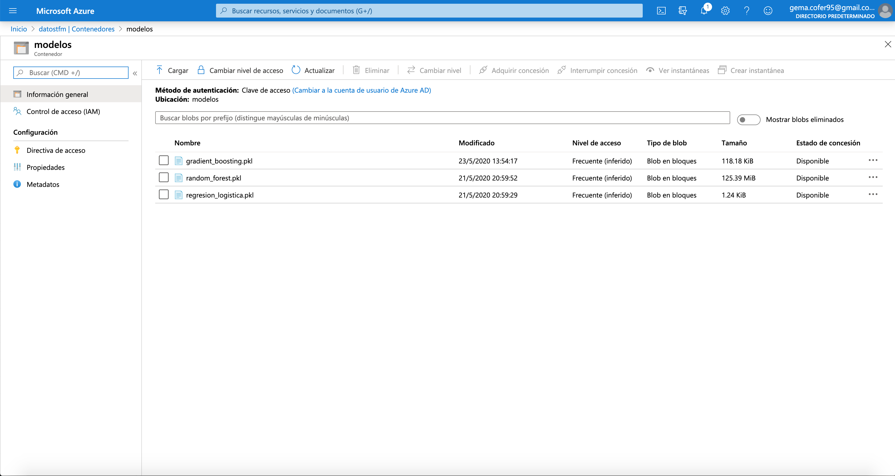
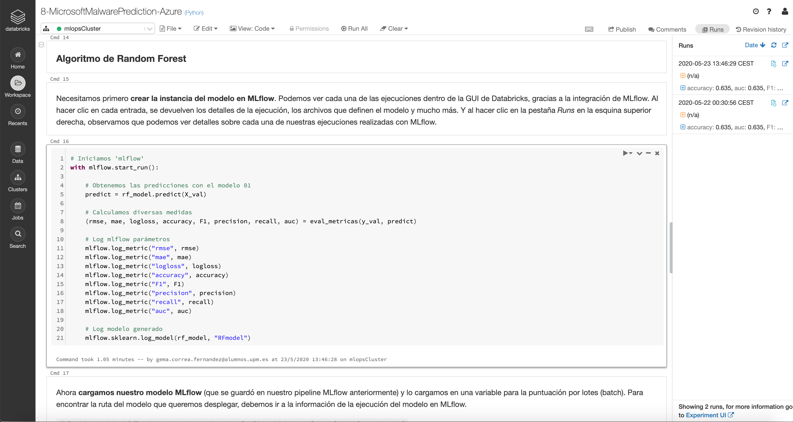
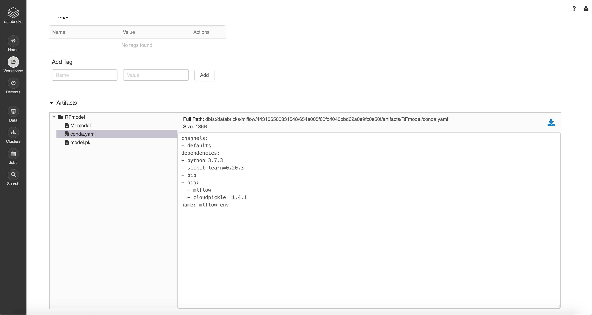
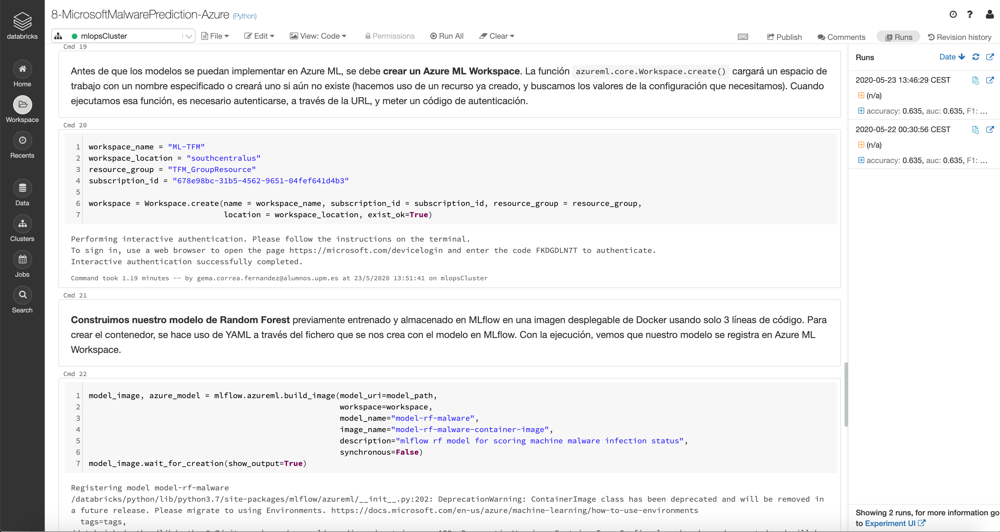
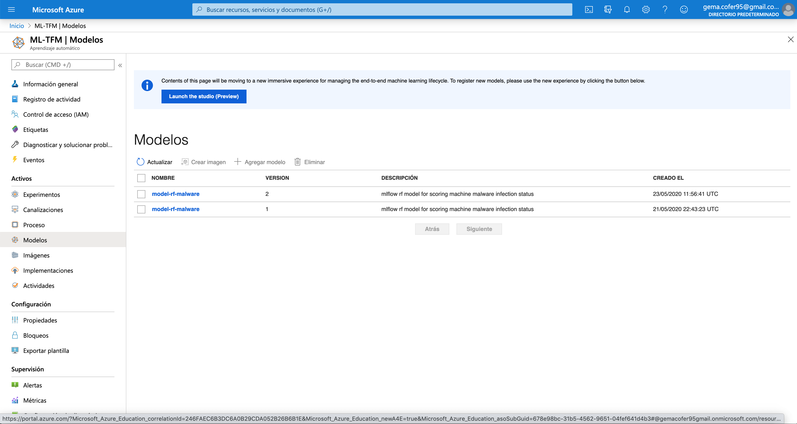

## Puesta en producción de modelos con MLflow y despliegue en el cloud

Como comparativa de la herramienta MLflow en local, se ha realizado un ejemplo en el cloud (Microsoft Azure). En concreto, se hace uso de Azure Databricks, la cual tiene integrada MLflow, puesto que son de los mismos creadores.

**(1)** En este caso se dispone de los datos y los ficheros de los modelos en pickle en un Blob Storage.

  

  

  

  

**(2)** Se crea la instancia del modelo en MLflow. 

  

**(3)** Podemos ver cada una de las ejecuciones dentro de la GUI de Databricks, gracias a la integración de MLflow. Al hacer clic en cada entrada, se devuelven los detalles de la ejecución, los archivos que definen el modelo y mucho más. Y al hacer clic en la pestaña _Runs_ en la esquina superior derecha, observamos que podemos ver detalles sobre cada una de nuestras ejecuciones realizadas con MLflow. 

  

  

**(4)** Ahora cargamos nuestro modelo MLflow. Antes de que los modelos se puedan implementar en Azure ML, se debe crear un Azure ML Workspace. La función `azureml.core.Workspace.create()` cargará un espacio de trabajo con un nombre especificado o creará uno si aún no existe (hacemos uso de un recurso ya creado, y buscamos los valores de la configuración que necesitamos). Cuando ejecutamos esa función, es necesario autenticarse, a través de la URL, y meter un código de autenticación. Construimos nuestro modelo de Random Forest previamente entrenado y almacenado en MLflow en una imagen desplegable de Docker usando solo 3 líneas de código. Para crear el contenedor, se hace uso de YAML a través del fichero que se nos crea con el modelo en MLflow. Con la ejecución, vemos que nuestro modelo se registra en Azure ML Workspace.

  

**(5)** Una vez tenemos nuestro modelo, tenemos que pasar a crear la implementación del modelo. Para ello hay que crear un ACI (Azure Container Instances) y hacer el despliegue de servicio web utilizando la imagen del contenedor del modelo.

  

**(6)** Con la última ejecución, vemos que nuestro modelo se registra en Azure ML Workspace.

  

  

**(7)** Se nos crea la implementación del modelo.

  

  

  

**(8)** Ahora, consultaremos el endpoint del servicio web ACI enviando una solicitud HTTP POST que contenga el vector de entrada. Para ello, se define una función que tome 'scoring_uri' e ingrese JSON, y devuelva las predicciones, a partir de la URL del contenedor. Se ha realizado un ejemplo con Postman, pero indistintamente podría ser usado con la aplicación Web creada.

  

**Vídeo demostrativo del funcionamiento MLflow en Azure y funcionamiento final con Postman:**

