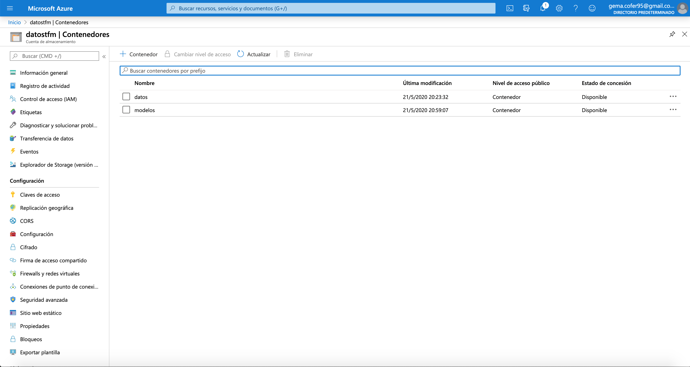
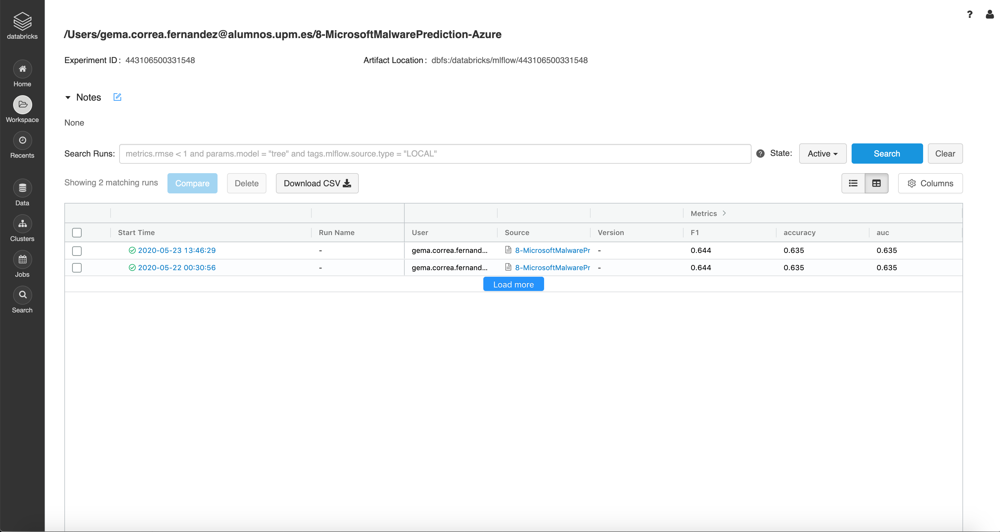
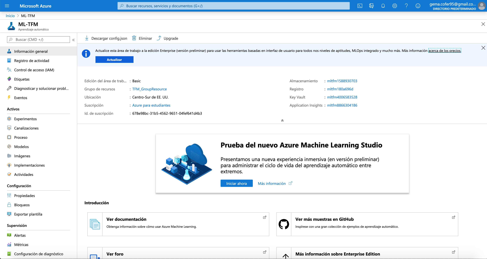
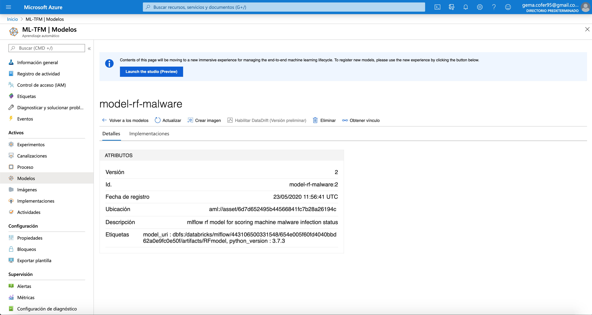
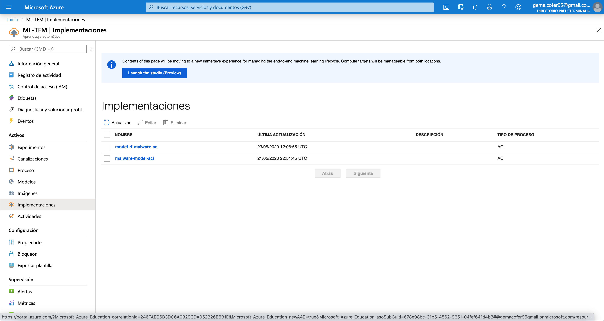

## Puesta en producción de modelos con MLflow y despliegue en el cloud

Como comparativa de la herramienta MLflow en local, se ha realizado un ejemplo en el cloud (Microsoft Azure). En concreto, se hace uso de Azure Databricks, la cual tiene integrada MLflow, puesto que son de los mismos creadores.

**(1)** En este caso se dispone de los datos y los ficheros de los modelos en pickle en un Blob Storage.

  

  

  

  

**(2)** Se crea la instancia del modelo en MLflow. 

  

**(3)** Podemos ver cada una de las ejecuciones dentro de la GUI de Databricks, gracias a la integración de MLflow. Al hacer clic en cada entrada, se devuelven los detalles de la ejecución, los archivos que definen el modelo y mucho más. Y al hacer clic en la pestaña _Runs_ en la esquina superior derecha, observamos que podemos ver detalles sobre cada una de nuestras ejecuciones realizadas con MLflow. 

  

  

  

  

  

  

  

  

  

  

  

() Ahora, consultaremos el endpoint del servicio web ACI enviando una solicitud HTTP POST que contenga el vector de entrada. Para ello, se define una función que tome 'scoring_uri' e ingrese JSON, y devuelva las predicciones, a partir de la URL del contenedor.

  

