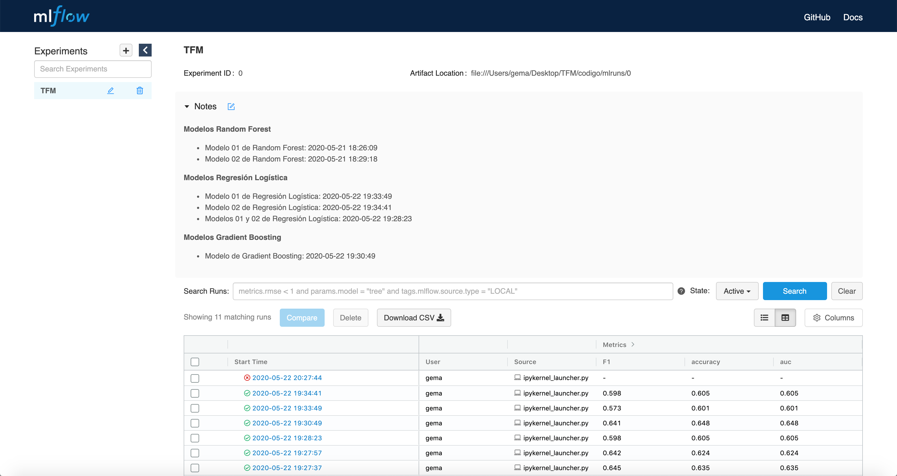
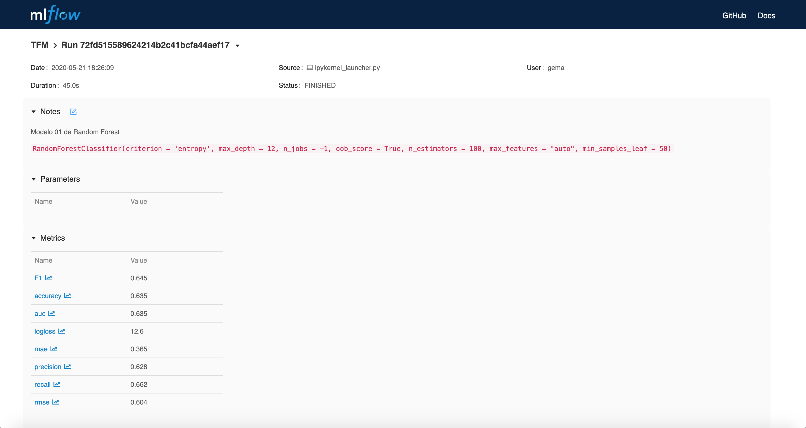
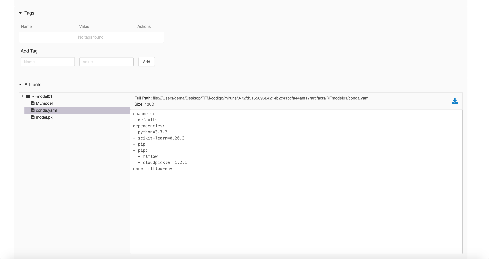
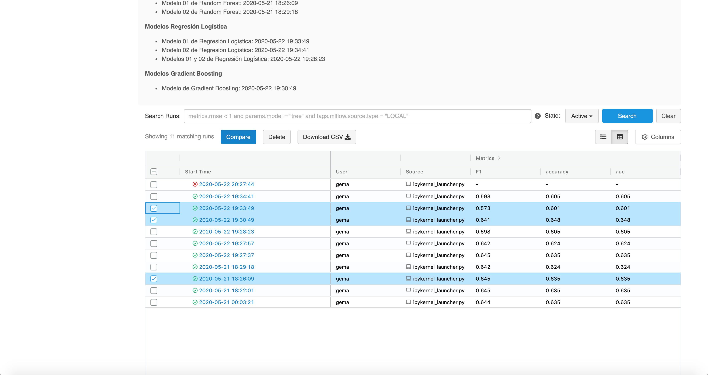
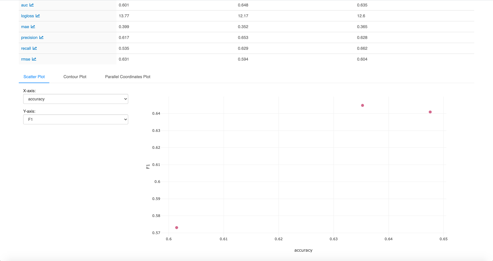

## Puesta en producción de modelos con MLflow en local

Para poner en producción modelos en local, es necesario antes ejecutar el notebook [`7-MicrosoftMalwarePrediction-MLflow.ipynb`](https://github.com/Gecofer/TFM_1920/blob/master/notebooks/7-MicrosoftMalwarePrediction-MLflow.ipynb). Y a continuación, disponer de la ruta donde se encuentra el modelo creado, es decir, la carpeta del modelo, como por ejemplo, `mlruns/0/72fd515589624214b2c41bcfa44aef17/artifacts/RFmodel01`. Es posible realizar este proceso, descargando el repositiorio, en donde la carpeta que nos interesa se encontraría [aquí](https://github.com/Gecofer/TFM_1920/tree/master/mlruns/0/326a8d2080934288afe93177737d3844/artifacts/GBmodel).

**(1)** Página con la interfaz de MLflow en local (se abre por defecto en el servicio http://127.0.0.1:5000), para lanzarla es necesario poner el comando `mlflow ui` en consola.

  

~~~python
# Iniciamos 'mlflow'
with mlflow.start_run():
    
    # Cargamos el modelo 01
    pkl_filename_01 = "modelos/random_forest_01.pkl"
    with open(pkl_filename_01, 'rb') as file:
        rf_model_01 = pickle.load(file)
        
    # Obtenemos las predicciones con el modelo 01  
    predict_01 = rf_model_01.predict(X_val)
    
    # Calculamos diversas medidas
    (rmse, mae, logloss, accuracy, F1, precision, recall, auc) = eval_metricas(y_val, predict_01)

    # Log mlflow parámetros
    mlflow.log_metric("rmse", rmse)
    mlflow.log_metric("mae", mae)
    mlflow.log_metric("logloss", logloss)
    mlflow.log_metric("accuracy", accuracy)
    mlflow.log_metric("F1", F1)
    mlflow.log_metric("precision", precision)
    mlflow.log_metric("recall", recall)
    mlflow.log_metric("auc", auc)

    # Log modelo generado
    mlflow.sklearn.log_model(rf_model_01, "RFmodel01")
~~~

Para ver nuestros modelos, podemos ver cada una de las ejecuciones dentro de la interfaz. En las pestaña de _Runs_ observamos que podemos ver detalles sobre cada una de nuestras ejecuciones realizadas con MLflow. Al hacer clic en cada entrada, se devuelven los detalles de la ejecución, los archivos que definen el modelo y mucho más. 

**(2)** Página con la información detallada de una ejecución de un modelo.

  

**(3)** Página de información con el fichero YAML del modelo, con el se creará la instancia del modelo. YAML es el lenguaje en el que se definen los _pods_, los deployments y demás estructuras. Básicamente, es un fichero que nos implementa el contenedor que contendrá nuestro modelos con las dependencias necesarias.

  

**(4)** Página con la selección de distintas ejecuciones con las que realizar comparaciones.

  

**(5)** Página con la muestra comparativa de las tres ejecuciones seleccionadas.

  

**(6)** Página con la muestra comparativa en gráfico de las tres ejecuciones seleccionadas.

  

Vídeo demostrativo para ver como lanzar la interfaz de MLflow: 

Es importante destacar que en este proceso, tenemos creadas las ejecuciones de nuestros modelos. Sin embargo, tenemos que desplegar el modelo, creando una instancia para cada modelo con con Docker donde podremos acceder a la API de dicho modelo. Para ello, es necesario ejecutar en el terminal:

~~~
# Poner en producción modelo RF (http://0.0.0.0:8001/invocations)
mlflow models serve -m /Users/gema/Desktop/TFM/codigo/mlruns/0/72fd515589624214b2c41bcfa44aef17/artifacts/RFmodel01 -h 0.0.0.0 -p 8001

# Poner en producción modelo RL (http://0.0.0.0:8002/invocations)
mlflow models serve -m /Users/gema/Desktop/TFM/codigo/mlruns/0/aac82aa84f6d4b82adafd19fc2975050/artifacts/RLmodel01 -h 0.0.0.0 -p 8002

# Poner en producción modelo GB (http://0.0.0.0:8003/invocations)
mlflow models serve -m /Users/gema/Desktop/TFM/codigo/mlruns/0/326a8d2080934288afe93177737d3844/artifacts/GBmodel -h 0.0.0.0 -p 8003
~~~

