#### Contenido: Análisis Descriptivo de los Datos (cargar y visualizar los datos)

- [Microsoft Malware Prediction](#Microsoft-Malware-Prediction)
    - [Objetivo del TFM](#Objetivo-del-TFM)
    - [Objetivo de los datos](#Objetivo-de-los-datos)

0. [0. Importación de las librerías](#0.-Importación-de-las-librerías)
1. [1. Lectura de los datos](#1.-Lectura-de-los-datos)
    - [Cambiar tipo a las variables](#Cambiar-tipo-a-las-variables)
2. [2. Análisis descriptivo de los datos](#2.-Análisis-descriptivo-de-los-datos)
    - [Resumen general de los datos en TRAIN](#Resumen-general-de-los-datos-TRAIN)
    - [Resumen general de los datos en TEST](#Resumen-general-de-los-datos-TEST)
    - [Información sobre el número total de variables numéricas, binarias y categóricas en TRAIN](#Información-sobre-el-número-total-de-variables-numéricas,-binarias-y-categóricas-para-TRAIN)
    - [Información sobre el número total de variables numéricas, binarias y categóricas en TEST](#Información-sobre-el-número-total-de-variables-numéricas,-binarias-y-categóricas-para-TEST)
    - [¿Conjunto desbalanceado?](#¿Conjunto-desbalanceado?)
    - [Información sobre los missings en TRAIN](#Información-sobre-los-missings-en-TRAIN)
    - [Información sobre los missings en TEST](#Información-sobre-los-missings-en-TEST)
    - [Información sobre variables demasiado sesgadas (asimetría) en TRAIN](#Información-sobre-variables-demasiado-sesgadas-(asimetría)-en-TRAIN)
    - [Información de cada variable](#Información-de-cada-variable)

# Microsoft Malware Prediction <a name="Microsoft-Malware-Prediction"></a>

## Análisis Descriptivo de los Datos (cargar y visualizar los datos)

#### Objetivo del TFM

En este trabajo se **desarrolla el enfoque actual de MLOps, desde la perspectiva de las empresas en España y su posible introducción al campo académico**. Además, se abordan distintos aspectos metodológicos, se proponen varias alternativas de arquitectura (herramientas y configuración del sistema) para llevar a cabo un MLOps de éxito. En términos generales, MLOps se basa en los principios y las prácticas de DevOps para aumentar la eficacia de los flujos de trabajo en los proyectos de Machine Learning. Asimismo, se presenta MLOps en casos reales de empresas donde el objetivo de negocio es detectar (predecir) la ocurrencia de un evento - como puede ser el fraude de transacciones online o el malware informático, entre otros. Para ello, será necesario mostrar cómo se desarrolla cada una de las etapas del proceso de modelización, incluyendo varias opciones de creación de variables para el modelo y métricas de diagnosis y selección de modelos de clasificación. Además, de introducir MLflow, plataforma que nos permite gestionar todo el ciclo de vida de Machine Learning.

#### Objetivo de los datos

El objetivo de este dataset es **predecir la probabilidad de que una máquina Windows se infecte por varias familias de malware, en función de las diferentes propiedades de esa máquina**. Los datos de telemetría que contienen estas propiedades y las infecciones de la máquina se generaron mediante la combinación de informes y amenazas recopilados por la solución de protección de Microsoft, Windows Defender. Los datos con los que vamos a trabajar han sido obtenidos de Kaggle (https://www.kaggle.com/c/microsoft-malware-prediction/data). Para poder realizar su extracción, es necesario aceptar las reglas. Cada fila de este conjunto de datos corresponde a una máquina, identificada de forma exclusiva por un `MachineIdentifier`, donde `HasDetections` indica que se detectó malware en la máquina (0 FALSO, 1 VERDADERO). Usando la información y las etiquetas en `train.csv`, se debe predecir el valor de `HasDetections` una máquina nueva.

La detección de malware es un problema propio de series temporales, pero se complica al introducir nuevas máquinas, conexiones entre máquinas, máquinas con parches, máquinas con programas beta, máquinas con nuevos sistemas operativos, etc. Es importante, destacar que este conjunto de datos no es representativo de las máquinas de los clientes de Microsoft en la naturaleza; ya que está muestreado para incluir una proporción mucho mayor de máquinas de malware.

---------

## 0. Importación de las librerías


```python
import pandas as pd
import plotly.graph_objs as go
import plotly.express as px
import scipy.stats as ss
import fun_auxiliares as aux
import numpy as np

from plotly import tools
from plotly.offline import init_notebook_mode, iplot

pd.set_option('display.max_columns', 500)
```

**Instalar dependencias**

> `!pip install plotly`

---------

## 1. Lectura de los datos

Los datos están en formato CSV, por lo que hacemos uso de la la función de Pandas `read_csv()`.


```python
# Lectura del conjunto de entrenamiento
train = pd.read_csv("./datos/train_malware.csv")
```

    /Users/gema/anaconda3/lib/python3.7/site-packages/IPython/core/interactiveshell.py:3057: DtypeWarning:

    Columns (28) have mixed types. Specify dtype option on import or set low_memory=False.


```python
# Lectura del conjunto para predecir
test = pd.read_csv("./datos/test_malware.csv")
```

### Cambiar tipo a las variables

Al cargar los datos de entrenamiento, nos sale el siguiente warning "*Columns (28) have mixed types. Specify dtype option on import or set low_memory=False.*", por tanto nos está sugiriendo cambiar el tipo a las variables. Para obtener el tipo a las variables, ejecutamos `train.info()` y obtenemos que los datos en memoria ocupan más de 5.5GB y que tenemos los tipos de `float64`, `int64` y `object`:

- `dtypes: float64(36), int64(17), object(30)`
- `memory usage: 5.5+ GB`


```python
# Visualizamos el tipo para cada variable
train.info()
```

    <class 'pandas.core.frame.DataFrame'>
    RangeIndex: 8921483 entries, 0 to 8921482
    Data columns (total 83 columns):
    MachineIdentifier                                    object
    ProductName                                          object
    EngineVersion                                        object
    AppVersion                                           object
    AvSigVersion                                         object
    IsBeta                                               int64
    RtpStateBitfield                                     float64
    IsSxsPassiveMode                                     int64
    DefaultBrowsersIdentifier                            float64
    AVProductStatesIdentifier                            float64
    AVProductsInstalled                                  float64
    AVProductsEnabled                                    float64
    HasTpm                                               int64
    CountryIdentifier                                    int64
    CityIdentifier                                       float64
    OrganizationIdentifier                               float64
    GeoNameIdentifier                                    float64
    LocaleEnglishNameIdentifier                          int64
    Platform                                             object
    Processor                                            object
    OsVer                                                object
    OsBuild                                              int64
    OsSuite                                              int64
    OsPlatformSubRelease                                 object
    OsBuildLab                                           object
    SkuEdition                                           object
    IsProtected                                          float64
    AutoSampleOptIn                                      int64
    PuaMode                                              object
    SMode                                                float64
    IeVerIdentifier                                      float64
    SmartScreen                                          object
    Firewall                                             float64
    UacLuaenable                                         float64
    Census_MDC2FormFactor                                object
    Census_DeviceFamily                                  object
    Census_OEMNameIdentifier                             float64
    Census_OEMModelIdentifier                            float64
    Census_ProcessorCoreCount                            float64
    Census_ProcessorManufacturerIdentifier               float64
    Census_ProcessorModelIdentifier                      float64
    Census_ProcessorClass                                object
    Census_PrimaryDiskTotalCapacity                      float64
    Census_PrimaryDiskTypeName                           object
    Census_SystemVolumeTotalCapacity                     float64
    Census_HasOpticalDiskDrive                           int64
    Census_TotalPhysicalRAM                              float64
    Census_ChassisTypeName                               object
    Census_InternalPrimaryDiagonalDisplaySizeInInches    float64
    Census_InternalPrimaryDisplayResolutionHorizontal    float64
    Census_InternalPrimaryDisplayResolutionVertical      float64
    Census_PowerPlatformRoleName                         object
    Census_InternalBatteryType                           object
    Census_InternalBatteryNumberOfCharges                float64
    Census_OSVersion                                     object
    Census_OSArchitecture                                object
    Census_OSBranch                                      object
    Census_OSBuildNumber                                 int64
    Census_OSBuildRevision                               int64
    Census_OSEdition                                     object
    Census_OSSkuName                                     object
    Census_OSInstallTypeName                             object
    Census_OSInstallLanguageIdentifier                   float64
    Census_OSUILocaleIdentifier                          int64
    Census_OSWUAutoUpdateOptionsName                     object
    Census_IsPortableOperatingSystem                     int64
    Census_GenuineStateName                              object
    Census_ActivationChannel                             object
    Census_IsFlightingInternal                           float64
    Census_IsFlightsDisabled                             float64
    Census_FlightRing                                    object
    Census_ThresholdOptIn                                float64
    Census_FirmwareManufacturerIdentifier                float64
    Census_FirmwareVersionIdentifier                     float64
    Census_IsSecureBootEnabled                           int64
    Census_IsWIMBootEnabled                              float64
    Census_IsVirtualDevice                               float64
    Census_IsTouchEnabled                                int64
    Census_IsPenCapable                                  int64
    Census_IsAlwaysOnAlwaysConnectedCapable              float64
    Wdft_IsGamer                                         float64
    Wdft_RegionIdentifier                                float64
    HasDetections                                        int64
    dtypes: float64(36), int64(17), object(30)
    memory usage: 5.5+ GB


Además, siguiendo con estas indicaciones y con las referencias en Kaggle (https://www.kaggle.com/theoviel/load-the-totality-of-the-data), establecemos los nuevos tipos de cada campo en el conjunto train, con el fin de poder reducir el uso de memoria, beneficioso tanto de manera local como en el _cloud_. Aquí están los tipos que se usan:

- Se cambia `object` por `category`. En la referencia https://stackoverflow.com/questions/30601830/when-to-use-category-rather-than-object nos pone el porqué, pero básicamente lo que dice es que permite ahorrar memoria, cosa que necesitamos al trabajar con tal cantidad de datos.
- Los valores binarios se cambian a `int8` (por ejemplo, la variable `IsBeta` solo toma valores entre 0 y 1, al estar en `int64`, estamos desperdiciando memoria).
- Los valores binarios con valores missings se cambian a `float16`, porque `int` no entiende nan.
- En la medida de lo posible, es conveniente bajar la codificación de 64 bits a 32 o 16.


```python
# Definición de los tipos de datos para train
dtypes_train = {
      'MachineIdentifier':                                    'category',   # era 'object'
      'ProductName':                                          'category',   # era 'object'
      'EngineVersion':                                        'category',   # era 'object'
      'AppVersion':                                           'category',   # era 'object'
      'AvSigVersion':                                         'category',   # era 'object'
      'IsBeta':                                               'int8',       # era 'int64'
      'RtpStateBitfield':                                     'float16',    # era 'float64'
      'IsSxsPassiveMode':                                     'int8',       # era 'int64'
      'DefaultBrowsersIdentifier':                            'float32',
      'AVProductStatesIdentifier':                            'float32',
      'AVProductsInstalled':                                  'float16',    # era 'float64'
      'AVProductsEnabled':                                    'float16',    # era 'float64'
      'HasTpm':                                               'int8',       # era 'int64'
      'CountryIdentifier':                                    'int16',
      'CityIdentifier':                                       'float32',
      'OrganizationIdentifier':                               'float16',    # era 'float64'
      'GeoNameIdentifier':                                    'float16',    # era 'float64'
      'LocaleEnglishNameIdentifier':                          'int16',
      'Platform':                                             'category',   # era 'object'
      'Processor':                                            'category',   # era 'object'
      'OsVer':                                                'category',   # era 'object'
      'OsBuild':                                              'int16',
      'OsSuite':                                              'int16',
      'OsPlatformSubRelease':                                 'category',   # era 'object'
      'OsBuildLab':                                           'category',   # era 'object'
      'SkuEdition':                                           'category',   # era 'object'
      'IsProtected':                                          'float16',    # era 'float64'
      'AutoSampleOptIn':                                      'int8',       # era 'int64'
      'PuaMode':                                              'category',   # era 'object'
      'SMode':                                                'float16',    # era 'float64'
      'IeVerIdentifier':                                      'float16',    # era 'float64'
      'SmartScreen':                                          'category',   # era 'object'
      'Firewall':                                             'float16',    # era 'float64'
      'UacLuaenable':                                         'float64',    # era 'float32'
      'Census_MDC2FormFactor':                                'category',   # era 'object'
      'Census_DeviceFamily':                                  'category',   # era 'object'
      'Census_OEMNameIdentifier':                             'float32',    # era 'float16'
      'Census_OEMModelIdentifier':                            'float32',
      'Census_ProcessorCoreCount':                            'float16',    # era 'float64'
      'Census_ProcessorManufacturerIdentifier':               'float16',    # era 'float64'
      'Census_ProcessorModelIdentifier':                      'float32',    # era 'float16'
      'Census_ProcessorClass':                                'category',
      'Census_PrimaryDiskTotalCapacity':                      'float64',    # era 'float32'
      'Census_PrimaryDiskTypeName':                           'category',
      'Census_SystemVolumeTotalCapacity':                     'float64',    # era 'float32'
      'Census_HasOpticalDiskDrive':                           'int8',       # era 'int64'
      'Census_TotalPhysicalRAM':                              'float32',
      'Census_ChassisTypeName':                               'category',   # era 'object'
      'Census_InternalPrimaryDiagonalDisplaySizeInInches':    'float32',    # era 'float16'
      'Census_InternalPrimaryDisplayResolutionHorizontal':    'float32',    # era 'float16'
      'Census_InternalPrimaryDisplayResolutionVertical':      'float32',    # era 'float16'
      'Census_PowerPlatformRoleName':                         'category',
      'Census_InternalBatteryType':                           'category',
      'Census_InternalBatteryNumberOfCharges':                'float64',    # era 'float32'
      'Census_OSVersion':                                     'category',   # era 'object'
      'Census_OSArchitecture':                                'category',   # era 'object'
      'Census_OSBranch':                                      'category',   # era 'object'
      'Census_OSBuildNumber':                                 'int16',
      'Census_OSBuildRevision':                               'int32',
      'Census_OSEdition':                                     'category',   # era 'object'
      'Census_OSSkuName':                                     'category',   # era 'object'
      'Census_OSInstallTypeName':                             'category',   # era 'object'
      'Census_OSInstallLanguageIdentifier':                   'float16',    # era 'float64'
      'Census_OSUILocaleIdentifier':                          'int16',
      'Census_OSWUAutoUpdateOptionsName':                     'category',   # era 'object'
      'Census_IsPortableOperatingSystem':                     'int8',       # era 'int64'
      'Census_GenuineStateName':                              'category',   # era 'object'
      'Census_ActivationChannel':                             'category',   # era 'object'
      'Census_IsFlightingInternal':                           'float16',    # era 'float64'
      'Census_IsFlightsDisabled':                             'float16',    # era 'float64'
      'Census_FlightRing':                                    'category',   # era 'object'
      'Census_ThresholdOptIn':                                'float16',    # era 'float64'
      'Census_FirmwareManufacturerIdentifier':                'float16',    # era 'float64'
      'Census_FirmwareVersionIdentifier':                     'float32',
      'Census_IsSecureBootEnabled':                           'int8',
      'Census_IsWIMBootEnabled':                              'float16',    # era 'float64'
      'Census_IsVirtualDevice':                               'float16',    # era 'float64'
      'Census_IsTouchEnabled':                                'int8',       # era 'int64'
      'Census_IsPenCapable':                                  'int8',       # era 'int64'
      'Census_IsAlwaysOnAlwaysConnectedCapable':              'float16',    # era 'float64'
      'Wdft_IsGamer':                                         'float16',    # era 'float64'
      'Wdft_RegionIdentifier':                                'float16',    # era 'float64'
      'HasDetections':                                        'int8'        # era 'int64'
    }
```


```python
# Lectura de nuevo del conjunto de entrenamiento, con los tipos de datos que hemos definido
train = pd.read_csv("./datos/train_malware.csv", dtype=dtypes_train)
```


```python
# Visualizamos de nuevo el tipo de datos del conjunto de datos
train.info()
```

    <class 'pandas.core.frame.DataFrame'>
    RangeIndex: 8921483 entries, 0 to 8921482
    Data columns (total 83 columns):
    MachineIdentifier                                    category
    ProductName                                          category
    EngineVersion                                        category
    AppVersion                                           category
    AvSigVersion                                         category
    IsBeta                                               int8
    RtpStateBitfield                                     float16
    IsSxsPassiveMode                                     int8
    DefaultBrowsersIdentifier                            float32
    AVProductStatesIdentifier                            float32
    AVProductsInstalled                                  float16
    AVProductsEnabled                                    float16
    HasTpm                                               int8
    CountryIdentifier                                    int16
    CityIdentifier                                       float32
    OrganizationIdentifier                               float16
    GeoNameIdentifier                                    float16
    LocaleEnglishNameIdentifier                          int16
    Platform                                             category
    Processor                                            category
    OsVer                                                category
    OsBuild                                              int16
    OsSuite                                              int16
    OsPlatformSubRelease                                 category
    OsBuildLab                                           category
    SkuEdition                                           category
    IsProtected                                          float16
    AutoSampleOptIn                                      int8
    PuaMode                                              category
    SMode                                                float16
    IeVerIdentifier                                      float16
    SmartScreen                                          category
    Firewall                                             float16
    UacLuaenable                                         float64
    Census_MDC2FormFactor                                category
    Census_DeviceFamily                                  category
    Census_OEMNameIdentifier                             float32
    Census_OEMModelIdentifier                            float32
    Census_ProcessorCoreCount                            float16
    Census_ProcessorManufacturerIdentifier               float16
    Census_ProcessorModelIdentifier                      float32
    Census_ProcessorClass                                category
    Census_PrimaryDiskTotalCapacity                      float64
    Census_PrimaryDiskTypeName                           category
    Census_SystemVolumeTotalCapacity                     float64
    Census_HasOpticalDiskDrive                           int8
    Census_TotalPhysicalRAM                              float32
    Census_ChassisTypeName                               category
    Census_InternalPrimaryDiagonalDisplaySizeInInches    float32
    Census_InternalPrimaryDisplayResolutionHorizontal    float32
    Census_InternalPrimaryDisplayResolutionVertical      float32
    Census_PowerPlatformRoleName                         category
    Census_InternalBatteryType                           category
    Census_InternalBatteryNumberOfCharges                float64
    Census_OSVersion                                     category
    Census_OSArchitecture                                category
    Census_OSBranch                                      category
    Census_OSBuildNumber                                 int16
    Census_OSBuildRevision                               int32
    Census_OSEdition                                     category
    Census_OSSkuName                                     category
    Census_OSInstallTypeName                             category
    Census_OSInstallLanguageIdentifier                   float16
    Census_OSUILocaleIdentifier                          int16
    Census_OSWUAutoUpdateOptionsName                     category
    Census_IsPortableOperatingSystem                     int8
    Census_GenuineStateName                              category
    Census_ActivationChannel                             category
    Census_IsFlightingInternal                           float16
    Census_IsFlightsDisabled                             float16
    Census_FlightRing                                    category
    Census_ThresholdOptIn                                float16
    Census_FirmwareManufacturerIdentifier                float16
    Census_FirmwareVersionIdentifier                     float32
    Census_IsSecureBootEnabled                           int8
    Census_IsWIMBootEnabled                              float16
    Census_IsVirtualDevice                               float16
    Census_IsTouchEnabled                                int8
    Census_IsPenCapable                                  int8
    Census_IsAlwaysOnAlwaysConnectedCapable              float16
    Wdft_IsGamer                                         float16
    Wdft_RegionIdentifier                                float16
    HasDetections                                        int8
    dtypes: category(30), float16(21), float32(11), float64(4), int16(6), int32(1), int8(10)
    memory usage: 1.9 GB


Al hacer esta modificación, se ve como se ha reducido el tamaño del conjunto de datos de train de 5.5+ GB a 1.9 GB, lo que se considera una buena elección haber realizado este proceso, ya que va a permitir reducir el tiempo de manera considerable a la hora de realizar diversas operaciones.

A continuación, pasamos a realizar el mismo proceso a los datos test, teniendo en cuenta que en este caso no disponemos de la variable target `HasDetections`.


```python
# Visualizamos el tipo de datos del conjunto de datos test
test.info()
```

    <class 'pandas.core.frame.DataFrame'>
    RangeIndex: 7853253 entries, 0 to 7853252
    Data columns (total 82 columns):
    MachineIdentifier                                    object
    ProductName                                          object
    EngineVersion                                        object
    AppVersion                                           object
    AvSigVersion                                         object
    IsBeta                                               int64
    RtpStateBitfield                                     float64
    IsSxsPassiveMode                                     int64
    DefaultBrowsersIdentifier                            float64
    AVProductStatesIdentifier                            float64
    AVProductsInstalled                                  float64
    AVProductsEnabled                                    float64
    HasTpm                                               int64
    CountryIdentifier                                    int64
    CityIdentifier                                       float64
    OrganizationIdentifier                               float64
    GeoNameIdentifier                                    float64
    LocaleEnglishNameIdentifier                          int64
    Platform                                             object
    Processor                                            object
    OsVer                                                object
    OsBuild                                              int64
    OsSuite                                              int64
    OsPlatformSubRelease                                 object
    OsBuildLab                                           object
    SkuEdition                                           object
    IsProtected                                          float64
    AutoSampleOptIn                                      int64
    PuaMode                                              object
    SMode                                                float64
    IeVerIdentifier                                      float64
    SmartScreen                                          object
    Firewall                                             float64
    UacLuaenable                                         float64
    Census_MDC2FormFactor                                object
    Census_DeviceFamily                                  object
    Census_OEMNameIdentifier                             float64
    Census_OEMModelIdentifier                            float64
    Census_ProcessorCoreCount                            float64
    Census_ProcessorManufacturerIdentifier               float64
    Census_ProcessorModelIdentifier                      float64
    Census_ProcessorClass                                object
    Census_PrimaryDiskTotalCapacity                      float64
    Census_PrimaryDiskTypeName                           object
    Census_SystemVolumeTotalCapacity                     float64
    Census_HasOpticalDiskDrive                           int64
    Census_TotalPhysicalRAM                              float64
    Census_ChassisTypeName                               object
    Census_InternalPrimaryDiagonalDisplaySizeInInches    float64
    Census_InternalPrimaryDisplayResolutionHorizontal    float64
    Census_InternalPrimaryDisplayResolutionVertical      float64
    Census_PowerPlatformRoleName                         object
    Census_InternalBatteryType                           object
    Census_InternalBatteryNumberOfCharges                float64
    Census_OSVersion                                     object
    Census_OSArchitecture                                object
    Census_OSBranch                                      object
    Census_OSBuildNumber                                 int64
    Census_OSBuildRevision                               int64
    Census_OSEdition                                     object
    Census_OSSkuName                                     object
    Census_OSInstallTypeName                             object
    Census_OSInstallLanguageIdentifier                   float64
    Census_OSUILocaleIdentifier                          int64
    Census_OSWUAutoUpdateOptionsName                     object
    Census_IsPortableOperatingSystem                     int64
    Census_GenuineStateName                              object
    Census_ActivationChannel                             object
    Census_IsFlightingInternal                           float64
    Census_IsFlightsDisabled                             float64
    Census_FlightRing                                    object
    Census_ThresholdOptIn                                float64
    Census_FirmwareManufacturerIdentifier                float64
    Census_FirmwareVersionIdentifier                     float64
    Census_IsSecureBootEnabled                           int64
    Census_IsWIMBootEnabled                              float64
    Census_IsVirtualDevice                               float64
    Census_IsTouchEnabled                                int64
    Census_IsPenCapable                                  int64
    Census_IsAlwaysOnAlwaysConnectedCapable              float64
    Wdft_IsGamer                                         float64
    Wdft_RegionIdentifier                                float64
    dtypes: float64(36), int64(16), object(30)
    memory usage: 4.8+ GB


```python
# Hacemos una copia de los tipos de datos a modificar en train
dtypes_test = dtypes_train.copy()

# Eliminamos la variable 'target' (la variable target no está en test)
del dtypes_test['HasDetections']
```


```python
# Lectura de nuevo del conjunto de test, con los tipos de datos que hemos definido
test = pd.read_csv("./datos/test_malware.csv", dtype=dtypes_test)
```


```python
test.info()
```

    <class 'pandas.core.frame.DataFrame'>
    RangeIndex: 7853253 entries, 0 to 7853252
    Data columns (total 82 columns):
    MachineIdentifier                                    category
    ProductName                                          category
    EngineVersion                                        category
    AppVersion                                           category
    AvSigVersion                                         category
    IsBeta                                               int8
    RtpStateBitfield                                     float16
    IsSxsPassiveMode                                     int8
    DefaultBrowsersIdentifier                            float32
    AVProductStatesIdentifier                            float32
    AVProductsInstalled                                  float16
    AVProductsEnabled                                    float16
    HasTpm                                               int8
    CountryIdentifier                                    int16
    CityIdentifier                                       float32
    OrganizationIdentifier                               float16
    GeoNameIdentifier                                    float16
    LocaleEnglishNameIdentifier                          int16
    Platform                                             category
    Processor                                            category
    OsVer                                                category
    OsBuild                                              int16
    OsSuite                                              int16
    OsPlatformSubRelease                                 category
    OsBuildLab                                           category
    SkuEdition                                           category
    IsProtected                                          float16
    AutoSampleOptIn                                      int8
    PuaMode                                              category
    SMode                                                float16
    IeVerIdentifier                                      float16
    SmartScreen                                          category
    Firewall                                             float16
    UacLuaenable                                         float64
    Census_MDC2FormFactor                                category
    Census_DeviceFamily                                  category
    Census_OEMNameIdentifier                             float32
    Census_OEMModelIdentifier                            float32
    Census_ProcessorCoreCount                            float16
    Census_ProcessorManufacturerIdentifier               float16
    Census_ProcessorModelIdentifier                      float32
    Census_ProcessorClass                                category
    Census_PrimaryDiskTotalCapacity                      float64
    Census_PrimaryDiskTypeName                           category
    Census_SystemVolumeTotalCapacity                     float64
    Census_HasOpticalDiskDrive                           int8
    Census_TotalPhysicalRAM                              float32
    Census_ChassisTypeName                               category
    Census_InternalPrimaryDiagonalDisplaySizeInInches    float32
    Census_InternalPrimaryDisplayResolutionHorizontal    float32
    Census_InternalPrimaryDisplayResolutionVertical      float32
    Census_PowerPlatformRoleName                         category
    Census_InternalBatteryType                           category
    Census_InternalBatteryNumberOfCharges                float64
    Census_OSVersion                                     category
    Census_OSArchitecture                                category
    Census_OSBranch                                      category
    Census_OSBuildNumber                                 int16
    Census_OSBuildRevision                               int32
    Census_OSEdition                                     category
    Census_OSSkuName                                     category
    Census_OSInstallTypeName                             category
    Census_OSInstallLanguageIdentifier                   float16
    Census_OSUILocaleIdentifier                          int16
    Census_OSWUAutoUpdateOptionsName                     category
    Census_IsPortableOperatingSystem                     int8
    Census_GenuineStateName                              category
    Census_ActivationChannel                             category
    Census_IsFlightingInternal                           float16
    Census_IsFlightsDisabled                             float16
    Census_FlightRing                                    category
    Census_ThresholdOptIn                                float16
    Census_FirmwareManufacturerIdentifier                float16
    Census_FirmwareVersionIdentifier                     float32
    Census_IsSecureBootEnabled                           int8
    Census_IsWIMBootEnabled                              float16
    Census_IsVirtualDevice                               float16
    Census_IsTouchEnabled                                int8
    Census_IsPenCapable                                  int8
    Census_IsAlwaysOnAlwaysConnectedCapable              float16
    Wdft_IsGamer                                         float16
    Wdft_RegionIdentifier                                float16
    dtypes: category(30), float16(21), float32(11), float64(4), int16(6), int32(1), int8(9)
    memory usage: 1.7 GB


Al hacer esta modificación, se ve como en este caso, se ha reducido el tamaño del conjunto de datos test de 4.8+ GB a 1.7 GB.

---------

## 2. Análisis descriptivo de los datos

### Resumen general de los datos TRAIN


```python
# Visualización del inicio del conjunto train
train.head()
```

<table border="1" class="dataframe">
  <thead>
    <tr style="text-align: right;">
      <th></th>
      <th>MachineIdentifier</th>
      <th>ProductName</th>
      <th>EngineVersion</th>
      <th>AppVersion</th>
      <th>AvSigVersion</th>
      <th>IsBeta</th>
      <th>RtpStateBitfield</th>
      <th>IsSxsPassiveMode</th>
      <th>DefaultBrowsersIdentifier</th>
      <th>AVProductStatesIdentifier</th>
      <th>AVProductsInstalled</th>
      <th>AVProductsEnabled</th>
      <th>HasTpm</th>
      <th>CountryIdentifier</th>
      <th>CityIdentifier</th>
      <th>OrganizationIdentifier</th>
      <th>GeoNameIdentifier</th>
      <th>LocaleEnglishNameIdentifier</th>
      <th>Platform</th>
      <th>Processor</th>
      <th>OsVer</th>
      <th>OsBuild</th>
      <th>OsSuite</th>
      <th>OsPlatformSubRelease</th>
      <th>OsBuildLab</th>
      <th>SkuEdition</th>
      <th>IsProtected</th>
      <th>AutoSampleOptIn</th>
      <th>PuaMode</th>
      <th>SMode</th>
      <th>IeVerIdentifier</th>
      <th>SmartScreen</th>
      <th>Firewall</th>
      <th>UacLuaenable</th>
      <th>Census_MDC2FormFactor</th>
      <th>Census_DeviceFamily</th>
      <th>Census_OEMNameIdentifier</th>
      <th>Census_OEMModelIdentifier</th>
      <th>Census_ProcessorCoreCount</th>
      <th>Census_ProcessorManufacturerIdentifier</th>
      <th>Census_ProcessorModelIdentifier</th>
      <th>Census_ProcessorClass</th>
      <th>Census_PrimaryDiskTotalCapacity</th>
      <th>Census_PrimaryDiskTypeName</th>
      <th>Census_SystemVolumeTotalCapacity</th>
      <th>Census_HasOpticalDiskDrive</th>
      <th>Census_TotalPhysicalRAM</th>
      <th>Census_ChassisTypeName</th>
      <th>Census_InternalPrimaryDiagonalDisplaySizeInInches</th>
      <th>Census_InternalPrimaryDisplayResolutionHorizontal</th>
      <th>Census_InternalPrimaryDisplayResolutionVertical</th>
      <th>Census_PowerPlatformRoleName</th>
      <th>Census_InternalBatteryType</th>
      <th>Census_InternalBatteryNumberOfCharges</th>
      <th>Census_OSVersion</th>
      <th>Census_OSArchitecture</th>
      <th>Census_OSBranch</th>
      <th>Census_OSBuildNumber</th>
      <th>Census_OSBuildRevision</th>
      <th>Census_OSEdition</th>
      <th>Census_OSSkuName</th>
      <th>Census_OSInstallTypeName</th>
      <th>Census_OSInstallLanguageIdentifier</th>
      <th>Census_OSUILocaleIdentifier</th>
      <th>Census_OSWUAutoUpdateOptionsName</th>
      <th>Census_IsPortableOperatingSystem</th>
      <th>Census_GenuineStateName</th>
      <th>Census_ActivationChannel</th>
      <th>Census_IsFlightingInternal</th>
      <th>Census_IsFlightsDisabled</th>
      <th>Census_FlightRing</th>
      <th>Census_ThresholdOptIn</th>
      <th>Census_FirmwareManufacturerIdentifier</th>
      <th>Census_FirmwareVersionIdentifier</th>
      <th>Census_IsSecureBootEnabled</th>
      <th>Census_IsWIMBootEnabled</th>
      <th>Census_IsVirtualDevice</th>
      <th>Census_IsTouchEnabled</th>
      <th>Census_IsPenCapable</th>
      <th>Census_IsAlwaysOnAlwaysConnectedCapable</th>
      <th>Wdft_IsGamer</th>
      <th>Wdft_RegionIdentifier</th>
      <th>HasDetections</th>
    </tr>
  </thead>
  <tbody>
    <tr>
      <th>0</th>
      <td>0000028988387b115f69f31a3bf04f09</td>
      <td>win8defender</td>
      <td>1.1.15100.1</td>
      <td>4.18.1807.18075</td>
      <td>1.273.1735.0</td>
      <td>0</td>
      <td>7.0</td>
      <td>0</td>
      <td>NaN</td>
      <td>53447.0</td>
      <td>1.0</td>
      <td>1.0</td>
      <td>1</td>
      <td>29</td>
      <td>128035.0</td>
      <td>18.0</td>
      <td>35.0</td>
      <td>171</td>
      <td>windows10</td>
      <td>x64</td>
      <td>10.0.0.0</td>
      <td>17134</td>
      <td>256</td>
      <td>rs4</td>
      <td>17134.1.amd64fre.rs4_release.180410-1804</td>
      <td>Pro</td>
      <td>1.0</td>
      <td>0</td>
      <td>NaN</td>
      <td>0.0</td>
      <td>137.0</td>
      <td>NaN</td>
      <td>1.0</td>
      <td>1.0</td>
      <td>Desktop</td>
      <td>Windows.Desktop</td>
      <td>2668.0</td>
      <td>9124.0</td>
      <td>4.0</td>
      <td>5.0</td>
      <td>2341.0</td>
      <td>NaN</td>
      <td>476940.0</td>
      <td>HDD</td>
      <td>299451.0</td>
      <td>0</td>
      <td>4096.0</td>
      <td>Desktop</td>
      <td>18.9</td>
      <td>1440.0</td>
      <td>900.0</td>
      <td>Desktop</td>
      <td>NaN</td>
      <td>4.294967e+09</td>
      <td>10.0.17134.165</td>
      <td>amd64</td>
      <td>rs4_release</td>
      <td>17134</td>
      <td>165</td>
      <td>Professional</td>
      <td>PROFESSIONAL</td>
      <td>UUPUpgrade</td>
      <td>26.0</td>
      <td>119</td>
      <td>UNKNOWN</td>
      <td>0</td>
      <td>IS_GENUINE</td>
      <td>Retail</td>
      <td>NaN</td>
      <td>0.0</td>
      <td>Retail</td>
      <td>NaN</td>
      <td>628.0</td>
      <td>36144.0</td>
      <td>0</td>
      <td>NaN</td>
      <td>0.0</td>
      <td>0</td>
      <td>0</td>
      <td>0.0</td>
      <td>0.0</td>
      <td>10.0</td>
      <td>0</td>
    </tr>
    <tr>
      <th>1</th>
      <td>000007535c3f730efa9ea0b7ef1bd645</td>
      <td>win8defender</td>
      <td>1.1.14600.4</td>
      <td>4.13.17134.1</td>
      <td>1.263.48.0</td>
      <td>0</td>
      <td>7.0</td>
      <td>0</td>
      <td>NaN</td>
      <td>53447.0</td>
      <td>1.0</td>
      <td>1.0</td>
      <td>1</td>
      <td>93</td>
      <td>1482.0</td>
      <td>18.0</td>
      <td>119.0</td>
      <td>64</td>
      <td>windows10</td>
      <td>x64</td>
      <td>10.0.0.0</td>
      <td>17134</td>
      <td>256</td>
      <td>rs4</td>
      <td>17134.1.amd64fre.rs4_release.180410-1804</td>
      <td>Pro</td>
      <td>1.0</td>
      <td>0</td>
      <td>NaN</td>
      <td>0.0</td>
      <td>137.0</td>
      <td>NaN</td>
      <td>1.0</td>
      <td>1.0</td>
      <td>Notebook</td>
      <td>Windows.Desktop</td>
      <td>2668.0</td>
      <td>91656.0</td>
      <td>4.0</td>
      <td>5.0</td>
      <td>2405.0</td>
      <td>NaN</td>
      <td>476940.0</td>
      <td>HDD</td>
      <td>102385.0</td>
      <td>0</td>
      <td>4096.0</td>
      <td>Notebook</td>
      <td>13.9</td>
      <td>1366.0</td>
      <td>768.0</td>
      <td>Mobile</td>
      <td>NaN</td>
      <td>1.000000e+00</td>
      <td>10.0.17134.1</td>
      <td>amd64</td>
      <td>rs4_release</td>
      <td>17134</td>
      <td>1</td>
      <td>Professional</td>
      <td>PROFESSIONAL</td>
      <td>IBSClean</td>
      <td>8.0</td>
      <td>31</td>
      <td>UNKNOWN</td>
      <td>0</td>
      <td>OFFLINE</td>
      <td>Retail</td>
      <td>NaN</td>
      <td>0.0</td>
      <td>NOT_SET</td>
      <td>NaN</td>
      <td>628.0</td>
      <td>57858.0</td>
      <td>0</td>
      <td>NaN</td>
      <td>0.0</td>
      <td>0</td>
      <td>0</td>
      <td>0.0</td>
      <td>0.0</td>
      <td>8.0</td>
      <td>0</td>
    </tr>
    <tr>
      <th>2</th>
      <td>000007905a28d863f6d0d597892cd692</td>
      <td>win8defender</td>
      <td>1.1.15100.1</td>
      <td>4.18.1807.18075</td>
      <td>1.273.1341.0</td>
      <td>0</td>
      <td>7.0</td>
      <td>0</td>
      <td>NaN</td>
      <td>53447.0</td>
      <td>1.0</td>
      <td>1.0</td>
      <td>1</td>
      <td>86</td>
      <td>153579.0</td>
      <td>18.0</td>
      <td>64.0</td>
      <td>49</td>
      <td>windows10</td>
      <td>x64</td>
      <td>10.0.0.0</td>
      <td>17134</td>
      <td>768</td>
      <td>rs4</td>
      <td>17134.1.amd64fre.rs4_release.180410-1804</td>
      <td>Home</td>
      <td>1.0</td>
      <td>0</td>
      <td>NaN</td>
      <td>0.0</td>
      <td>137.0</td>
      <td>RequireAdmin</td>
      <td>1.0</td>
      <td>1.0</td>
      <td>Desktop</td>
      <td>Windows.Desktop</td>
      <td>4909.0</td>
      <td>317701.0</td>
      <td>4.0</td>
      <td>5.0</td>
      <td>1972.0</td>
      <td>NaN</td>
      <td>114473.0</td>
      <td>SSD</td>
      <td>113907.0</td>
      <td>0</td>
      <td>4096.0</td>
      <td>Desktop</td>
      <td>21.5</td>
      <td>1920.0</td>
      <td>1080.0</td>
      <td>Desktop</td>
      <td>NaN</td>
      <td>4.294967e+09</td>
      <td>10.0.17134.165</td>
      <td>amd64</td>
      <td>rs4_release</td>
      <td>17134</td>
      <td>165</td>
      <td>Core</td>
      <td>CORE</td>
      <td>UUPUpgrade</td>
      <td>7.0</td>
      <td>30</td>
      <td>FullAuto</td>
      <td>0</td>
      <td>IS_GENUINE</td>
      <td>OEM:NONSLP</td>
      <td>NaN</td>
      <td>0.0</td>
      <td>Retail</td>
      <td>NaN</td>
      <td>142.0</td>
      <td>52682.0</td>
      <td>0</td>
      <td>NaN</td>
      <td>0.0</td>
      <td>0</td>
      <td>0</td>
      <td>0.0</td>
      <td>0.0</td>
      <td>3.0</td>
      <td>0</td>
    </tr>
    <tr>
      <th>3</th>
      <td>00000b11598a75ea8ba1beea8459149f</td>
      <td>win8defender</td>
      <td>1.1.15100.1</td>
      <td>4.18.1807.18075</td>
      <td>1.273.1527.0</td>
      <td>0</td>
      <td>7.0</td>
      <td>0</td>
      <td>NaN</td>
      <td>53447.0</td>
      <td>1.0</td>
      <td>1.0</td>
      <td>1</td>
      <td>88</td>
      <td>20710.0</td>
      <td>NaN</td>
      <td>117.0</td>
      <td>115</td>
      <td>windows10</td>
      <td>x64</td>
      <td>10.0.0.0</td>
      <td>17134</td>
      <td>256</td>
      <td>rs4</td>
      <td>17134.1.amd64fre.rs4_release.180410-1804</td>
      <td>Pro</td>
      <td>1.0</td>
      <td>0</td>
      <td>NaN</td>
      <td>0.0</td>
      <td>137.0</td>
      <td>ExistsNotSet</td>
      <td>1.0</td>
      <td>1.0</td>
      <td>Desktop</td>
      <td>Windows.Desktop</td>
      <td>1443.0</td>
      <td>275890.0</td>
      <td>4.0</td>
      <td>5.0</td>
      <td>2273.0</td>
      <td>NaN</td>
      <td>238475.0</td>
      <td>UNKNOWN</td>
      <td>227116.0</td>
      <td>0</td>
      <td>4096.0</td>
      <td>MiniTower</td>
      <td>18.5</td>
      <td>1366.0</td>
      <td>768.0</td>
      <td>Desktop</td>
      <td>NaN</td>
      <td>4.294967e+09</td>
      <td>10.0.17134.228</td>
      <td>amd64</td>
      <td>rs4_release</td>
      <td>17134</td>
      <td>228</td>
      <td>Professional</td>
      <td>PROFESSIONAL</td>
      <td>UUPUpgrade</td>
      <td>17.0</td>
      <td>64</td>
      <td>FullAuto</td>
      <td>0</td>
      <td>IS_GENUINE</td>
      <td>OEM:NONSLP</td>
      <td>NaN</td>
      <td>0.0</td>
      <td>Retail</td>
      <td>NaN</td>
      <td>355.0</td>
      <td>20050.0</td>
      <td>0</td>
      <td>NaN</td>
      <td>0.0</td>
      <td>0</td>
      <td>0</td>
      <td>0.0</td>
      <td>0.0</td>
      <td>3.0</td>
      <td>1</td>
    </tr>
    <tr>
      <th>4</th>
      <td>000014a5f00daa18e76b81417eeb99fc</td>
      <td>win8defender</td>
      <td>1.1.15100.1</td>
      <td>4.18.1807.18075</td>
      <td>1.273.1379.0</td>
      <td>0</td>
      <td>7.0</td>
      <td>0</td>
      <td>NaN</td>
      <td>53447.0</td>
      <td>1.0</td>
      <td>1.0</td>
      <td>1</td>
      <td>18</td>
      <td>37376.0</td>
      <td>NaN</td>
      <td>277.0</td>
      <td>75</td>
      <td>windows10</td>
      <td>x64</td>
      <td>10.0.0.0</td>
      <td>17134</td>
      <td>768</td>
      <td>rs4</td>
      <td>17134.1.amd64fre.rs4_release.180410-1804</td>
      <td>Home</td>
      <td>1.0</td>
      <td>0</td>
      <td>NaN</td>
      <td>0.0</td>
      <td>137.0</td>
      <td>RequireAdmin</td>
      <td>1.0</td>
      <td>1.0</td>
      <td>Notebook</td>
      <td>Windows.Desktop</td>
      <td>1443.0</td>
      <td>331929.0</td>
      <td>4.0</td>
      <td>5.0</td>
      <td>2500.0</td>
      <td>NaN</td>
      <td>476940.0</td>
      <td>HDD</td>
      <td>101900.0</td>
      <td>0</td>
      <td>6144.0</td>
      <td>Portable</td>
      <td>14.0</td>
      <td>1366.0</td>
      <td>768.0</td>
      <td>Mobile</td>
      <td>lion</td>
      <td>0.000000e+00</td>
      <td>10.0.17134.191</td>
      <td>amd64</td>
      <td>rs4_release</td>
      <td>17134</td>
      <td>191</td>
      <td>Core</td>
      <td>CORE</td>
      <td>Update</td>
      <td>8.0</td>
      <td>31</td>
      <td>FullAuto</td>
      <td>0</td>
      <td>IS_GENUINE</td>
      <td>Retail</td>
      <td>0.0</td>
      <td>0.0</td>
      <td>Retail</td>
      <td>0.0</td>
      <td>355.0</td>
      <td>19844.0</td>
      <td>0</td>
      <td>0.0</td>
      <td>0.0</td>
      <td>0</td>
      <td>0</td>
      <td>0.0</td>
      <td>0.0</td>
      <td>1.0</td>
      <td>1</td>
    </tr>
  </tbody>
</table>
</div>


```python
# Visualización del final del conjunto train
train.tail()
```

<table border="1" class="dataframe">
  <thead>
    <tr style="text-align: right;">
      <th></th>
      <th>MachineIdentifier</th>
      <th>ProductName</th>
      <th>EngineVersion</th>
      <th>AppVersion</th>
      <th>AvSigVersion</th>
      <th>IsBeta</th>
      <th>RtpStateBitfield</th>
      <th>IsSxsPassiveMode</th>
      <th>DefaultBrowsersIdentifier</th>
      <th>AVProductStatesIdentifier</th>
      <th>AVProductsInstalled</th>
      <th>AVProductsEnabled</th>
      <th>HasTpm</th>
      <th>CountryIdentifier</th>
      <th>CityIdentifier</th>
      <th>OrganizationIdentifier</th>
      <th>GeoNameIdentifier</th>
      <th>LocaleEnglishNameIdentifier</th>
      <th>Platform</th>
      <th>Processor</th>
      <th>OsVer</th>
      <th>OsBuild</th>
      <th>OsSuite</th>
      <th>OsPlatformSubRelease</th>
      <th>OsBuildLab</th>
      <th>SkuEdition</th>
      <th>IsProtected</th>
      <th>AutoSampleOptIn</th>
      <th>PuaMode</th>
      <th>SMode</th>
      <th>IeVerIdentifier</th>
      <th>SmartScreen</th>
      <th>Firewall</th>
      <th>UacLuaenable</th>
      <th>Census_MDC2FormFactor</th>
      <th>Census_DeviceFamily</th>
      <th>Census_OEMNameIdentifier</th>
      <th>Census_OEMModelIdentifier</th>
      <th>Census_ProcessorCoreCount</th>
      <th>Census_ProcessorManufacturerIdentifier</th>
      <th>Census_ProcessorModelIdentifier</th>
      <th>Census_ProcessorClass</th>
      <th>Census_PrimaryDiskTotalCapacity</th>
      <th>Census_PrimaryDiskTypeName</th>
      <th>Census_SystemVolumeTotalCapacity</th>
      <th>Census_HasOpticalDiskDrive</th>
      <th>Census_TotalPhysicalRAM</th>
      <th>Census_ChassisTypeName</th>
      <th>Census_InternalPrimaryDiagonalDisplaySizeInInches</th>
      <th>Census_InternalPrimaryDisplayResolutionHorizontal</th>
      <th>Census_InternalPrimaryDisplayResolutionVertical</th>
      <th>Census_PowerPlatformRoleName</th>
      <th>Census_InternalBatteryType</th>
      <th>Census_InternalBatteryNumberOfCharges</th>
      <th>Census_OSVersion</th>
      <th>Census_OSArchitecture</th>
      <th>Census_OSBranch</th>
      <th>Census_OSBuildNumber</th>
      <th>Census_OSBuildRevision</th>
      <th>Census_OSEdition</th>
      <th>Census_OSSkuName</th>
      <th>Census_OSInstallTypeName</th>
      <th>Census_OSInstallLanguageIdentifier</th>
      <th>Census_OSUILocaleIdentifier</th>
      <th>Census_OSWUAutoUpdateOptionsName</th>
      <th>Census_IsPortableOperatingSystem</th>
      <th>Census_GenuineStateName</th>
      <th>Census_ActivationChannel</th>
      <th>Census_IsFlightingInternal</th>
      <th>Census_IsFlightsDisabled</th>
      <th>Census_FlightRing</th>
      <th>Census_ThresholdOptIn</th>
      <th>Census_FirmwareManufacturerIdentifier</th>
      <th>Census_FirmwareVersionIdentifier</th>
      <th>Census_IsSecureBootEnabled</th>
      <th>Census_IsWIMBootEnabled</th>
      <th>Census_IsVirtualDevice</th>
      <th>Census_IsTouchEnabled</th>
      <th>Census_IsPenCapable</th>
      <th>Census_IsAlwaysOnAlwaysConnectedCapable</th>
      <th>Wdft_IsGamer</th>
      <th>Wdft_RegionIdentifier</th>
      <th>HasDetections</th>
    </tr>
  </thead>
  <tbody>
    <tr>
      <th>8921478</th>
      <td>ffffedfe8fcc46e6d36ab39953589fee</td>
      <td>win8defender</td>
      <td>1.1.15100.1</td>
      <td>4.18.1807.18075</td>
      <td>1.273.1555.0</td>
      <td>0</td>
      <td>7.0</td>
      <td>0</td>
      <td>NaN</td>
      <td>53447.0</td>
      <td>1.0</td>
      <td>1.0</td>
      <td>1</td>
      <td>66</td>
      <td>84963.0</td>
      <td>NaN</td>
      <td>89.0</td>
      <td>88</td>
      <td>windows10</td>
      <td>x64</td>
      <td>10.0.0.0</td>
      <td>16299</td>
      <td>768</td>
      <td>rs3</td>
      <td>16299.431.amd64fre.rs3_release_svc_escrow.1805...</td>
      <td>Home</td>
      <td>1.0</td>
      <td>0</td>
      <td>NaN</td>
      <td>0.0</td>
      <td>117.0</td>
      <td>RequireAdmin</td>
      <td>1.0</td>
      <td>1.0</td>
      <td>Notebook</td>
      <td>Windows.Desktop</td>
      <td>585.0</td>
      <td>189419.0</td>
      <td>4.0</td>
      <td>1.0</td>
      <td>142.0</td>
      <td>NaN</td>
      <td>953869.0</td>
      <td>HDD</td>
      <td>936175.0</td>
      <td>0</td>
      <td>4096.0</td>
      <td>Notebook</td>
      <td>15.5</td>
      <td>1366.0</td>
      <td>768.0</td>
      <td>Mobile</td>
      <td>NaN</td>
      <td>0.000000e+00</td>
      <td>10.0.16299.431</td>
      <td>amd64</td>
      <td>rs3_release_svc_escrow</td>
      <td>16299</td>
      <td>431</td>
      <td>Core</td>
      <td>CORE</td>
      <td>UUPUpgrade</td>
      <td>14.0</td>
      <td>49</td>
      <td>UNKNOWN</td>
      <td>0</td>
      <td>IS_GENUINE</td>
      <td>Retail</td>
      <td>NaN</td>
      <td>0.0</td>
      <td>Retail</td>
      <td>NaN</td>
      <td>556.0</td>
      <td>63069.0</td>
      <td>1</td>
      <td>NaN</td>
      <td>0.0</td>
      <td>0</td>
      <td>0</td>
      <td>0.0</td>
      <td>0.0</td>
      <td>5.0</td>
      <td>1</td>
    </tr>
    <tr>
      <th>8921479</th>
      <td>ffffef606490b2970873ec0a27ebd24b</td>
      <td>win8defender</td>
      <td>1.1.13303.0</td>
      <td>4.9.10586.672</td>
      <td>1.233.4218.0</td>
      <td>0</td>
      <td>7.0</td>
      <td>0</td>
      <td>1078.0</td>
      <td>59914.0</td>
      <td>2.0</td>
      <td>1.0</td>
      <td>1</td>
      <td>66</td>
      <td>82414.0</td>
      <td>27.0</td>
      <td>89.0</td>
      <td>88</td>
      <td>windows10</td>
      <td>x86</td>
      <td>10.0.0.0</td>
      <td>10586</td>
      <td>256</td>
      <td>th2</td>
      <td>10586.672.x86fre.th2_release_sec.161024-1825</td>
      <td>Pro</td>
      <td>0.0</td>
      <td>0</td>
      <td>NaN</td>
      <td>NaN</td>
      <td>86.0</td>
      <td>RequireAdmin</td>
      <td>1.0</td>
      <td>1.0</td>
      <td>Desktop</td>
      <td>Windows.Desktop</td>
      <td>1443.0</td>
      <td>275958.0</td>
      <td>2.0</td>
      <td>5.0</td>
      <td>3366.0</td>
      <td>NaN</td>
      <td>76293.0</td>
      <td>Unspecified</td>
      <td>75741.0</td>
      <td>0</td>
      <td>2048.0</td>
      <td>SpaceSaving</td>
      <td>19.0</td>
      <td>1280.0</td>
      <td>1024.0</td>
      <td>SOHOServer</td>
      <td>NaN</td>
      <td>4.294967e+09</td>
      <td>10.0.10586.679</td>
      <td>x86</td>
      <td>th2_release_sec</td>
      <td>10586</td>
      <td>679</td>
      <td>Professional</td>
      <td>PROFESSIONAL</td>
      <td>Update</td>
      <td>14.0</td>
      <td>49</td>
      <td>FullAuto</td>
      <td>0</td>
      <td>IS_GENUINE</td>
      <td>Retail</td>
      <td>0.0</td>
      <td>0.0</td>
      <td>Retail</td>
      <td>0.0</td>
      <td>NaN</td>
      <td>NaN</td>
      <td>0</td>
      <td>0.0</td>
      <td>0.0</td>
      <td>0</td>
      <td>0</td>
      <td>0.0</td>
      <td>0.0</td>
      <td>5.0</td>
      <td>0</td>
    </tr>
    <tr>
      <th>8921480</th>
      <td>fffff8a40070d2d8379bb7fa2ed2fa66</td>
      <td>win8defender</td>
      <td>1.1.15200.1</td>
      <td>4.18.1807.18075</td>
      <td>1.275.1242.0</td>
      <td>0</td>
      <td>7.0</td>
      <td>0</td>
      <td>NaN</td>
      <td>53447.0</td>
      <td>1.0</td>
      <td>1.0</td>
      <td>1</td>
      <td>43</td>
      <td>134580.0</td>
      <td>27.0</td>
      <td>53.0</td>
      <td>42</td>
      <td>windows10</td>
      <td>x64</td>
      <td>10.0.0.0</td>
      <td>16299</td>
      <td>768</td>
      <td>rs3</td>
      <td>16299.15.amd64fre.rs3_release.170928-1534</td>
      <td>Home</td>
      <td>1.0</td>
      <td>0</td>
      <td>NaN</td>
      <td>0.0</td>
      <td>117.0</td>
      <td>NaN</td>
      <td>1.0</td>
      <td>1.0</td>
      <td>Notebook</td>
      <td>Windows.Desktop</td>
      <td>4902.0</td>
      <td>315307.0</td>
      <td>8.0</td>
      <td>5.0</td>
      <td>3104.0</td>
      <td>NaN</td>
      <td>244198.0</td>
      <td>SSD</td>
      <td>242989.0</td>
      <td>0</td>
      <td>8192.0</td>
      <td>Notebook</td>
      <td>15.5</td>
      <td>1920.0</td>
      <td>1080.0</td>
      <td>Mobile</td>
      <td>NaN</td>
      <td>0.000000e+00</td>
      <td>10.0.16299.371</td>
      <td>amd64</td>
      <td>rs3_release</td>
      <td>16299</td>
      <td>371</td>
      <td>CoreCountrySpecific</td>
      <td>CORE_COUNTRYSPECIFIC</td>
      <td>UUPUpgrade</td>
      <td>37.0</td>
      <td>158</td>
      <td>UNKNOWN</td>
      <td>0</td>
      <td>IS_GENUINE</td>
      <td>OEM:DM</td>
      <td>NaN</td>
      <td>0.0</td>
      <td>Retail</td>
      <td>NaN</td>
      <td>513.0</td>
      <td>71061.0</td>
      <td>1</td>
      <td>NaN</td>
      <td>0.0</td>
      <td>0</td>
      <td>0</td>
      <td>0.0</td>
      <td>0.0</td>
      <td>7.0</td>
      <td>1</td>
    </tr>
    <tr>
      <th>8921481</th>
      <td>fffffbbaaf5969ae4b93e7f3f6d7132f</td>
      <td>win8defender</td>
      <td>1.1.14901.4</td>
      <td>4.16.17656.18052</td>
      <td>1.269.1834.0</td>
      <td>0</td>
      <td>7.0</td>
      <td>0</td>
      <td>NaN</td>
      <td>6630.0</td>
      <td>3.0</td>
      <td>1.0</td>
      <td>1</td>
      <td>207</td>
      <td>159430.0</td>
      <td>33.0</td>
      <td>277.0</td>
      <td>75</td>
      <td>windows10</td>
      <td>x64</td>
      <td>10.0.0.0</td>
      <td>15063</td>
      <td>768</td>
      <td>rs2</td>
      <td>15063.0.amd64fre.rs2_release.170317-1834</td>
      <td>Home</td>
      <td>1.0</td>
      <td>0</td>
      <td>NaN</td>
      <td>0.0</td>
      <td>108.0</td>
      <td>NaN</td>
      <td>1.0</td>
      <td>1.0</td>
      <td>Notebook</td>
      <td>Windows.Desktop</td>
      <td>2102.0</td>
      <td>228975.0</td>
      <td>2.0</td>
      <td>5.0</td>
      <td>1998.0</td>
      <td>NaN</td>
      <td>476940.0</td>
      <td>HDD</td>
      <td>463486.0</td>
      <td>0</td>
      <td>4096.0</td>
      <td>Notebook</td>
      <td>12.7</td>
      <td>1024.0</td>
      <td>768.0</td>
      <td>Mobile</td>
      <td>NaN</td>
      <td>0.000000e+00</td>
      <td>10.0.15063.483</td>
      <td>amd64</td>
      <td>rs2_release</td>
      <td>15063</td>
      <td>483</td>
      <td>Core</td>
      <td>CORE</td>
      <td>Other</td>
      <td>8.0</td>
      <td>31</td>
      <td>Notify</td>
      <td>0</td>
      <td>IS_GENUINE</td>
      <td>OEM:DM</td>
      <td>NaN</td>
      <td>0.0</td>
      <td>Retail</td>
      <td>NaN</td>
      <td>554.0</td>
      <td>33142.0</td>
      <td>1</td>
      <td>NaN</td>
      <td>0.0</td>
      <td>0</td>
      <td>0</td>
      <td>0.0</td>
      <td>0.0</td>
      <td>13.0</td>
      <td>1</td>
    </tr>
    <tr>
      <th>8921482</th>
      <td>ffffff75ba4f33d938ccfdb148b8ea16</td>
      <td>win8defender</td>
      <td>1.1.15200.1</td>
      <td>4.18.1807.18075</td>
      <td>1.275.1209.0</td>
      <td>0</td>
      <td>7.0</td>
      <td>0</td>
      <td>NaN</td>
      <td>7945.0</td>
      <td>2.0</td>
      <td>1.0</td>
      <td>1</td>
      <td>159</td>
      <td>119079.0</td>
      <td>18.0</td>
      <td>194.0</td>
      <td>74</td>
      <td>windows10</td>
      <td>x64</td>
      <td>10.0.0.0</td>
      <td>17134</td>
      <td>768</td>
      <td>rs4</td>
      <td>17134.1.amd64fre.rs4_release.180410-1804</td>
      <td>Home</td>
      <td>1.0</td>
      <td>0</td>
      <td>NaN</td>
      <td>0.0</td>
      <td>137.0</td>
      <td>ExistsNotSet</td>
      <td>1.0</td>
      <td>1.0</td>
      <td>Notebook</td>
      <td>Windows.Desktop</td>
      <td>2102.0</td>
      <td>242491.0</td>
      <td>4.0</td>
      <td>5.0</td>
      <td>2697.0</td>
      <td>NaN</td>
      <td>953869.0</td>
      <td>HDD</td>
      <td>637127.0</td>
      <td>0</td>
      <td>6144.0</td>
      <td>Notebook</td>
      <td>15.5</td>
      <td>1920.0</td>
      <td>1080.0</td>
      <td>Mobile</td>
      <td>NaN</td>
      <td>0.000000e+00</td>
      <td>10.0.17134.228</td>
      <td>amd64</td>
      <td>rs4_release</td>
      <td>17134</td>
      <td>228</td>
      <td>Core</td>
      <td>CORE</td>
      <td>UUPUpgrade</td>
      <td>7.0</td>
      <td>30</td>
      <td>FullAuto</td>
      <td>0</td>
      <td>IS_GENUINE</td>
      <td>OEM:DM</td>
      <td>NaN</td>
      <td>0.0</td>
      <td>Retail</td>
      <td>NaN</td>
      <td>554.0</td>
      <td>33084.0</td>
      <td>1</td>
      <td>NaN</td>
      <td>0.0</td>
      <td>0</td>
      <td>0</td>
      <td>0.0</td>
      <td>0.0</td>
      <td>11.0</td>
      <td>0</td>
    </tr>
  </tbody>
</table>
</div>


```python
# Dimensión del conjunto de datos train: (8921483, 83)
train.shape
```


    (8921483, 83)


```python
# Summary del conjunto de datos train
train.describe()
```


<table border="1" class="dataframe">
  <thead>
    <tr style="text-align: right;">
      <th></th>
      <th>IsBeta</th>
      <th>RtpStateBitfield</th>
      <th>IsSxsPassiveMode</th>
      <th>DefaultBrowsersIdentifier</th>
      <th>AVProductStatesIdentifier</th>
      <th>AVProductsInstalled</th>
      <th>AVProductsEnabled</th>
      <th>HasTpm</th>
      <th>CountryIdentifier</th>
      <th>CityIdentifier</th>
      <th>OrganizationIdentifier</th>
      <th>GeoNameIdentifier</th>
      <th>LocaleEnglishNameIdentifier</th>
      <th>OsBuild</th>
      <th>OsSuite</th>
      <th>IsProtected</th>
      <th>AutoSampleOptIn</th>
      <th>SMode</th>
      <th>IeVerIdentifier</th>
      <th>Firewall</th>
      <th>UacLuaenable</th>
      <th>Census_OEMNameIdentifier</th>
      <th>Census_OEMModelIdentifier</th>
      <th>Census_ProcessorCoreCount</th>
      <th>Census_ProcessorManufacturerIdentifier</th>
      <th>Census_ProcessorModelIdentifier</th>
      <th>Census_PrimaryDiskTotalCapacity</th>
      <th>Census_SystemVolumeTotalCapacity</th>
      <th>Census_HasOpticalDiskDrive</th>
      <th>Census_TotalPhysicalRAM</th>
      <th>Census_InternalPrimaryDiagonalDisplaySizeInInches</th>
      <th>Census_InternalPrimaryDisplayResolutionHorizontal</th>
      <th>Census_InternalPrimaryDisplayResolutionVertical</th>
      <th>Census_InternalBatteryNumberOfCharges</th>
      <th>Census_OSBuildNumber</th>
      <th>Census_OSBuildRevision</th>
      <th>Census_OSInstallLanguageIdentifier</th>
      <th>Census_OSUILocaleIdentifier</th>
      <th>Census_IsPortableOperatingSystem</th>
      <th>Census_IsFlightingInternal</th>
      <th>Census_IsFlightsDisabled</th>
      <th>Census_ThresholdOptIn</th>
      <th>Census_FirmwareManufacturerIdentifier</th>
      <th>Census_FirmwareVersionIdentifier</th>
      <th>Census_IsSecureBootEnabled</th>
      <th>Census_IsWIMBootEnabled</th>
      <th>Census_IsVirtualDevice</th>
      <th>Census_IsTouchEnabled</th>
      <th>Census_IsPenCapable</th>
      <th>Census_IsAlwaysOnAlwaysConnectedCapable</th>
      <th>Wdft_IsGamer</th>
      <th>Wdft_RegionIdentifier</th>
      <th>HasDetections</th>
    </tr>
  </thead>
  <tbody>
    <tr>
      <th>count</th>
      <td>8.921483e+06</td>
      <td>8889165.0</td>
      <td>8.921483e+06</td>
      <td>433438.000000</td>
      <td>8.885262e+06</td>
      <td>8885262.0</td>
      <td>8885262.0</td>
      <td>8.921483e+06</td>
      <td>8.921483e+06</td>
      <td>8.596074e+06</td>
      <td>6169965.0</td>
      <td>8921270.0</td>
      <td>8.921483e+06</td>
      <td>8.921483e+06</td>
      <td>8.921483e+06</td>
      <td>8885439.0</td>
      <td>8.921483e+06</td>
      <td>8.383724e+06</td>
      <td>8862589.0</td>
      <td>8830133.0</td>
      <td>8.910645e+06</td>
      <td>8.826005e+06</td>
      <td>8.819250e+06</td>
      <td>8880177.0</td>
      <td>8880170.0</td>
      <td>8.880140e+06</td>
      <td>8.868467e+06</td>
      <td>8.868481e+06</td>
      <td>8.921483e+06</td>
      <td>8.840950e+06</td>
      <td>8.874349e+06</td>
      <td>8.874497e+06</td>
      <td>8.874497e+06</td>
      <td>8.652728e+06</td>
      <td>8.921483e+06</td>
      <td>8.921483e+06</td>
      <td>8861399.0</td>
      <td>8.921483e+06</td>
      <td>8.921483e+06</td>
      <td>1.512724e+06</td>
      <td>8.760960e+06</td>
      <td>3.254158e+06</td>
      <td>8738226.0</td>
      <td>8.761350e+06</td>
      <td>8.921483e+06</td>
      <td>3.261780e+06</td>
      <td>8.905530e+06</td>
      <td>8.921483e+06</td>
      <td>8.921483e+06</td>
      <td>8850140.0</td>
      <td>8618032.0</td>
      <td>8618032.0</td>
      <td>8.921483e+06</td>
    </tr>
    <tr>
      <th>mean</th>
      <td>7.509962e-06</td>
      <td>NaN</td>
      <td>1.733378e-02</td>
      <td>1658.903809</td>
      <td>4.948320e+04</td>
      <td>NaN</td>
      <td>NaN</td>
      <td>9.879711e-01</td>
      <td>1.080490e+02</td>
      <td>8.049152e+04</td>
      <td>NaN</td>
      <td>NaN</td>
      <td>1.228161e+02</td>
      <td>1.571997e+04</td>
      <td>5.751534e+02</td>
      <td>NaN</td>
      <td>2.891896e-05</td>
      <td>4.649162e-04</td>
      <td>NaN</td>
      <td>NaN</td>
      <td>1.302773e+01</td>
      <td>2.219056e+03</td>
      <td>2.378578e+05</td>
      <td>NaN</td>
      <td>NaN</td>
      <td>2.327470e+03</td>
      <td>3.089053e+06</td>
      <td>3.773683e+05</td>
      <td>7.718728e-02</td>
      <td>6.109390e+03</td>
      <td>1.694262e+01</td>
      <td>1.522598e+03</td>
      <td>9.542983e+02</td>
      <td>1.123782e+09</td>
      <td>1.583483e+04</td>
      <td>9.730490e+02</td>
      <td>NaN</td>
      <td>6.046534e+01</td>
      <td>5.452008e-04</td>
      <td>1.388788e-05</td>
      <td>1.007318e-05</td>
      <td>2.508163e-04</td>
      <td>NaN</td>
      <td>3.268055e+04</td>
      <td>4.860229e-01</td>
      <td>2.980232e-07</td>
      <td>7.202148e-03</td>
      <td>1.255431e-01</td>
      <td>3.807091e-02</td>
      <td>NaN</td>
      <td>NaN</td>
      <td>NaN</td>
      <td>4.997927e-01</td>
    </tr>
    <tr>
      <th>std</th>
      <td>2.740421e-03</td>
      <td>0.0</td>
      <td>1.305118e-01</td>
      <td>999.028870</td>
      <td>1.379994e+04</td>
      <td>0.0</td>
      <td>0.0</td>
      <td>1.090149e-01</td>
      <td>6.304706e+01</td>
      <td>4.873461e+04</td>
      <td>0.0</td>
      <td>NaN</td>
      <td>6.932125e+01</td>
      <td>2.190685e+03</td>
      <td>2.480847e+02</td>
      <td>0.0</td>
      <td>5.377558e-03</td>
      <td>2.104187e-02</td>
      <td>NaN</td>
      <td>0.0</td>
      <td>9.867770e+03</td>
      <td>1.323710e+03</td>
      <td>7.148446e+04</td>
      <td>0.0</td>
      <td>0.0</td>
      <td>8.296290e+02</td>
      <td>4.451634e+09</td>
      <td>3.258791e+05</td>
      <td>2.668884e-01</td>
      <td>4.971148e+03</td>
      <td>5.864020e+00</td>
      <td>3.553196e+02</td>
      <td>2.162140e+02</td>
      <td>1.887782e+09</td>
      <td>1.961743e+03</td>
      <td>2.931971e+03</td>
      <td>0.0</td>
      <td>4.499992e+01</td>
      <td>2.334317e-02</td>
      <td>3.726959e-03</td>
      <td>3.173828e-03</td>
      <td>1.582336e-02</td>
      <td>NaN</td>
      <td>2.112612e+04</td>
      <td>4.998046e-01</td>
      <td>5.459785e-04</td>
      <td>8.453369e-02</td>
      <td>3.313338e-01</td>
      <td>1.913675e-01</td>
      <td>0.0</td>
      <td>0.0</td>
      <td>0.0</td>
      <td>5.000000e-01</td>
    </tr>
    <tr>
      <th>min</th>
      <td>0.000000e+00</td>
      <td>0.0</td>
      <td>0.000000e+00</td>
      <td>1.000000</td>
      <td>3.000000e+00</td>
      <td>0.0</td>
      <td>0.0</td>
      <td>0.000000e+00</td>
      <td>1.000000e+00</td>
      <td>5.000000e+00</td>
      <td>1.0</td>
      <td>1.0</td>
      <td>1.000000e+00</td>
      <td>7.600000e+03</td>
      <td>1.600000e+01</td>
      <td>0.0</td>
      <td>0.000000e+00</td>
      <td>0.000000e+00</td>
      <td>1.0</td>
      <td>0.0</td>
      <td>0.000000e+00</td>
      <td>1.000000e+00</td>
      <td>1.000000e+00</td>
      <td>1.0</td>
      <td>1.0</td>
      <td>2.000000e+00</td>
      <td>0.000000e+00</td>
      <td>0.000000e+00</td>
      <td>0.000000e+00</td>
      <td>2.550000e+02</td>
      <td>7.000000e-01</td>
      <td>-1.000000e+00</td>
      <td>-1.000000e+00</td>
      <td>0.000000e+00</td>
      <td>7.600000e+03</td>
      <td>0.000000e+00</td>
      <td>1.0</td>
      <td>1.000000e+00</td>
      <td>0.000000e+00</td>
      <td>0.000000e+00</td>
      <td>0.000000e+00</td>
      <td>0.000000e+00</td>
      <td>2.0</td>
      <td>3.000000e+00</td>
      <td>0.000000e+00</td>
      <td>0.000000e+00</td>
      <td>0.000000e+00</td>
      <td>0.000000e+00</td>
      <td>0.000000e+00</td>
      <td>0.0</td>
      <td>0.0</td>
      <td>1.0</td>
      <td>0.000000e+00</td>
    </tr>
    <tr>
      <th>25%</th>
      <td>0.000000e+00</td>
      <td>7.0</td>
      <td>0.000000e+00</td>
      <td>788.000000</td>
      <td>4.948000e+04</td>
      <td>1.0</td>
      <td>1.0</td>
      <td>1.000000e+00</td>
      <td>5.100000e+01</td>
      <td>3.682500e+04</td>
      <td>18.0</td>
      <td>89.0</td>
      <td>7.400000e+01</td>
      <td>1.506300e+04</td>
      <td>2.560000e+02</td>
      <td>1.0</td>
      <td>0.000000e+00</td>
      <td>0.000000e+00</td>
      <td>111.0</td>
      <td>1.0</td>
      <td>1.000000e+00</td>
      <td>1.443000e+03</td>
      <td>1.896920e+05</td>
      <td>2.0</td>
      <td>5.0</td>
      <td>1.998000e+03</td>
      <td>2.393720e+05</td>
      <td>1.207750e+05</td>
      <td>0.000000e+00</td>
      <td>4.096000e+03</td>
      <td>1.390000e+01</td>
      <td>1.366000e+03</td>
      <td>7.680000e+02</td>
      <td>0.000000e+00</td>
      <td>1.506300e+04</td>
      <td>1.670000e+02</td>
      <td>8.0</td>
      <td>3.100000e+01</td>
      <td>0.000000e+00</td>
      <td>0.000000e+00</td>
      <td>0.000000e+00</td>
      <td>0.000000e+00</td>
      <td>142.0</td>
      <td>1.315600e+04</td>
      <td>0.000000e+00</td>
      <td>0.000000e+00</td>
      <td>0.000000e+00</td>
      <td>0.000000e+00</td>
      <td>0.000000e+00</td>
      <td>0.0</td>
      <td>0.0</td>
      <td>3.0</td>
      <td>0.000000e+00</td>
    </tr>
    <tr>
      <th>50%</th>
      <td>0.000000e+00</td>
      <td>7.0</td>
      <td>0.000000e+00</td>
      <td>1632.000000</td>
      <td>5.344700e+04</td>
      <td>1.0</td>
      <td>1.0</td>
      <td>1.000000e+00</td>
      <td>9.700000e+01</td>
      <td>8.237300e+04</td>
      <td>27.0</td>
      <td>181.0</td>
      <td>8.800000e+01</td>
      <td>1.629900e+04</td>
      <td>7.680000e+02</td>
      <td>1.0</td>
      <td>0.000000e+00</td>
      <td>0.000000e+00</td>
      <td>117.0</td>
      <td>1.0</td>
      <td>1.000000e+00</td>
      <td>2.102000e+03</td>
      <td>2.474580e+05</td>
      <td>4.0</td>
      <td>5.0</td>
      <td>2.500000e+03</td>
      <td>4.769400e+05</td>
      <td>2.495000e+05</td>
      <td>0.000000e+00</td>
      <td>4.096000e+03</td>
      <td>1.550000e+01</td>
      <td>1.366000e+03</td>
      <td>7.680000e+02</td>
      <td>0.000000e+00</td>
      <td>1.629900e+04</td>
      <td>2.850000e+02</td>
      <td>9.0</td>
      <td>3.400000e+01</td>
      <td>0.000000e+00</td>
      <td>0.000000e+00</td>
      <td>0.000000e+00</td>
      <td>0.000000e+00</td>
      <td>500.0</td>
      <td>3.307000e+04</td>
      <td>0.000000e+00</td>
      <td>0.000000e+00</td>
      <td>0.000000e+00</td>
      <td>0.000000e+00</td>
      <td>0.000000e+00</td>
      <td>0.0</td>
      <td>0.0</td>
      <td>10.0</td>
      <td>0.000000e+00</td>
    </tr>
    <tr>
      <th>75%</th>
      <td>0.000000e+00</td>
      <td>7.0</td>
      <td>0.000000e+00</td>
      <td>2373.000000</td>
      <td>5.344700e+04</td>
      <td>2.0</td>
      <td>1.0</td>
      <td>1.000000e+00</td>
      <td>1.620000e+02</td>
      <td>1.237000e+05</td>
      <td>27.0</td>
      <td>267.0</td>
      <td>1.820000e+02</td>
      <td>1.713400e+04</td>
      <td>7.680000e+02</td>
      <td>1.0</td>
      <td>0.000000e+00</td>
      <td>0.000000e+00</td>
      <td>137.0</td>
      <td>1.0</td>
      <td>1.000000e+00</td>
      <td>2.668000e+03</td>
      <td>3.044180e+05</td>
      <td>4.0</td>
      <td>5.0</td>
      <td>2.874000e+03</td>
      <td>9.538690e+05</td>
      <td>4.759730e+05</td>
      <td>0.000000e+00</td>
      <td>8.192000e+03</td>
      <td>1.720000e+01</td>
      <td>1.920000e+03</td>
      <td>1.080000e+03</td>
      <td>4.294967e+09</td>
      <td>1.713400e+04</td>
      <td>5.470000e+02</td>
      <td>20.0</td>
      <td>9.000000e+01</td>
      <td>0.000000e+00</td>
      <td>0.000000e+00</td>
      <td>0.000000e+00</td>
      <td>0.000000e+00</td>
      <td>556.0</td>
      <td>5.243600e+04</td>
      <td>1.000000e+00</td>
      <td>0.000000e+00</td>
      <td>0.000000e+00</td>
      <td>0.000000e+00</td>
      <td>0.000000e+00</td>
      <td>0.0</td>
      <td>1.0</td>
      <td>11.0</td>
      <td>1.000000e+00</td>
    </tr>
    <tr>
      <th>max</th>
      <td>1.000000e+00</td>
      <td>35.0</td>
      <td>1.000000e+00</td>
      <td>3213.000000</td>
      <td>7.050700e+04</td>
      <td>7.0</td>
      <td>5.0</td>
      <td>1.000000e+00</td>
      <td>2.220000e+02</td>
      <td>1.679620e+05</td>
      <td>52.0</td>
      <td>296.0</td>
      <td>2.830000e+02</td>
      <td>1.824400e+04</td>
      <td>7.840000e+02</td>
      <td>1.0</td>
      <td>1.000000e+00</td>
      <td>1.000000e+00</td>
      <td>429.0</td>
      <td>1.0</td>
      <td>1.677722e+07</td>
      <td>6.145000e+03</td>
      <td>3.454980e+05</td>
      <td>192.0</td>
      <td>10.0</td>
      <td>4.479000e+03</td>
      <td>8.160437e+12</td>
      <td>4.768710e+07</td>
      <td>1.000000e+00</td>
      <td>1.572864e+06</td>
      <td>1.823000e+02</td>
      <td>1.228800e+04</td>
      <td>8.640000e+03</td>
      <td>4.294967e+09</td>
      <td>1.824400e+04</td>
      <td>4.173600e+04</td>
      <td>39.0</td>
      <td>1.620000e+02</td>
      <td>1.000000e+00</td>
      <td>1.000000e+00</td>
      <td>1.000000e+00</td>
      <td>1.000000e+00</td>
      <td>1092.0</td>
      <td>7.210500e+04</td>
      <td>1.000000e+00</td>
      <td>1.000000e+00</td>
      <td>1.000000e+00</td>
      <td>1.000000e+00</td>
      <td>1.000000e+00</td>
      <td>1.0</td>
      <td>1.0</td>
      <td>15.0</td>
      <td>1.000000e+00</td>
    </tr>
  </tbody>
</table>
</div>


Esta salida `train.describe()` nos muestra como tenemos unos datos que están *sucios*, con muchos missings, valores muy dispersos..., a los cuales vamos a tener que hacer un tratamiento y preprocesamiento exhaustivo.

### Resumen general de los datos TEST

Realizamos el mismo análisis descriptivo para los datos test, puesto que cualquier modificación que se haga sobre el conjunto de entrenamiento también se hará sobre el conjunto test.


```python
# Visualización del inicio del conjunto train
test.head()
```


<table border="1" class="dataframe">
  <thead>
    <tr style="text-align: right;">
      <th></th>
      <th>MachineIdentifier</th>
      <th>ProductName</th>
      <th>EngineVersion</th>
      <th>AppVersion</th>
      <th>AvSigVersion</th>
      <th>IsBeta</th>
      <th>RtpStateBitfield</th>
      <th>IsSxsPassiveMode</th>
      <th>DefaultBrowsersIdentifier</th>
      <th>AVProductStatesIdentifier</th>
      <th>AVProductsInstalled</th>
      <th>AVProductsEnabled</th>
      <th>HasTpm</th>
      <th>CountryIdentifier</th>
      <th>CityIdentifier</th>
      <th>OrganizationIdentifier</th>
      <th>GeoNameIdentifier</th>
      <th>LocaleEnglishNameIdentifier</th>
      <th>Platform</th>
      <th>Processor</th>
      <th>OsVer</th>
      <th>OsBuild</th>
      <th>OsSuite</th>
      <th>OsPlatformSubRelease</th>
      <th>OsBuildLab</th>
      <th>SkuEdition</th>
      <th>IsProtected</th>
      <th>AutoSampleOptIn</th>
      <th>PuaMode</th>
      <th>SMode</th>
      <th>IeVerIdentifier</th>
      <th>SmartScreen</th>
      <th>Firewall</th>
      <th>UacLuaenable</th>
      <th>Census_MDC2FormFactor</th>
      <th>Census_DeviceFamily</th>
      <th>Census_OEMNameIdentifier</th>
      <th>Census_OEMModelIdentifier</th>
      <th>Census_ProcessorCoreCount</th>
      <th>Census_ProcessorManufacturerIdentifier</th>
      <th>Census_ProcessorModelIdentifier</th>
      <th>Census_ProcessorClass</th>
      <th>Census_PrimaryDiskTotalCapacity</th>
      <th>Census_PrimaryDiskTypeName</th>
      <th>Census_SystemVolumeTotalCapacity</th>
      <th>Census_HasOpticalDiskDrive</th>
      <th>Census_TotalPhysicalRAM</th>
      <th>Census_ChassisTypeName</th>
      <th>Census_InternalPrimaryDiagonalDisplaySizeInInches</th>
      <th>Census_InternalPrimaryDisplayResolutionHorizontal</th>
      <th>Census_InternalPrimaryDisplayResolutionVertical</th>
      <th>Census_PowerPlatformRoleName</th>
      <th>Census_InternalBatteryType</th>
      <th>Census_InternalBatteryNumberOfCharges</th>
      <th>Census_OSVersion</th>
      <th>Census_OSArchitecture</th>
      <th>Census_OSBranch</th>
      <th>Census_OSBuildNumber</th>
      <th>Census_OSBuildRevision</th>
      <th>Census_OSEdition</th>
      <th>Census_OSSkuName</th>
      <th>Census_OSInstallTypeName</th>
      <th>Census_OSInstallLanguageIdentifier</th>
      <th>Census_OSUILocaleIdentifier</th>
      <th>Census_OSWUAutoUpdateOptionsName</th>
      <th>Census_IsPortableOperatingSystem</th>
      <th>Census_GenuineStateName</th>
      <th>Census_ActivationChannel</th>
      <th>Census_IsFlightingInternal</th>
      <th>Census_IsFlightsDisabled</th>
      <th>Census_FlightRing</th>
      <th>Census_ThresholdOptIn</th>
      <th>Census_FirmwareManufacturerIdentifier</th>
      <th>Census_FirmwareVersionIdentifier</th>
      <th>Census_IsSecureBootEnabled</th>
      <th>Census_IsWIMBootEnabled</th>
      <th>Census_IsVirtualDevice</th>
      <th>Census_IsTouchEnabled</th>
      <th>Census_IsPenCapable</th>
      <th>Census_IsAlwaysOnAlwaysConnectedCapable</th>
      <th>Wdft_IsGamer</th>
      <th>Wdft_RegionIdentifier</th>
    </tr>
  </thead>
  <tbody>
    <tr>
      <th>0</th>
      <td>0000010489e3af074adeac69c53e555e</td>
      <td>win8defender</td>
      <td>1.1.15400.5</td>
      <td>4.18.1810.5</td>
      <td>1.281.501.0</td>
      <td>0</td>
      <td>7.0</td>
      <td>0</td>
      <td>NaN</td>
      <td>53447.0</td>
      <td>1.0</td>
      <td>1.0</td>
      <td>1</td>
      <td>43</td>
      <td>58552.0</td>
      <td>18.0</td>
      <td>53.0</td>
      <td>42</td>
      <td>windows10</td>
      <td>x64</td>
      <td>10.0.0.0</td>
      <td>15063</td>
      <td>768</td>
      <td>rs2</td>
      <td>15063.0.amd64fre.rs2_release.170317-1834</td>
      <td>Home</td>
      <td>1.0</td>
      <td>0</td>
      <td>NaN</td>
      <td>NaN</td>
      <td>108.0</td>
      <td>NaN</td>
      <td>1.0</td>
      <td>1.0</td>
      <td>Notebook</td>
      <td>Windows.Desktop</td>
      <td>2689.0</td>
      <td>30661.0</td>
      <td>4.0</td>
      <td>5.0</td>
      <td>3063.0</td>
      <td>NaN</td>
      <td>488386.0</td>
      <td>SSD</td>
      <td>123179.0</td>
      <td>0</td>
      <td>8192.0</td>
      <td>Notebook</td>
      <td>15.5</td>
      <td>1920.0</td>
      <td>1080.0</td>
      <td>Mobile</td>
      <td>NaN</td>
      <td>8.0</td>
      <td>10.0.15063.1387</td>
      <td>amd64</td>
      <td>rs2_release</td>
      <td>15063</td>
      <td>1387</td>
      <td>Core</td>
      <td>CORE</td>
      <td>Reset</td>
      <td>37.0</td>
      <td>158</td>
      <td>AutoInstallAndRebootAtMaintenanceTime</td>
      <td>0</td>
      <td>IS_GENUINE</td>
      <td>OEM:DM</td>
      <td>NaN</td>
      <td>0.0</td>
      <td>Retail</td>
      <td>NaN</td>
      <td>807.0</td>
      <td>8554.0</td>
      <td>1</td>
      <td>NaN</td>
      <td>0.0</td>
      <td>0</td>
      <td>0</td>
      <td>0.0</td>
      <td>0.0</td>
      <td>7.0</td>
    </tr>
    <tr>
      <th>1</th>
      <td>00000176ac758d54827acd545b6315a5</td>
      <td>win8defender</td>
      <td>1.1.15400.4</td>
      <td>4.18.1809.2</td>
      <td>1.279.301.0</td>
      <td>0</td>
      <td>7.0</td>
      <td>0</td>
      <td>NaN</td>
      <td>53447.0</td>
      <td>1.0</td>
      <td>1.0</td>
      <td>1</td>
      <td>68</td>
      <td>71395.0</td>
      <td>NaN</td>
      <td>276.0</td>
      <td>74</td>
      <td>windows10</td>
      <td>x64</td>
      <td>10.0.0.0</td>
      <td>16299</td>
      <td>768</td>
      <td>rs3</td>
      <td>16299.431.amd64fre.rs3_release_svc_escrow.1805...</td>
      <td>Home</td>
      <td>1.0</td>
      <td>0</td>
      <td>NaN</td>
      <td>NaN</td>
      <td>117.0</td>
      <td>RequireAdmin</td>
      <td>1.0</td>
      <td>1.0</td>
      <td>Notebook</td>
      <td>Windows.Desktop</td>
      <td>2206.0</td>
      <td>242491.0</td>
      <td>4.0</td>
      <td>5.0</td>
      <td>3410.0</td>
      <td>NaN</td>
      <td>1907729.0</td>
      <td>HDD</td>
      <td>1882352.0</td>
      <td>0</td>
      <td>8192.0</td>
      <td>Notebook</td>
      <td>15.5</td>
      <td>1366.0</td>
      <td>768.0</td>
      <td>Mobile</td>
      <td>NaN</td>
      <td>0.0</td>
      <td>10.0.16299.611</td>
      <td>amd64</td>
      <td>rs3_release_svc_escrow</td>
      <td>16299</td>
      <td>611</td>
      <td>Core</td>
      <td>CORE</td>
      <td>UUPUpgrade</td>
      <td>7.0</td>
      <td>30</td>
      <td>AutoInstallAndRebootAtMaintenanceTime</td>
      <td>0</td>
      <td>IS_GENUINE</td>
      <td>Retail</td>
      <td>NaN</td>
      <td>0.0</td>
      <td>Retail</td>
      <td>NaN</td>
      <td>554.0</td>
      <td>33105.0</td>
      <td>1</td>
      <td>NaN</td>
      <td>0.0</td>
      <td>0</td>
      <td>0</td>
      <td>0.0</td>
      <td>1.0</td>
      <td>12.0</td>
    </tr>
    <tr>
      <th>2</th>
      <td>0000019dcefc128c2d4387c1273dae1d</td>
      <td>win8defender</td>
      <td>1.1.15300.6</td>
      <td>4.18.1809.2</td>
      <td>1.277.230.0</td>
      <td>0</td>
      <td>7.0</td>
      <td>0</td>
      <td>NaN</td>
      <td>49480.0</td>
      <td>2.0</td>
      <td>1.0</td>
      <td>1</td>
      <td>201</td>
      <td>66202.0</td>
      <td>NaN</td>
      <td>267.0</td>
      <td>251</td>
      <td>windows10</td>
      <td>x64</td>
      <td>10.0.0.0</td>
      <td>14393</td>
      <td>768</td>
      <td>rs1</td>
      <td>14393.2189.amd64fre.rs1_release.180329-1711</td>
      <td>Home</td>
      <td>1.0</td>
      <td>0</td>
      <td>NaN</td>
      <td>NaN</td>
      <td>98.0</td>
      <td>RequireAdmin</td>
      <td>1.0</td>
      <td>1.0</td>
      <td>Notebook</td>
      <td>Windows.Desktop</td>
      <td>585.0</td>
      <td>189533.0</td>
      <td>2.0</td>
      <td>5.0</td>
      <td>2097.0</td>
      <td>NaN</td>
      <td>29820.0</td>
      <td>SSD</td>
      <td>28678.0</td>
      <td>0</td>
      <td>4096.0</td>
      <td>Notebook</td>
      <td>13.9</td>
      <td>1280.0</td>
      <td>720.0</td>
      <td>Mobile</td>
      <td>NaN</td>
      <td>0.0</td>
      <td>10.0.14393.2189</td>
      <td>amd64</td>
      <td>rs1_release</td>
      <td>14393</td>
      <td>2189</td>
      <td>CoreSingleLanguage</td>
      <td>CORE_SINGLELANGUAGE</td>
      <td>Other</td>
      <td>35.0</td>
      <td>148</td>
      <td>UNKNOWN</td>
      <td>0</td>
      <td>IS_GENUINE</td>
      <td>OEM:DM</td>
      <td>NaN</td>
      <td>0.0</td>
      <td>Retail</td>
      <td>NaN</td>
      <td>556.0</td>
      <td>63396.0</td>
      <td>1</td>
      <td>NaN</td>
      <td>0.0</td>
      <td>0</td>
      <td>0</td>
      <td>0.0</td>
      <td>1.0</td>
      <td>11.0</td>
    </tr>
    <tr>
      <th>3</th>
      <td>0000055553dc51b1295785415f1a224d</td>
      <td>win8defender</td>
      <td>1.1.15400.5</td>
      <td>4.18.1810.5</td>
      <td>1.281.664.0</td>
      <td>0</td>
      <td>7.0</td>
      <td>0</td>
      <td>NaN</td>
      <td>42160.0</td>
      <td>2.0</td>
      <td>1.0</td>
      <td>1</td>
      <td>29</td>
      <td>120917.0</td>
      <td>NaN</td>
      <td>35.0</td>
      <td>171</td>
      <td>windows10</td>
      <td>x64</td>
      <td>10.0.0.0</td>
      <td>16299</td>
      <td>768</td>
      <td>rs3</td>
      <td>16299.15.amd64fre.rs3_release.170928-1534</td>
      <td>Home</td>
      <td>1.0</td>
      <td>0</td>
      <td>NaN</td>
      <td>NaN</td>
      <td>117.0</td>
      <td>RequireAdmin</td>
      <td>1.0</td>
      <td>1.0</td>
      <td>Notebook</td>
      <td>Windows.Desktop</td>
      <td>2668.0</td>
      <td>171228.0</td>
      <td>2.0</td>
      <td>5.0</td>
      <td>1985.0</td>
      <td>NaN</td>
      <td>476940.0</td>
      <td>HDD</td>
      <td>439345.0</td>
      <td>0</td>
      <td>4096.0</td>
      <td>Notebook</td>
      <td>14.0</td>
      <td>1366.0</td>
      <td>768.0</td>
      <td>Mobile</td>
      <td>li-i</td>
      <td>0.0</td>
      <td>10.0.16299.371</td>
      <td>amd64</td>
      <td>rs3_release</td>
      <td>16299</td>
      <td>371</td>
      <td>CoreSingleLanguage</td>
      <td>CORE_SINGLELANGUAGE</td>
      <td>Upgrade</td>
      <td>26.0</td>
      <td>119</td>
      <td>Notify</td>
      <td>0</td>
      <td>IS_GENUINE</td>
      <td>OEM:DM</td>
      <td>NaN</td>
      <td>0.0</td>
      <td>Retail</td>
      <td>0.0</td>
      <td>628.0</td>
      <td>26320.0</td>
      <td>1</td>
      <td>0.0</td>
      <td>0.0</td>
      <td>0</td>
      <td>0</td>
      <td>0.0</td>
      <td>0.0</td>
      <td>10.0</td>
    </tr>
    <tr>
      <th>4</th>
      <td>00000574cefffeca83ec8adf9285b2bf</td>
      <td>win8defender</td>
      <td>1.1.15400.4</td>
      <td>4.18.1809.2</td>
      <td>1.279.236.0</td>
      <td>0</td>
      <td>7.0</td>
      <td>0</td>
      <td>NaN</td>
      <td>53447.0</td>
      <td>1.0</td>
      <td>1.0</td>
      <td>1</td>
      <td>171</td>
      <td>124736.0</td>
      <td>18.0</td>
      <td>211.0</td>
      <td>182</td>
      <td>windows10</td>
      <td>x64</td>
      <td>10.0.0.0</td>
      <td>16299</td>
      <td>768</td>
      <td>rs3</td>
      <td>16299.15.amd64fre.rs3_release.170928-1534</td>
      <td>Home</td>
      <td>1.0</td>
      <td>0</td>
      <td>NaN</td>
      <td>NaN</td>
      <td>117.0</td>
      <td>RequireAdmin</td>
      <td>1.0</td>
      <td>1.0</td>
      <td>Notebook</td>
      <td>Windows.Desktop</td>
      <td>585.0</td>
      <td>189538.0</td>
      <td>4.0</td>
      <td>5.0</td>
      <td>3394.0</td>
      <td>NaN</td>
      <td>476940.0</td>
      <td>HDD</td>
      <td>461506.0</td>
      <td>1</td>
      <td>2048.0</td>
      <td>Notebook</td>
      <td>15.5</td>
      <td>1366.0</td>
      <td>768.0</td>
      <td>Mobile</td>
      <td>NaN</td>
      <td>0.0</td>
      <td>10.0.16299.371</td>
      <td>amd64</td>
      <td>rs3_release</td>
      <td>16299</td>
      <td>371</td>
      <td>CoreSingleLanguage</td>
      <td>CORE_SINGLELANGUAGE</td>
      <td>Update</td>
      <td>29.0</td>
      <td>125</td>
      <td>UNKNOWN</td>
      <td>0</td>
      <td>IS_GENUINE</td>
      <td>Retail</td>
      <td>NaN</td>
      <td>0.0</td>
      <td>Retail</td>
      <td>NaN</td>
      <td>556.0</td>
      <td>63269.0</td>
      <td>1</td>
      <td>NaN</td>
      <td>0.0</td>
      <td>0</td>
      <td>0</td>
      <td>0.0</td>
      <td>1.0</td>
      <td>3.0</td>
    </tr>
  </tbody>
</table>
</div>


```python
# Visualización del final del conjunto train
test.tail()
```


<table border="1" class="dataframe">
  <thead>
    <tr style="text-align: right;">
      <th></th>
      <th>MachineIdentifier</th>
      <th>ProductName</th>
      <th>EngineVersion</th>
      <th>AppVersion</th>
      <th>AvSigVersion</th>
      <th>IsBeta</th>
      <th>RtpStateBitfield</th>
      <th>IsSxsPassiveMode</th>
      <th>DefaultBrowsersIdentifier</th>
      <th>AVProductStatesIdentifier</th>
      <th>AVProductsInstalled</th>
      <th>AVProductsEnabled</th>
      <th>HasTpm</th>
      <th>CountryIdentifier</th>
      <th>CityIdentifier</th>
      <th>OrganizationIdentifier</th>
      <th>GeoNameIdentifier</th>
      <th>LocaleEnglishNameIdentifier</th>
      <th>Platform</th>
      <th>Processor</th>
      <th>OsVer</th>
      <th>OsBuild</th>
      <th>OsSuite</th>
      <th>OsPlatformSubRelease</th>
      <th>OsBuildLab</th>
      <th>SkuEdition</th>
      <th>IsProtected</th>
      <th>AutoSampleOptIn</th>
      <th>PuaMode</th>
      <th>SMode</th>
      <th>IeVerIdentifier</th>
      <th>SmartScreen</th>
      <th>Firewall</th>
      <th>UacLuaenable</th>
      <th>Census_MDC2FormFactor</th>
      <th>Census_DeviceFamily</th>
      <th>Census_OEMNameIdentifier</th>
      <th>Census_OEMModelIdentifier</th>
      <th>Census_ProcessorCoreCount</th>
      <th>Census_ProcessorManufacturerIdentifier</th>
      <th>Census_ProcessorModelIdentifier</th>
      <th>Census_ProcessorClass</th>
      <th>Census_PrimaryDiskTotalCapacity</th>
      <th>Census_PrimaryDiskTypeName</th>
      <th>Census_SystemVolumeTotalCapacity</th>
      <th>Census_HasOpticalDiskDrive</th>
      <th>Census_TotalPhysicalRAM</th>
      <th>Census_ChassisTypeName</th>
      <th>Census_InternalPrimaryDiagonalDisplaySizeInInches</th>
      <th>Census_InternalPrimaryDisplayResolutionHorizontal</th>
      <th>Census_InternalPrimaryDisplayResolutionVertical</th>
      <th>Census_PowerPlatformRoleName</th>
      <th>Census_InternalBatteryType</th>
      <th>Census_InternalBatteryNumberOfCharges</th>
      <th>Census_OSVersion</th>
      <th>Census_OSArchitecture</th>
      <th>Census_OSBranch</th>
      <th>Census_OSBuildNumber</th>
      <th>Census_OSBuildRevision</th>
      <th>Census_OSEdition</th>
      <th>Census_OSSkuName</th>
      <th>Census_OSInstallTypeName</th>
      <th>Census_OSInstallLanguageIdentifier</th>
      <th>Census_OSUILocaleIdentifier</th>
      <th>Census_OSWUAutoUpdateOptionsName</th>
      <th>Census_IsPortableOperatingSystem</th>
      <th>Census_GenuineStateName</th>
      <th>Census_ActivationChannel</th>
      <th>Census_IsFlightingInternal</th>
      <th>Census_IsFlightsDisabled</th>
      <th>Census_FlightRing</th>
      <th>Census_ThresholdOptIn</th>
      <th>Census_FirmwareManufacturerIdentifier</th>
      <th>Census_FirmwareVersionIdentifier</th>
      <th>Census_IsSecureBootEnabled</th>
      <th>Census_IsWIMBootEnabled</th>
      <th>Census_IsVirtualDevice</th>
      <th>Census_IsTouchEnabled</th>
      <th>Census_IsPenCapable</th>
      <th>Census_IsAlwaysOnAlwaysConnectedCapable</th>
      <th>Wdft_IsGamer</th>
      <th>Wdft_RegionIdentifier</th>
    </tr>
  </thead>
  <tbody>
    <tr>
      <th>7853248</th>
      <td>fffff8c0e065c468a2373f7afd5e7674</td>
      <td>win8defender</td>
      <td>1.1.15400.5</td>
      <td>4.18.1810.5</td>
      <td>1.281.261.0</td>
      <td>0</td>
      <td>7.0</td>
      <td>0</td>
      <td>NaN</td>
      <td>53447.0</td>
      <td>1.0</td>
      <td>1.0</td>
      <td>1</td>
      <td>29</td>
      <td>157045.0</td>
      <td>NaN</td>
      <td>35.0</td>
      <td>171</td>
      <td>windows10</td>
      <td>x64</td>
      <td>10.0.0.0</td>
      <td>16299</td>
      <td>768</td>
      <td>rs3</td>
      <td>16299.637.amd64fre.rs3_release_svc.180808-1748</td>
      <td>Home</td>
      <td>1.0</td>
      <td>0</td>
      <td>NaN</td>
      <td>NaN</td>
      <td>117.0</td>
      <td>NaN</td>
      <td>1.0</td>
      <td>1.0</td>
      <td>Notebook</td>
      <td>Windows.Desktop</td>
      <td>2206.0</td>
      <td>229758.0</td>
      <td>4.0</td>
      <td>5.0</td>
      <td>2296.0</td>
      <td>NaN</td>
      <td>476940.0</td>
      <td>HDD</td>
      <td>476938.0</td>
      <td>0</td>
      <td>4096.0</td>
      <td>Notebook</td>
      <td>13.9</td>
      <td>1366.0</td>
      <td>768.0</td>
      <td>Mobile</td>
      <td>NaN</td>
      <td>0.0</td>
      <td>10.0.16299.15</td>
      <td>amd64</td>
      <td>rs3_release</td>
      <td>16299</td>
      <td>15</td>
      <td>CoreSingleLanguage</td>
      <td>CORE_SINGLELANGUAGE</td>
      <td>IBSClean</td>
      <td>26.0</td>
      <td>119</td>
      <td>UNKNOWN</td>
      <td>0</td>
      <td>IS_GENUINE</td>
      <td>Retail</td>
      <td>NaN</td>
      <td>0.0</td>
      <td>Retail</td>
      <td>NaN</td>
      <td>554.0</td>
      <td>33060.0</td>
      <td>0</td>
      <td>NaN</td>
      <td>0.0</td>
      <td>0</td>
      <td>0</td>
      <td>0.0</td>
      <td>0.0</td>
      <td>10.0</td>
    </tr>
    <tr>
      <th>7853249</th>
      <td>fffff90b27a1248b6fffc7a535bd736c</td>
      <td>win8defender</td>
      <td>1.1.15400.5</td>
      <td>4.18.1810.5</td>
      <td>1.281.382.0</td>
      <td>0</td>
      <td>7.0</td>
      <td>0</td>
      <td>NaN</td>
      <td>53447.0</td>
      <td>1.0</td>
      <td>1.0</td>
      <td>1</td>
      <td>95</td>
      <td>145168.0</td>
      <td>18.0</td>
      <td>121.0</td>
      <td>75</td>
      <td>windows10</td>
      <td>x64</td>
      <td>10.0.0.0</td>
      <td>17134</td>
      <td>256</td>
      <td>rs4</td>
      <td>17134.1.amd64fre.rs4_release.180410-1804</td>
      <td>Pro</td>
      <td>1.0</td>
      <td>0</td>
      <td>NaN</td>
      <td>NaN</td>
      <td>137.0</td>
      <td>NaN</td>
      <td>1.0</td>
      <td>1.0</td>
      <td>Notebook</td>
      <td>Windows.Desktop</td>
      <td>530.0</td>
      <td>257648.0</td>
      <td>4.0</td>
      <td>5.0</td>
      <td>2498.0</td>
      <td>NaN</td>
      <td>715404.0</td>
      <td>HDD</td>
      <td>49900.0</td>
      <td>0</td>
      <td>4096.0</td>
      <td>Laptop</td>
      <td>15.5</td>
      <td>1366.0</td>
      <td>768.0</td>
      <td>Mobile</td>
      <td>NaN</td>
      <td>0.0</td>
      <td>10.0.17134.407</td>
      <td>amd64</td>
      <td>rs4_release</td>
      <td>17134</td>
      <td>407</td>
      <td>Professional</td>
      <td>PROFESSIONAL</td>
      <td>IBSClean</td>
      <td>8.0</td>
      <td>31</td>
      <td>FullAuto</td>
      <td>0</td>
      <td>IS_GENUINE</td>
      <td>Volume:GVLK</td>
      <td>NaN</td>
      <td>0.0</td>
      <td>Retail</td>
      <td>NaN</td>
      <td>142.0</td>
      <td>42119.0</td>
      <td>0</td>
      <td>NaN</td>
      <td>0.0</td>
      <td>0</td>
      <td>0</td>
      <td>0.0</td>
      <td>0.0</td>
      <td>11.0</td>
    </tr>
    <tr>
      <th>7853250</th>
      <td>fffffa6a956c17ddbabca53d4ab708ae</td>
      <td>win8defender</td>
      <td>1.1.15400.5</td>
      <td>4.18.1810.5</td>
      <td>1.281.261.0</td>
      <td>0</td>
      <td>7.0</td>
      <td>0</td>
      <td>NaN</td>
      <td>68585.0</td>
      <td>2.0</td>
      <td>1.0</td>
      <td>1</td>
      <td>43</td>
      <td>163420.0</td>
      <td>18.0</td>
      <td>53.0</td>
      <td>42</td>
      <td>windows10</td>
      <td>x64</td>
      <td>10.0.0.0</td>
      <td>17134</td>
      <td>768</td>
      <td>rs4</td>
      <td>17134.1.amd64fre.rs4_release.180410-1804</td>
      <td>Home</td>
      <td>1.0</td>
      <td>0</td>
      <td>NaN</td>
      <td>NaN</td>
      <td>137.0</td>
      <td>NaN</td>
      <td>1.0</td>
      <td>1.0</td>
      <td>Notebook</td>
      <td>Windows.Desktop</td>
      <td>666.0</td>
      <td>264574.0</td>
      <td>8.0</td>
      <td>5.0</td>
      <td>2742.0</td>
      <td>NaN</td>
      <td>239372.0</td>
      <td>SSD</td>
      <td>141797.0</td>
      <td>0</td>
      <td>8192.0</td>
      <td>Laptop</td>
      <td>13.3</td>
      <td>2560.0</td>
      <td>1600.0</td>
      <td>Mobile</td>
      <td>NaN</td>
      <td>0.0</td>
      <td>10.0.17134.345</td>
      <td>amd64</td>
      <td>rs4_release</td>
      <td>17134</td>
      <td>345</td>
      <td>CoreSingleLanguage</td>
      <td>CORE_SINGLELANGUAGE</td>
      <td>IBSClean</td>
      <td>37.0</td>
      <td>158</td>
      <td>FullAuto</td>
      <td>0</td>
      <td>IS_GENUINE</td>
      <td>Volume:GVLK</td>
      <td>NaN</td>
      <td>0.0</td>
      <td>Retail</td>
      <td>NaN</td>
      <td>152.0</td>
      <td>8391.0</td>
      <td>1</td>
      <td>NaN</td>
      <td>0.0</td>
      <td>0</td>
      <td>0</td>
      <td>0.0</td>
      <td>1.0</td>
      <td>7.0</td>
    </tr>
    <tr>
      <th>7853251</th>
      <td>fffffad7b6c8196ec5cae634406c0d4f</td>
      <td>win8defender</td>
      <td>1.1.15400.4</td>
      <td>4.8.10240.17443</td>
      <td>1.279.1433.0</td>
      <td>0</td>
      <td>7.0</td>
      <td>0</td>
      <td>NaN</td>
      <td>53447.0</td>
      <td>1.0</td>
      <td>1.0</td>
      <td>1</td>
      <td>159</td>
      <td>56722.0</td>
      <td>18.0</td>
      <td>277.0</td>
      <td>75</td>
      <td>windows10</td>
      <td>x86</td>
      <td>10.0.0.0</td>
      <td>10240</td>
      <td>256</td>
      <td>th1</td>
      <td>10240.17443.x86fre.th1.170602-2340</td>
      <td>Pro</td>
      <td>1.0</td>
      <td>0</td>
      <td>NaN</td>
      <td>NaN</td>
      <td>53.0</td>
      <td>RequireAdmin</td>
      <td>1.0</td>
      <td>1.0</td>
      <td>Notebook</td>
      <td>Windows.Desktop</td>
      <td>4730.0</td>
      <td>314846.0</td>
      <td>4.0</td>
      <td>5.0</td>
      <td>2529.0</td>
      <td>NaN</td>
      <td>476940.0</td>
      <td>HDD</td>
      <td>49899.0</td>
      <td>0</td>
      <td>4096.0</td>
      <td>Notebook</td>
      <td>15.5</td>
      <td>1366.0</td>
      <td>768.0</td>
      <td>Mobile</td>
      <td>li-i</td>
      <td>0.0</td>
      <td>10.0.10240.17443</td>
      <td>x86</td>
      <td>th1</td>
      <td>10240</td>
      <td>17443</td>
      <td>Professional</td>
      <td>PROFESSIONAL</td>
      <td>IBSClean</td>
      <td>8.0</td>
      <td>31</td>
      <td>UNKNOWN</td>
      <td>0</td>
      <td>INVALID_LICENSE</td>
      <td>Volume:GVLK</td>
      <td>NaN</td>
      <td>0.0</td>
      <td>NOT_SET</td>
      <td>0.0</td>
      <td>897.0</td>
      <td>67854.0</td>
      <td>0</td>
      <td>0.0</td>
      <td>0.0</td>
      <td>0</td>
      <td>0</td>
      <td>0.0</td>
      <td>0.0</td>
      <td>11.0</td>
    </tr>
    <tr>
      <th>7853252</th>
      <td>fffffbd305a90eb0f93ee4f30a39c736</td>
      <td>win8defender</td>
      <td>1.1.15400.5</td>
      <td>4.18.1810.5</td>
      <td>1.281.796.0</td>
      <td>0</td>
      <td>7.0</td>
      <td>0</td>
      <td>NaN</td>
      <td>53447.0</td>
      <td>1.0</td>
      <td>1.0</td>
      <td>1</td>
      <td>29</td>
      <td>68856.0</td>
      <td>NaN</td>
      <td>35.0</td>
      <td>171</td>
      <td>windows10</td>
      <td>x64</td>
      <td>10.0.0.0</td>
      <td>14393</td>
      <td>768</td>
      <td>rs1</td>
      <td>14393.0.amd64fre.rs1_release.160715-1616</td>
      <td>Home</td>
      <td>1.0</td>
      <td>0</td>
      <td>NaN</td>
      <td>NaN</td>
      <td>94.0</td>
      <td>RequireAdmin</td>
      <td>1.0</td>
      <td>1.0</td>
      <td>Notebook</td>
      <td>Windows.Desktop</td>
      <td>3890.0</td>
      <td>227605.0</td>
      <td>2.0</td>
      <td>5.0</td>
      <td>1979.0</td>
      <td>NaN</td>
      <td>476940.0</td>
      <td>HDD</td>
      <td>460396.0</td>
      <td>0</td>
      <td>2048.0</td>
      <td>Notebook</td>
      <td>15.6</td>
      <td>1280.0</td>
      <td>768.0</td>
      <td>Mobile</td>
      <td>NaN</td>
      <td>NaN</td>
      <td>10.0.14393.0</td>
      <td>amd64</td>
      <td>rs1_release</td>
      <td>14393</td>
      <td>0</td>
      <td>CoreSingleLanguage</td>
      <td>CORE_SINGLELANGUAGE</td>
      <td>Refresh</td>
      <td>26.0</td>
      <td>119</td>
      <td>FullAuto</td>
      <td>0</td>
      <td>IS_GENUINE</td>
      <td>Retail</td>
      <td>NaN</td>
      <td>0.0</td>
      <td>Retail</td>
      <td>NaN</td>
      <td>142.0</td>
      <td>4966.0</td>
      <td>1</td>
      <td>NaN</td>
      <td>0.0</td>
      <td>0</td>
      <td>0</td>
      <td>NaN</td>
      <td>0.0</td>
      <td>10.0</td>
    </tr>
  </tbody>
</table>
</div>


```python
# Dimensión del conjunto de datos test: (7853253, 82)
test.shape
```


    (7853253, 82)


```python
# Summary del conjunto de datos test
test.describe()
```


<table border="1" class="dataframe">
  <thead>
    <tr style="text-align: right;">
      <th></th>
      <th>IsBeta</th>
      <th>RtpStateBitfield</th>
      <th>IsSxsPassiveMode</th>
      <th>DefaultBrowsersIdentifier</th>
      <th>AVProductStatesIdentifier</th>
      <th>AVProductsInstalled</th>
      <th>AVProductsEnabled</th>
      <th>HasTpm</th>
      <th>CountryIdentifier</th>
      <th>CityIdentifier</th>
      <th>OrganizationIdentifier</th>
      <th>GeoNameIdentifier</th>
      <th>LocaleEnglishNameIdentifier</th>
      <th>OsBuild</th>
      <th>OsSuite</th>
      <th>IsProtected</th>
      <th>AutoSampleOptIn</th>
      <th>SMode</th>
      <th>IeVerIdentifier</th>
      <th>Firewall</th>
      <th>UacLuaenable</th>
      <th>Census_OEMNameIdentifier</th>
      <th>Census_OEMModelIdentifier</th>
      <th>Census_ProcessorCoreCount</th>
      <th>Census_ProcessorManufacturerIdentifier</th>
      <th>Census_ProcessorModelIdentifier</th>
      <th>Census_PrimaryDiskTotalCapacity</th>
      <th>Census_SystemVolumeTotalCapacity</th>
      <th>Census_HasOpticalDiskDrive</th>
      <th>Census_TotalPhysicalRAM</th>
      <th>Census_InternalPrimaryDiagonalDisplaySizeInInches</th>
      <th>Census_InternalPrimaryDisplayResolutionHorizontal</th>
      <th>Census_InternalPrimaryDisplayResolutionVertical</th>
      <th>Census_InternalBatteryNumberOfCharges</th>
      <th>Census_OSBuildNumber</th>
      <th>Census_OSBuildRevision</th>
      <th>Census_OSInstallLanguageIdentifier</th>
      <th>Census_OSUILocaleIdentifier</th>
      <th>Census_IsPortableOperatingSystem</th>
      <th>Census_IsFlightingInternal</th>
      <th>Census_IsFlightsDisabled</th>
      <th>Census_ThresholdOptIn</th>
      <th>Census_FirmwareManufacturerIdentifier</th>
      <th>Census_FirmwareVersionIdentifier</th>
      <th>Census_IsSecureBootEnabled</th>
      <th>Census_IsWIMBootEnabled</th>
      <th>Census_IsVirtualDevice</th>
      <th>Census_IsTouchEnabled</th>
      <th>Census_IsPenCapable</th>
      <th>Census_IsAlwaysOnAlwaysConnectedCapable</th>
      <th>Wdft_IsGamer</th>
      <th>Wdft_RegionIdentifier</th>
    </tr>
  </thead>
  <tbody>
    <tr>
      <th>count</th>
      <td>7.853253e+06</td>
      <td>7821031.0</td>
      <td>7.853253e+06</td>
      <td>307119.000000</td>
      <td>7.829486e+06</td>
      <td>7829486.0</td>
      <td>7829486.0</td>
      <td>7.853253e+06</td>
      <td>7.853253e+06</td>
      <td>7.661291e+06</td>
      <td>5371124.0</td>
      <td>7853106.0</td>
      <td>7.853253e+06</td>
      <td>7.853253e+06</td>
      <td>7.853253e+06</td>
      <td>7829604.0</td>
      <td>7.853253e+06</td>
      <td>2.021981e+06</td>
      <td>7803457.0</td>
      <td>7794781.0</td>
      <td>7.845388e+06</td>
      <td>7.763707e+06</td>
      <td>7.757318e+06</td>
      <td>7791976.0</td>
      <td>7791972.0</td>
      <td>7.791939e+06</td>
      <td>7.778552e+06</td>
      <td>7.778563e+06</td>
      <td>7.853253e+06</td>
      <td>7.758202e+06</td>
      <td>7.810643e+06</td>
      <td>7.810742e+06</td>
      <td>7.810742e+06</td>
      <td>7.614020e+06</td>
      <td>7.853253e+06</td>
      <td>7.853253e+06</td>
      <td>7794510.0</td>
      <td>7.853253e+06</td>
      <td>7.853253e+06</td>
      <td>1.179291e+06</td>
      <td>7.727452e+06</td>
      <td>2.323738e+06</td>
      <td>7654619.0</td>
      <td>7.675629e+06</td>
      <td>7.853253e+06</td>
      <td>2.330546e+06</td>
      <td>7.835962e+06</td>
      <td>7.853253e+06</td>
      <td>7.853253e+06</td>
      <td>7763101.0</td>
      <td>7550396.0</td>
      <td>7550396.0</td>
    </tr>
    <tr>
      <th>mean</th>
      <td>5.857445e-06</td>
      <td>NaN</td>
      <td>1.586807e-02</td>
      <td>1603.782104</td>
      <td>5.080973e+04</td>
      <td>NaN</td>
      <td>NaN</td>
      <td>9.917166e-01</td>
      <td>1.094486e+02</td>
      <td>8.078833e+04</td>
      <td>NaN</td>
      <td>NaN</td>
      <td>1.223064e+02</td>
      <td>1.591664e+04</td>
      <td>5.519506e+02</td>
      <td>NaN</td>
      <td>2.062839e-05</td>
      <td>3.181458e-03</td>
      <td>NaN</td>
      <td>NaN</td>
      <td>1.822923e+02</td>
      <td>2.260698e+03</td>
      <td>2.401291e+05</td>
      <td>NaN</td>
      <td>NaN</td>
      <td>2.359678e+03</td>
      <td>1.330673e+06</td>
      <td>3.576744e+05</td>
      <td>6.765617e-02</td>
      <td>6.244907e+03</td>
      <td>1.708807e+01</td>
      <td>1.548663e+03</td>
      <td>9.486672e+02</td>
      <td>1.215032e+09</td>
      <td>1.600164e+04</td>
      <td>1.016619e+03</td>
      <td>NaN</td>
      <td>6.297024e+01</td>
      <td>5.849805e-04</td>
      <td>1.102686e-05</td>
      <td>4.947186e-06</td>
      <td>2.806187e-04</td>
      <td>NaN</td>
      <td>3.235728e+04</td>
      <td>4.513596e-01</td>
      <td>4.172325e-07</td>
      <td>8.178711e-03</td>
      <td>1.182907e-01</td>
      <td>3.794440e-02</td>
      <td>NaN</td>
      <td>NaN</td>
      <td>NaN</td>
    </tr>
    <tr>
      <th>std</th>
      <td>2.420209e-03</td>
      <td>0.0</td>
      <td>1.249651e-01</td>
      <td>1049.361572</td>
      <td>1.212642e+04</td>
      <td>0.0</td>
      <td>0.0</td>
      <td>9.063571e-02</td>
      <td>6.318849e+01</td>
      <td>4.885157e+04</td>
      <td>0.0</td>
      <td>NaN</td>
      <td>6.956352e+01</td>
      <td>2.127204e+03</td>
      <td>2.528661e+02</td>
      <td>0.0</td>
      <td>4.541803e-03</td>
      <td>5.529785e-02</td>
      <td>NaN</td>
      <td>0.0</td>
      <td>3.467205e+05</td>
      <td>1.322178e+03</td>
      <td>7.143539e+04</td>
      <td>0.0</td>
      <td>0.0</td>
      <td>8.252613e+02</td>
      <td>2.309929e+09</td>
      <td>3.211256e+05</td>
      <td>2.511550e-01</td>
      <td>5.558386e+03</td>
      <td>6.042088e+00</td>
      <td>3.831171e+02</td>
      <td>2.240069e+02</td>
      <td>1.934482e+09</td>
      <td>1.963138e+03</td>
      <td>2.995043e+03</td>
      <td>0.0</td>
      <td>4.656980e+01</td>
      <td>2.417930e-02</td>
      <td>3.320694e-03</td>
      <td>2.223969e-03</td>
      <td>1.673889e-02</td>
      <td>NaN</td>
      <td>2.115158e+04</td>
      <td>4.976285e-01</td>
      <td>6.461143e-04</td>
      <td>9.008789e-02</td>
      <td>3.229521e-01</td>
      <td>1.910618e-01</td>
      <td>0.0</td>
      <td>0.0</td>
      <td>0.0</td>
    </tr>
    <tr>
      <th>min</th>
      <td>0.000000e+00</td>
      <td>0.0</td>
      <td>0.000000e+00</td>
      <td>1.000000</td>
      <td>2.000000e+00</td>
      <td>1.0</td>
      <td>0.0</td>
      <td>0.000000e+00</td>
      <td>1.000000e+00</td>
      <td>1.000000e+00</td>
      <td>1.0</td>
      <td>1.0</td>
      <td>1.000000e+00</td>
      <td>7.600000e+03</td>
      <td>1.600000e+01</td>
      <td>0.0</td>
      <td>0.000000e+00</td>
      <td>0.000000e+00</td>
      <td>1.0</td>
      <td>0.0</td>
      <td>0.000000e+00</td>
      <td>1.000000e+00</td>
      <td>1.000000e+00</td>
      <td>1.0</td>
      <td>1.0</td>
      <td>1.000000e+00</td>
      <td>7.641000e+03</td>
      <td>0.000000e+00</td>
      <td>0.000000e+00</td>
      <td>2.560000e+02</td>
      <td>7.000000e-01</td>
      <td>-1.000000e+00</td>
      <td>-1.000000e+00</td>
      <td>0.000000e+00</td>
      <td>7.601000e+03</td>
      <td>0.000000e+00</td>
      <td>1.0</td>
      <td>1.000000e+00</td>
      <td>0.000000e+00</td>
      <td>0.000000e+00</td>
      <td>0.000000e+00</td>
      <td>0.000000e+00</td>
      <td>1.0</td>
      <td>5.000000e+00</td>
      <td>0.000000e+00</td>
      <td>0.000000e+00</td>
      <td>0.000000e+00</td>
      <td>0.000000e+00</td>
      <td>0.000000e+00</td>
      <td>0.0</td>
      <td>0.0</td>
      <td>1.0</td>
    </tr>
    <tr>
      <th>25%</th>
      <td>0.000000e+00</td>
      <td>7.0</td>
      <td>0.000000e+00</td>
      <td>508.000000</td>
      <td>5.344700e+04</td>
      <td>1.0</td>
      <td>1.0</td>
      <td>1.000000e+00</td>
      <td>5.100000e+01</td>
      <td>3.682900e+04</td>
      <td>18.0</td>
      <td>89.0</td>
      <td>7.500000e+01</td>
      <td>1.506300e+04</td>
      <td>2.560000e+02</td>
      <td>1.0</td>
      <td>0.000000e+00</td>
      <td>0.000000e+00</td>
      <td>111.0</td>
      <td>1.0</td>
      <td>1.000000e+00</td>
      <td>1.443000e+03</td>
      <td>1.900070e+05</td>
      <td>2.0</td>
      <td>5.0</td>
      <td>2.010000e+03</td>
      <td>2.384750e+05</td>
      <td>1.144720e+05</td>
      <td>0.000000e+00</td>
      <td>4.096000e+03</td>
      <td>1.390000e+01</td>
      <td>1.366000e+03</td>
      <td>7.680000e+02</td>
      <td>0.000000e+00</td>
      <td>1.629900e+04</td>
      <td>2.850000e+02</td>
      <td>8.0</td>
      <td>3.100000e+01</td>
      <td>0.000000e+00</td>
      <td>0.000000e+00</td>
      <td>0.000000e+00</td>
      <td>0.000000e+00</td>
      <td>142.0</td>
      <td>1.260600e+04</td>
      <td>0.000000e+00</td>
      <td>0.000000e+00</td>
      <td>0.000000e+00</td>
      <td>0.000000e+00</td>
      <td>0.000000e+00</td>
      <td>0.0</td>
      <td>0.0</td>
      <td>3.0</td>
    </tr>
    <tr>
      <th>50%</th>
      <td>0.000000e+00</td>
      <td>7.0</td>
      <td>0.000000e+00</td>
      <td>1632.000000</td>
      <td>5.344700e+04</td>
      <td>1.0</td>
      <td>1.0</td>
      <td>1.000000e+00</td>
      <td>9.700000e+01</td>
      <td>8.237300e+04</td>
      <td>27.0</td>
      <td>193.0</td>
      <td>8.100000e+01</td>
      <td>1.713400e+04</td>
      <td>7.680000e+02</td>
      <td>1.0</td>
      <td>0.000000e+00</td>
      <td>0.000000e+00</td>
      <td>137.0</td>
      <td>1.0</td>
      <td>1.000000e+00</td>
      <td>2.102000e+03</td>
      <td>2.484110e+05</td>
      <td>4.0</td>
      <td>5.0</td>
      <td>2.509000e+03</td>
      <td>4.769400e+05</td>
      <td>2.421160e+05</td>
      <td>0.000000e+00</td>
      <td>4.096000e+03</td>
      <td>1.550000e+01</td>
      <td>1.366000e+03</td>
      <td>7.680000e+02</td>
      <td>0.000000e+00</td>
      <td>1.713400e+04</td>
      <td>3.450000e+02</td>
      <td>9.0</td>
      <td>3.400000e+01</td>
      <td>0.000000e+00</td>
      <td>0.000000e+00</td>
      <td>0.000000e+00</td>
      <td>0.000000e+00</td>
      <td>486.0</td>
      <td>3.306000e+04</td>
      <td>0.000000e+00</td>
      <td>0.000000e+00</td>
      <td>0.000000e+00</td>
      <td>0.000000e+00</td>
      <td>0.000000e+00</td>
      <td>0.0</td>
      <td>0.0</td>
      <td>10.0</td>
    </tr>
    <tr>
      <th>75%</th>
      <td>0.000000e+00</td>
      <td>7.0</td>
      <td>0.000000e+00</td>
      <td>2377.000000</td>
      <td>5.344700e+04</td>
      <td>2.0</td>
      <td>1.0</td>
      <td>1.000000e+00</td>
      <td>1.640000e+02</td>
      <td>1.232060e+05</td>
      <td>27.0</td>
      <td>267.0</td>
      <td>1.820000e+02</td>
      <td>1.713400e+04</td>
      <td>7.680000e+02</td>
      <td>1.0</td>
      <td>0.000000e+00</td>
      <td>0.000000e+00</td>
      <td>137.0</td>
      <td>1.0</td>
      <td>1.000000e+00</td>
      <td>2.668000e+03</td>
      <td>3.086900e+05</td>
      <td>4.0</td>
      <td>5.0</td>
      <td>2.880000e+03</td>
      <td>9.538690e+05</td>
      <td>4.757990e+05</td>
      <td>0.000000e+00</td>
      <td>8.192000e+03</td>
      <td>1.730000e+01</td>
      <td>1.920000e+03</td>
      <td>1.080000e+03</td>
      <td>4.294967e+09</td>
      <td>1.713400e+04</td>
      <td>5.400000e+02</td>
      <td>25.0</td>
      <td>1.150000e+02</td>
      <td>0.000000e+00</td>
      <td>0.000000e+00</td>
      <td>0.000000e+00</td>
      <td>0.000000e+00</td>
      <td>556.0</td>
      <td>5.208100e+04</td>
      <td>1.000000e+00</td>
      <td>0.000000e+00</td>
      <td>0.000000e+00</td>
      <td>0.000000e+00</td>
      <td>0.000000e+00</td>
      <td>0.0</td>
      <td>1.0</td>
      <td>11.0</td>
    </tr>
    <tr>
      <th>max</th>
      <td>1.000000e+00</td>
      <td>40.0</td>
      <td>1.000000e+00</td>
      <td>3214.000000</td>
      <td>7.050200e+04</td>
      <td>6.0</td>
      <td>5.0</td>
      <td>1.000000e+00</td>
      <td>2.220000e+02</td>
      <td>1.679620e+05</td>
      <td>52.0</td>
      <td>296.0</td>
      <td>2.830000e+02</td>
      <td>1.828900e+04</td>
      <td>7.840000e+02</td>
      <td>1.0</td>
      <td>1.000000e+00</td>
      <td>1.000000e+00</td>
      <td>429.0</td>
      <td>1.0</td>
      <td>8.084829e+08</td>
      <td>6.145000e+03</td>
      <td>3.454990e+05</td>
      <td>224.0</td>
      <td>10.0</td>
      <td>4.475000e+03</td>
      <td>6.442406e+12</td>
      <td>9.537481e+07</td>
      <td>1.000000e+00</td>
      <td>6.238464e+06</td>
      <td>2.138000e+02</td>
      <td>1.536000e+04</td>
      <td>7.560000e+03</td>
      <td>4.294967e+09</td>
      <td>1.828900e+04</td>
      <td>4.173600e+04</td>
      <td>39.0</td>
      <td>1.620000e+02</td>
      <td>1.000000e+00</td>
      <td>1.000000e+00</td>
      <td>1.000000e+00</td>
      <td>1.000000e+00</td>
      <td>1088.0</td>
      <td>7.211100e+04</td>
      <td>1.000000e+00</td>
      <td>1.000000e+00</td>
      <td>1.000000e+00</td>
      <td>1.000000e+00</td>
      <td>1.000000e+00</td>
      <td>1.0</td>
      <td>1.0</td>
      <td>15.0</td>
    </tr>
  </tbody>
</table>
</div>


### Información sobre el número total de variables numéricas, binarias y categóricas para TRAIN


```python
# Encontrar variables binarias
variables_binarias = [c for c in train.columns if train[c].nunique() == 2]

# Encontrar variables numéricas
numericas = ['int8', 'int16', 'int32', 'int64', 'float16', 'float32', 'float64']
variables_numericas = [c for c,v in dtypes_train.items() if (v in numericas) & (c not in variables_binarias)]

# Encontrar variables categóricas
variables_categoricas = [c for c,v in dtypes_train.items() if (v not in numericas) &
                         (c not in variables_binarias)]
```


```python
# La suma de la longitud de las tres variables debe de dar 83
len(variables_binarias)+len(variables_numericas)+len(variables_categoricas)
```
83


```python
variables = {
    'binarias': len(variables_binarias),
    'numericas': len(variables_numericas),
    'categoricas': len(variables_categoricas),
}

pie = go.Pie(labels=list(variables.keys()), values=list(variables.values()))
layout = dict(title="Tipos de variables para TRAIN", title_x=0, height=400, width=700)
fig = dict(data=[pie], layout=layout)
iplot(fig)
```


### Información sobre el número total de variables numéricas, binarias y categóricas para TEST


```python
# Encontrar variables binarias
variables_binarias_test = [c for c in test.columns if test[c].nunique() == 2]

# Encontrar variables numéricas
numericas_test = ['int8', 'int16', 'int32', 'int64', 'float16', 'float32', 'float64']
variables_numericas_test = [c for c,v in dtypes_test.items() if (v in numericas_test) &
                            (c not in variables_binarias_test)]

# Encontrar variables categóricas
variables_categoricas_test = [c for c,v in dtypes_test.items() if (v not in numericas_test) &
                              (c not in variables_binarias_test)]
```


```python
# La suma de la longitud de las tres variables debe de dar 82
len(variables_binarias_test)+len(variables_numericas_test)+len(variables_categoricas_test)
```


    82


```python
variables_test = {
    'binarias': len(variables_binarias_test),
    'numericas': len(variables_numericas),
    'categoricas': len(variables_categoricas),
}

pie = go.Pie(labels=list(variables_test.keys()), values=list(variables_test.values()))
layout = dict(title="Tipos de variables para TEST", title_x=0, height=400, width=700)
fig = dict(data=[pie], layout=layout)
iplot(fig)
```


### ¿Conjunto desbalanceado?


```python
# Vemos la distribución de la target: 0-FALSO (4462591) y 1-VERDADERO (4458892)
train['HasDetections'].value_counts()
```


    0    4462591
    1    4458892
    Name: HasDetections, dtype: int64


```python
pie = go.Pie(labels=train['HasDetections'].value_counts().keys().tolist(),
             values=train['HasDetections'].value_counts().values.tolist())
layout = dict(title="¿Conjunto desbalanceado?", title_x=0, height=400, width=700)
fig = dict(data=[pie], layout=layout)
iplot(fig)
```


Por tanto, se observa como no hace falta hacer un tratamiento de balanceado a los datos.

### Información sobre los missings en TRAIN

- https://towardsdatascience.com/data-cleaning-with-python-and-pandas-detecting-missing-values-3e9c6ebcf78b
- https://ligdigonzalez.com/manipulando-datos-perdidos-en-python/

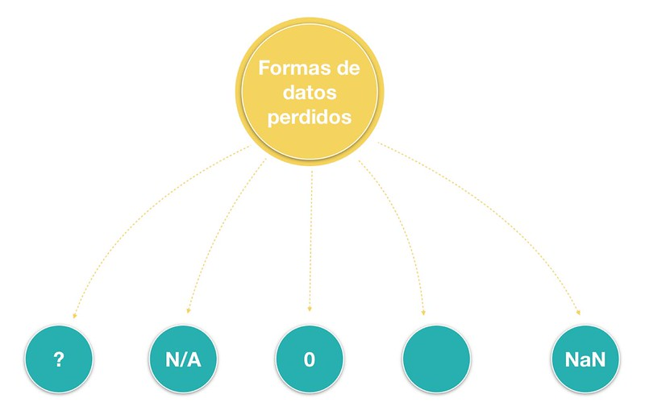
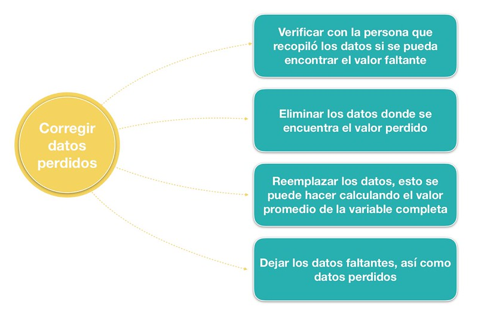


```python
# Obtener el total de observaciones vacías por variables
train.isnull().sum()
```


    MachineIdentifier                                0
    ProductName                                      0
    EngineVersion                                    0
    AppVersion                                       0
    AvSigVersion                                     0
    IsBeta                                           0
    RtpStateBitfield                             32318
    IsSxsPassiveMode                                 0
    DefaultBrowsersIdentifier                  8488045
    AVProductStatesIdentifier                    36221
    AVProductsInstalled                          36221
    AVProductsEnabled                            36221
    HasTpm                                           0
    CountryIdentifier                                0
    CityIdentifier                              325409
    OrganizationIdentifier                     2751518
    GeoNameIdentifier                              213
    LocaleEnglishNameIdentifier                      0
    Platform                                         0
    Processor                                        0
    OsVer                                            0
    OsBuild                                          0
    OsSuite                                          0
    OsPlatformSubRelease                             0
    OsBuildLab                                      21
    SkuEdition                                       0
    IsProtected                                  36044
    AutoSampleOptIn                                  0
    PuaMode                                    8919174
    SMode                                       537759
                                                ...   
    Census_InternalBatteryNumberOfCharges       268755
    Census_OSVersion                                 0
    Census_OSArchitecture                            0
    Census_OSBranch                                  0
    Census_OSBuildNumber                             0
    Census_OSBuildRevision                           0
    Census_OSEdition                                 0
    Census_OSSkuName                                 0
    Census_OSInstallTypeName                         0
    Census_OSInstallLanguageIdentifier           60084
    Census_OSUILocaleIdentifier                      0
    Census_OSWUAutoUpdateOptionsName                 0
    Census_IsPortableOperatingSystem                 0
    Census_GenuineStateName                          0
    Census_ActivationChannel                         0
    Census_IsFlightingInternal                 7408759
    Census_IsFlightsDisabled                    160523
    Census_FlightRing                                0
    Census_ThresholdOptIn                      5667325
    Census_FirmwareManufacturerIdentifier       183257
    Census_FirmwareVersionIdentifier            160133
    Census_IsSecureBootEnabled                       0
    Census_IsWIMBootEnabled                    5659703
    Census_IsVirtualDevice                       15953
    Census_IsTouchEnabled                            0
    Census_IsPenCapable                              0
    Census_IsAlwaysOnAlwaysConnectedCapable      71343
    Wdft_IsGamer                                303451
    Wdft_RegionIdentifier                       303451
    HasDetections                                    0
    Length: 83, dtype: int64


```python
# Obtener el total de observaciones vacías (missings)
train.isnull().sum().sum() # 60686127
```


    60686127


Como hemos visto previamente, existe un alto número de valores faltantes 60686127 celdas, ¿pero es elevado ese valor en comparacón al total de datos que tenemos? Si tenemos 8921483 variables y 83 columnas, nuestra tabla consta de 740483089 celdas, por tanto, tiene 8.2% ((60686127*100)/740483089) de observaciones vacías, lo que no supone un porcentaje muy elevado.

**Variables que tienen menos de un 60% de observaciones vacías**

Con la función `train.isnull().sum()` hemos visto como no existe una distribución equitativa en cuanto al reparto de missings, puesto que hay variables sin ninguno y otras donde más del 90% lo son.


```python
# Obtener las variables con más de un 60% de observaciones vacías (7)
train_NA = aux.assess_NA(train)
train_NA60 = train_NA.loc[train_NA['PorcentajeNA'] > 60]
train_NA60.sort_values('PorcentajeNA', ascending=False)
```

    /Users/gema/Desktop/TFM/codigo/fun_auxiliares.py:44: FutureWarning:

    Sorting because non-concatenation axis is not aligned. A future version
    of pandas will change to not sort by default.

    To accept the future behavior, pass 'sort=False'.

    To retain the current behavior and silence the warning, pass 'sort=True'.


<table border="1" class="dataframe">
  <thead>
    <tr style="text-align: right;">
      <th></th>
      <th>TotalNA</th>
      <th>PorcentajeNA</th>
    </tr>
  </thead>
  <tbody>
    <tr>
      <th>PuaMode</th>
      <td>8919174</td>
      <td>99.97</td>
    </tr>
    <tr>
      <th>Census_ProcessorClass</th>
      <td>8884852</td>
      <td>99.59</td>
    </tr>
    <tr>
      <th>DefaultBrowsersIdentifier</th>
      <td>8488045</td>
      <td>95.14</td>
    </tr>
    <tr>
      <th>Census_IsFlightingInternal</th>
      <td>7408759</td>
      <td>83.04</td>
    </tr>
    <tr>
      <th>Census_InternalBatteryType</th>
      <td>6338429</td>
      <td>71.05</td>
    </tr>
    <tr>
      <th>Census_ThresholdOptIn</th>
      <td>5667325</td>
      <td>63.52</td>
    </tr>
    <tr>
      <th>Census_IsWIMBootEnabled</th>
      <td>5659703</td>
      <td>63.44</td>
    </tr>
  </tbody>
</table>
</div>


```python
missings60 = pd.DataFrame(train_NA60['TotalNA'])
fig = px.bar(missings60, x=missings60.index, y='TotalNA')
fig.update_layout(title_text='Missings > 60%', title_x=0, xaxis=dict(title='Variables'),
                 margin=dict(l=100, r=100, t=100, b=100), template='seaborn')
fig.show()
```

Obtenemos que hay 60686127 missings y que las variables que tienen más de un 60% de observaciones vacías son:

1. `DefaultBrowsersIdentifier`
2. `PuaMode`
3. `Census_ProcessorClass`
4. `Census_InternalBatteryType`
5. `Census_IsFlightingInternal`
6. `Census_ThresholdOptIn`
7. `Census_IsWIMBootEnabled`

A partir de esa salida, **¿es interesante quedarse con las variables o realizar alguna operación como su imputación o eliminación?** Si partimos de una metodología mecánica, sin duda eliminaríamos las variables que tienen más de un 90% de missings, por ejemplo la variable `PuaMode` tiene 8921483 valores donde 8919174 son missings. No obstante, antes de eliminar alguna variable (aún sabiendo los missings), se va a realizar un estudio exhaustivo de cada variable, con el fin de sacar la mayor información y beneficio para la creación del modelo.

Por otro lado, si queremos saber si imputar los datos con observaciones vacías, debemos plantearnos los siguientes escenarios (https://ligdigonzalez.com/manipulando-datos-perdidos-en-python/):

- **Verificar con la persona o grupo que recopiló los datos si es posible que se pueda encontrar el valor real que está faltante**.
    - Esta posibilidad no puede ser contrastada, puesto que los datos han sido obtenidos de Kaggle.
- **Dejar los datos faltantes**, así tal cual, como datos perdidos.
    - Esta es una opción que se va a contemplar, pero se debe analizar.    
- **Eliminar los datos donde se encuentra ese valor perdido** (eliminado la variable faltante o bien la fila completa donde se encuentre).
    - Esta posibilidad hay que estudiarla, pero sí sería efectiva, debido a que reducir la dimensionalidad de los datos es algo que debemos hacer. No obstante, si se opta por eliminar las filas con datos faltantes, deberíamos escoger variables que no tengan muchos datos faltantes, ya que se debe buscar hacer el menor impacto posible, por lo que se debe tener mucho cuidado al momento de eliminar datos.
- **Reemplazar los datos** (imputar los datos), como por ejemplo, calculando el valor promedio de la variable completa. Esta opción es lógica, ya que no se desperdician datos, sin embargo, es menos precisa ya que necesitamos reemplazar los datos faltantes con una conjetura que puede ser cierta como falsa. De igual forma, no siempre se puede calcular el valor del promedio, ya que podemos tener datos categóricos perdidos, en este caso se sustituiría el valor faltante por el más común de esa categoría, es decir, el que se repita más veces.
    - Esta opción la he descartado por varias razones, la principal es que las medidas o características de una máquina que disponemos en los datos, pueden ser determinantes para decidir si una máquina se va infectar o no de malware, por lo que en muchos casos el valor faltante beneficiría en lugar de su imputación. Además, disponemos de variables categóricas y numéricas, algunas con muchos valores o etiquetas, por lo que tendríamos un bajo porcentaje para aceptar los datos. Otra opción que se podría aplicar aquí, sería imputar valores faltantes a partir de filas completas, es decir, rellenar los datos faltantes a partir de similitudes con filas completas que sí tengan ese dato faltante. Sin embargo, descarto esta opción por el mismo motivo que antes, y es que una máquina puede coincidir con las mismas características que otra, excepto en una característica, en donde dicho valor puede ser determinante para diagnosticar el dispositivo como infectado.

**Variables que tienen menos de un 10% de observaciones vacías**

Cuando eliminamos variables, la regla general es que tenga un alto porcentaje de valores perdidos. Por contraposición, si queremos eliminar filas, debemos tener en cuenta aquellas variables que tienen pocas observacions vacías, puesto que dicha eliminación, puede servir para eliminar ruido del dataset.


```python
# Obtener las variables con menos de un 10% de observaciones vacías (35)
train_NA = aux.assess_NA(train)
train_NA10 = train_NA.loc[train_NA['PorcentajeNA'] < 10]
train_NA10.sort_values('PorcentajeNA', ascending=False)
```

<table border="1" class="dataframe">
  <thead>
    <tr style="text-align: right;">
      <th></th>
      <th>TotalNA</th>
      <th>PorcentajeNA</th>
    </tr>
  </thead>
  <tbody>
    <tr>
      <th>SMode</th>
      <td>537759</td>
      <td>6.03</td>
    </tr>
    <tr>
      <th>CityIdentifier</th>
      <td>325409</td>
      <td>3.65</td>
    </tr>
    <tr>
      <th>Wdft_RegionIdentifier</th>
      <td>303451</td>
      <td>3.40</td>
    </tr>
    <tr>
      <th>Wdft_IsGamer</th>
      <td>303451</td>
      <td>3.40</td>
    </tr>
    <tr>
      <th>Census_InternalBatteryNumberOfCharges</th>
      <td>268755</td>
      <td>3.01</td>
    </tr>
    <tr>
      <th>Census_FirmwareManufacturerIdentifier</th>
      <td>183257</td>
      <td>2.05</td>
    </tr>
    <tr>
      <th>Census_IsFlightsDisabled</th>
      <td>160523</td>
      <td>1.80</td>
    </tr>
    <tr>
      <th>Census_FirmwareVersionIdentifier</th>
      <td>160133</td>
      <td>1.79</td>
    </tr>
    <tr>
      <th>Census_OEMModelIdentifier</th>
      <td>102233</td>
      <td>1.15</td>
    </tr>
    <tr>
      <th>Census_OEMNameIdentifier</th>
      <td>95478</td>
      <td>1.07</td>
    </tr>
    <tr>
      <th>Firewall</th>
      <td>91350</td>
      <td>1.02</td>
    </tr>
    <tr>
      <th>Census_TotalPhysicalRAM</th>
      <td>80533</td>
      <td>0.90</td>
    </tr>
    <tr>
      <th>Census_IsAlwaysOnAlwaysConnectedCapable</th>
      <td>71343</td>
      <td>0.80</td>
    </tr>
    <tr>
      <th>Census_OSInstallLanguageIdentifier</th>
      <td>60084</td>
      <td>0.67</td>
    </tr>
    <tr>
      <th>IeVerIdentifier</th>
      <td>58894</td>
      <td>0.66</td>
    </tr>
    <tr>
      <th>Census_SystemVolumeTotalCapacity</th>
      <td>53002</td>
      <td>0.59</td>
    </tr>
    <tr>
      <th>Census_PrimaryDiskTotalCapacity</th>
      <td>53016</td>
      <td>0.59</td>
    </tr>
    <tr>
      <th>Census_InternalPrimaryDisplayResolutionHorizontal</th>
      <td>46986</td>
      <td>0.53</td>
    </tr>
    <tr>
      <th>Census_InternalPrimaryDiagonalDisplaySizeInInches</th>
      <td>47134</td>
      <td>0.53</td>
    </tr>
    <tr>
      <th>Census_InternalPrimaryDisplayResolutionVertical</th>
      <td>46986</td>
      <td>0.53</td>
    </tr>
    <tr>
      <th>Census_ProcessorCoreCount</th>
      <td>41306</td>
      <td>0.46</td>
    </tr>
    <tr>
      <th>Census_ProcessorManufacturerIdentifier</th>
      <td>41313</td>
      <td>0.46</td>
    </tr>
    <tr>
      <th>Census_ProcessorModelIdentifier</th>
      <td>41343</td>
      <td>0.46</td>
    </tr>
    <tr>
      <th>AVProductsEnabled</th>
      <td>36221</td>
      <td>0.41</td>
    </tr>
    <tr>
      <th>AVProductsInstalled</th>
      <td>36221</td>
      <td>0.41</td>
    </tr>
    <tr>
      <th>AVProductStatesIdentifier</th>
      <td>36221</td>
      <td>0.41</td>
    </tr>
    <tr>
      <th>IsProtected</th>
      <td>36044</td>
      <td>0.40</td>
    </tr>
    <tr>
      <th>RtpStateBitfield</th>
      <td>32318</td>
      <td>0.36</td>
    </tr>
    <tr>
      <th>Census_IsVirtualDevice</th>
      <td>15953</td>
      <td>0.18</td>
    </tr>
    <tr>
      <th>Census_PrimaryDiskTypeName</th>
      <td>12844</td>
      <td>0.14</td>
    </tr>
    <tr>
      <th>UacLuaenable</th>
      <td>10838</td>
      <td>0.12</td>
    </tr>
    <tr>
      <th>Census_ChassisTypeName</th>
      <td>623</td>
      <td>0.01</td>
    </tr>
    <tr>
      <th>OsBuildLab</th>
      <td>21</td>
      <td>0.00</td>
    </tr>
    <tr>
      <th>Census_PowerPlatformRoleName</th>
      <td>55</td>
      <td>0.00</td>
    </tr>
    <tr>
      <th>GeoNameIdentifier</th>
      <td>213</td>
      <td>0.00</td>
    </tr>
  </tbody>
</table>
</div>


```python
missings10 = pd.DataFrame(train_NA10['TotalNA'])
fig = px.bar(missings10, x=missings10.index, y='TotalNA')
fig.update_layout(title_text='Missings < 10%', title_x=0, xaxis=dict(title='Variables'),
                 margin=dict(l=100, r=100, t=50, b=350), template='seaborn')
fig.show()
```


Hay 35 variables que tienen menos de un 10% de datos faltantes. Por lo que estaría bien, ver si es rentable eliminar aquellas filas que tengan menos de un determinado porcentaje, por ejemplo, hay 4 variables que tienen alrededor del 0% de valores faltantes, esto nos permitiría reducir el dataset por filas, y sin mucha pérdida de información si se tiene en cuenta el conjunto global de los datos.

- `Census_ChassisTypeName`: 623	missings (0.01)
- `OsBuildLab`:	21 missings (0.00)
- `Census_PowerPlatformRoleName`: 55 missings (0.00)
- `GeoNameIdentifier`: 213 missings (0.00)

**En el preprocesamiento, veremos que técnicas de las aquí mencionadas usaremos para tratar los missings.**

### Información sobre los missings en TEST


```python
# Obtener el total de observaciones vacías por variables
train.isnull().sum()
```


    MachineIdentifier                                0
    ProductName                                      0
    EngineVersion                                    0
    AppVersion                                       0
    AvSigVersion                                     0
    IsBeta                                           0
    RtpStateBitfield                             32318
    IsSxsPassiveMode                                 0
    DefaultBrowsersIdentifier                  8488045
    AVProductStatesIdentifier                    36221
    AVProductsInstalled                          36221
    AVProductsEnabled                            36221
    HasTpm                                           0
    CountryIdentifier                                0
    CityIdentifier                              325409
    OrganizationIdentifier                     2751518
    GeoNameIdentifier                              213
    LocaleEnglishNameIdentifier                      0
    Platform                                         0
    Processor                                        0
    OsVer                                            0
    OsBuild                                          0
    OsSuite                                          0
    OsPlatformSubRelease                             0
    OsBuildLab                                      21
    SkuEdition                                       0
    IsProtected                                  36044
    AutoSampleOptIn                                  0
    PuaMode                                    8919174
    SMode                                       537759
                                                ...   
    Census_InternalBatteryNumberOfCharges       268755
    Census_OSVersion                                 0
    Census_OSArchitecture                            0
    Census_OSBranch                                  0
    Census_OSBuildNumber                             0
    Census_OSBuildRevision                           0
    Census_OSEdition                                 0
    Census_OSSkuName                                 0
    Census_OSInstallTypeName                         0
    Census_OSInstallLanguageIdentifier           60084
    Census_OSUILocaleIdentifier                      0
    Census_OSWUAutoUpdateOptionsName                 0
    Census_IsPortableOperatingSystem                 0
    Census_GenuineStateName                          0
    Census_ActivationChannel                         0
    Census_IsFlightingInternal                 7408759
    Census_IsFlightsDisabled                    160523
    Census_FlightRing                                0
    Census_ThresholdOptIn                      5667325
    Census_FirmwareManufacturerIdentifier       183257
    Census_FirmwareVersionIdentifier            160133
    Census_IsSecureBootEnabled                       0
    Census_IsWIMBootEnabled                    5659703
    Census_IsVirtualDevice                       15953
    Census_IsTouchEnabled                            0
    Census_IsPenCapable                              0
    Census_IsAlwaysOnAlwaysConnectedCapable      71343
    Wdft_IsGamer                                303451
    Wdft_RegionIdentifier                       303451
    HasDetections                                    0
    Length: 83, dtype: int64


```python
# Obtener el total de observaciones vacías (missings)
test.isnull().sum().sum() # 61447282
```


    61447282


**Variables que tienen menos de un 60% de observaciones vacías**


```python
# Obtener las variables con más de un 60% de observaciones vacías (8)
test_NA = aux.assess_NA(test)
test_NA60 = test_NA.loc[test_NA['PorcentajeNA'] > 60]
test_NA60.sort_values('PorcentajeNA', ascending=False)
```


<table border="1" class="dataframe">
  <thead>
    <tr style="text-align: right;">
      <th></th>
      <th>TotalNA</th>
      <th>PorcentajeNA</th>
    </tr>
  </thead>
  <tbody>
    <tr>
      <th>PuaMode</th>
      <td>7851065</td>
      <td>99.97</td>
    </tr>
    <tr>
      <th>Census_ProcessorClass</th>
      <td>7835022</td>
      <td>99.77</td>
    </tr>
    <tr>
      <th>DefaultBrowsersIdentifier</th>
      <td>7546134</td>
      <td>96.09</td>
    </tr>
    <tr>
      <th>Census_IsFlightingInternal</th>
      <td>6673962</td>
      <td>84.98</td>
    </tr>
    <tr>
      <th>Census_InternalBatteryType</th>
      <td>5979844</td>
      <td>76.14</td>
    </tr>
    <tr>
      <th>SMode</th>
      <td>5831272</td>
      <td>74.25</td>
    </tr>
    <tr>
      <th>Census_ThresholdOptIn</th>
      <td>5529515</td>
      <td>70.41</td>
    </tr>
    <tr>
      <th>Census_IsWIMBootEnabled</th>
      <td>5522707</td>
      <td>70.32</td>
    </tr>
  </tbody>
</table>
</div>


**Variables que tienen menos de un 10% de observaciones vacías**


```python
# Obtener las variables con menos de un 10% de observaciones vacías (36)
test_NA = aux.assess_NA(test)
test_NA10 = test_NA.loc[test_NA['PorcentajeNA'] < 10]
test_NA10.sort_values('PorcentajeNA', ascending=False)
```


<table border="1" class="dataframe">
  <thead>
    <tr style="text-align: right;">
      <th></th>
      <th>TotalNA</th>
      <th>PorcentajeNA</th>
    </tr>
  </thead>
  <tbody>
    <tr>
      <th>Wdft_RegionIdentifier</th>
      <td>302857</td>
      <td>3.86</td>
    </tr>
    <tr>
      <th>Wdft_IsGamer</th>
      <td>302857</td>
      <td>3.86</td>
    </tr>
    <tr>
      <th>Census_InternalBatteryNumberOfCharges</th>
      <td>239233</td>
      <td>3.05</td>
    </tr>
    <tr>
      <th>Census_FirmwareManufacturerIdentifier</th>
      <td>198634</td>
      <td>2.53</td>
    </tr>
    <tr>
      <th>CityIdentifier</th>
      <td>191962</td>
      <td>2.44</td>
    </tr>
    <tr>
      <th>Census_FirmwareVersionIdentifier</th>
      <td>177624</td>
      <td>2.26</td>
    </tr>
    <tr>
      <th>Census_IsFlightsDisabled</th>
      <td>125801</td>
      <td>1.60</td>
    </tr>
    <tr>
      <th>Census_OEMModelIdentifier</th>
      <td>95935</td>
      <td>1.22</td>
    </tr>
    <tr>
      <th>Census_TotalPhysicalRAM</th>
      <td>95051</td>
      <td>1.21</td>
    </tr>
    <tr>
      <th>Census_IsAlwaysOnAlwaysConnectedCapable</th>
      <td>90152</td>
      <td>1.15</td>
    </tr>
    <tr>
      <th>Census_OEMNameIdentifier</th>
      <td>89546</td>
      <td>1.14</td>
    </tr>
    <tr>
      <th>Census_PrimaryDiskTotalCapacity</th>
      <td>74701</td>
      <td>0.95</td>
    </tr>
    <tr>
      <th>Census_SystemVolumeTotalCapacity</th>
      <td>74690</td>
      <td>0.95</td>
    </tr>
    <tr>
      <th>Census_ProcessorManufacturerIdentifier</th>
      <td>61281</td>
      <td>0.78</td>
    </tr>
    <tr>
      <th>Census_ProcessorCoreCount</th>
      <td>61277</td>
      <td>0.78</td>
    </tr>
    <tr>
      <th>Census_ProcessorModelIdentifier</th>
      <td>61314</td>
      <td>0.78</td>
    </tr>
    <tr>
      <th>Census_OSInstallLanguageIdentifier</th>
      <td>58743</td>
      <td>0.75</td>
    </tr>
    <tr>
      <th>Firewall</th>
      <td>58472</td>
      <td>0.74</td>
    </tr>
    <tr>
      <th>IeVerIdentifier</th>
      <td>49796</td>
      <td>0.63</td>
    </tr>
    <tr>
      <th>Census_InternalPrimaryDiagonalDisplaySizeInInches</th>
      <td>42610</td>
      <td>0.54</td>
    </tr>
    <tr>
      <th>Census_InternalPrimaryDisplayResolutionVertical</th>
      <td>42511</td>
      <td>0.54</td>
    </tr>
    <tr>
      <th>Census_InternalPrimaryDisplayResolutionHorizontal</th>
      <td>42511</td>
      <td>0.54</td>
    </tr>
    <tr>
      <th>RtpStateBitfield</th>
      <td>32222</td>
      <td>0.41</td>
    </tr>
    <tr>
      <th>IsProtected</th>
      <td>23649</td>
      <td>0.30</td>
    </tr>
    <tr>
      <th>AVProductStatesIdentifier</th>
      <td>23767</td>
      <td>0.30</td>
    </tr>
    <tr>
      <th>AVProductsEnabled</th>
      <td>23767</td>
      <td>0.30</td>
    </tr>
    <tr>
      <th>AVProductsInstalled</th>
      <td>23767</td>
      <td>0.30</td>
    </tr>
    <tr>
      <th>Census_IsVirtualDevice</th>
      <td>17291</td>
      <td>0.22</td>
    </tr>
    <tr>
      <th>UacLuaenable</th>
      <td>7865</td>
      <td>0.10</td>
    </tr>
    <tr>
      <th>Census_PrimaryDiskTypeName</th>
      <td>6807</td>
      <td>0.09</td>
    </tr>
    <tr>
      <th>Census_OSEdition</th>
      <td>5</td>
      <td>0.00</td>
    </tr>
    <tr>
      <th>GeoNameIdentifier</th>
      <td>147</td>
      <td>0.00</td>
    </tr>
    <tr>
      <th>Census_GenuineStateName</th>
      <td>1</td>
      <td>0.00</td>
    </tr>
    <tr>
      <th>OsBuildLab</th>
      <td>17</td>
      <td>0.00</td>
    </tr>
    <tr>
      <th>Census_ChassisTypeName</th>
      <td>341</td>
      <td>0.00</td>
    </tr>
    <tr>
      <th>Census_PowerPlatformRoleName</th>
      <td>26</td>
      <td>0.00</td>
    </tr>
  </tbody>
</table>
</div>


### Información sobre variables demasiado sesgadas (asimetría) en TRAIN

Vamos a obtener aquellas variables en donde más del 80% de los valores, forman parte de la primera categoría.


```python
train_asimetria = pd.DataFrame([{'variable': c, 'valores_unicos': train[c].nunique(),
                       'asimetria': train[c].value_counts(normalize=True).values[0] * 100}
                      for c in train.columns])
train_asimetria.set_index("variable", inplace = True)
train_asimetria = train_asimetria.sort_values('asimetria', ascending=False)
train_asimetria80 = train_asimetria.loc[train_asimetria['asimetria'] > 80]
train_asimetria80
```


<table border="1" class="dataframe">
  <thead>
    <tr style="text-align: right;">
      <th></th>
      <th>asimetria</th>
      <th>valores_unicos</th>
    </tr>
    <tr>
      <th>variable</th>
      <th></th>
      <th></th>
    </tr>
  </thead>
  <tbody>
    <tr>
      <th>Census_IsWIMBootEnabled</th>
      <td>99.999969</td>
      <td>2</td>
    </tr>
    <tr>
      <th>IsBeta</th>
      <td>99.999249</td>
      <td>2</td>
    </tr>
    <tr>
      <th>Census_IsFlightsDisabled</th>
      <td>99.998996</td>
      <td>2</td>
    </tr>
    <tr>
      <th>Census_IsFlightingInternal</th>
      <td>99.998612</td>
      <td>2</td>
    </tr>
    <tr>
      <th>AutoSampleOptIn</th>
      <td>99.997108</td>
      <td>2</td>
    </tr>
    <tr>
      <th>Census_ThresholdOptIn</th>
      <td>99.974924</td>
      <td>2</td>
    </tr>
    <tr>
      <th>SMode</th>
      <td>99.953708</td>
      <td>2</td>
    </tr>
    <tr>
      <th>Census_IsPortableOperatingSystem</th>
      <td>99.945480</td>
      <td>2</td>
    </tr>
    <tr>
      <th>PuaMode</th>
      <td>99.913382</td>
      <td>2</td>
    </tr>
    <tr>
      <th>Census_DeviceFamily</th>
      <td>99.838256</td>
      <td>3</td>
    </tr>
    <tr>
      <th>UacLuaenable</th>
      <td>99.392547</td>
      <td>11</td>
    </tr>
    <tr>
      <th>Census_IsVirtualDevice</th>
      <td>99.296055</td>
      <td>2</td>
    </tr>
    <tr>
      <th>ProductName</th>
      <td>98.935569</td>
      <td>6</td>
    </tr>
    <tr>
      <th>HasTpm</th>
      <td>98.797106</td>
      <td>2</td>
    </tr>
    <tr>
      <th>IsSxsPassiveMode</th>
      <td>98.266622</td>
      <td>2</td>
    </tr>
    <tr>
      <th>Firewall</th>
      <td>97.858254</td>
      <td>2</td>
    </tr>
    <tr>
      <th>AVProductsEnabled</th>
      <td>97.398377</td>
      <td>6</td>
    </tr>
    <tr>
      <th>RtpStateBitfield</th>
      <td>97.326206</td>
      <td>7</td>
    </tr>
    <tr>
      <th>OsVer</th>
      <td>96.761323</td>
      <td>58</td>
    </tr>
    <tr>
      <th>Platform</th>
      <td>96.606304</td>
      <td>4</td>
    </tr>
    <tr>
      <th>Census_IsPenCapable</th>
      <td>96.192909</td>
      <td>2</td>
    </tr>
    <tr>
      <th>IsProtected</th>
      <td>94.562373</td>
      <td>2</td>
    </tr>
    <tr>
      <th>Census_IsAlwaysOnAlwaysConnectedCapable</th>
      <td>94.258080</td>
      <td>2</td>
    </tr>
    <tr>
      <th>Census_FlightRing</th>
      <td>93.657960</td>
      <td>10</td>
    </tr>
    <tr>
      <th>Census_HasOpticalDiskDrive</th>
      <td>92.281272</td>
      <td>2</td>
    </tr>
    <tr>
      <th>Census_OSArchitecture</th>
      <td>90.858045</td>
      <td>3</td>
    </tr>
    <tr>
      <th>Processor</th>
      <td>90.853001</td>
      <td>3</td>
    </tr>
    <tr>
      <th>Census_GenuineStateName</th>
      <td>88.299187</td>
      <td>5</td>
    </tr>
    <tr>
      <th>Census_ProcessorManufacturerIdentifier</th>
      <td>88.278918</td>
      <td>7</td>
    </tr>
    <tr>
      <th>Census_IsTouchEnabled</th>
      <td>87.445686</td>
      <td>2</td>
    </tr>
  </tbody>
</table>
</div>


----

Acabamos de observar, como debemos estudiar las variables que vamos a usar. Para ello deberemos hacer un tratamiento adecuado a los datos. Es importante saber, que las variables que eliminemos en el conjunto train, deberán ser eliminadas automáticamente en el conjunto test. No obstante, esta metodología no se aplicará sobre la eliminación de filas, debido a que tenemos que tener el dataset test lo más independiente del conjunto train. Por lo que solo eliminaré variables.

Seguidamente, vamos a estudiar variable por variable, para completar la información que aquí hemos extraído de las variables, y ver que variables podemos eliminar, cuales se quedan y cuales necesitan un tratamiento específico. La información de abajo ha sido obtenida mediante la información que aparece en Kaggle, las búsquedas en Internet, conocimientos propios del área y visualización de los datos.

-----

### Información de cada variable

1. ~~**MachineIdentifier**~~: es el ID de la máquina y al ser único va a causar _overfitting_, ya que tiene 8921483 valores únicos, por lo que no aporta información, así que tenemos que quitarlo.

2. **ProductName**: es el programa de seguridad usado para defender el dispositivo, existen 6 categorías ('win8defender', 'mse', 'mseprerelease', 'scep', 'windowsintune' y 'fep'). Por ejemplo, 'win8defender' es el tipo de programa que más veces se repite, con 8826520 valores. El programa 'win8defender' de Windows Defender, usa protección en tiempo real para analizar todo lo que de descarga o lo que se ejecuta en el dispositivo. Por tanto, es un método de prevención y de eliminación de software espía en Microsoft Windows, que ya viene instalado y activado en los equipos con Windows 7, Windows 8 y Windows 10 (https://computerhoy.com/reportajes/tecnologia/5-motivos-utilizar-windows-defender-como-antivirus-no-hacerlo-308231).

> `train['ProductName'].value_counts()`

~~~
win8defender     8826520
mse                94873
mseprerelease         53
scep                  22
windowsintune          8
fep                    7
~~~

3. **EngineVersion**: indica la información de la versión del motor del programa de seguridad. La página de Windows Security About muestra Antimalware Client Version (Windows Defender version), Engine Version (Scanning Engine), Antivirus Version (Virus definitions), y Antispyware version (Spyware definitions), como se puede ver en https://www.bleepingcomputer.com/tutorials/how-to-find-windows-defender-version-number-installed-in-windows-10/. Hay 70 valores únicos, los cinco más comunes son:

> `train['EngineVersion'].value_counts()`

~~~
1.1.15200.1    3845067
1.1.15100.1    3675915
1.1.15000.2     265218
1.1.14901.4     212408
1.1.14600.4     160585
...
~~~

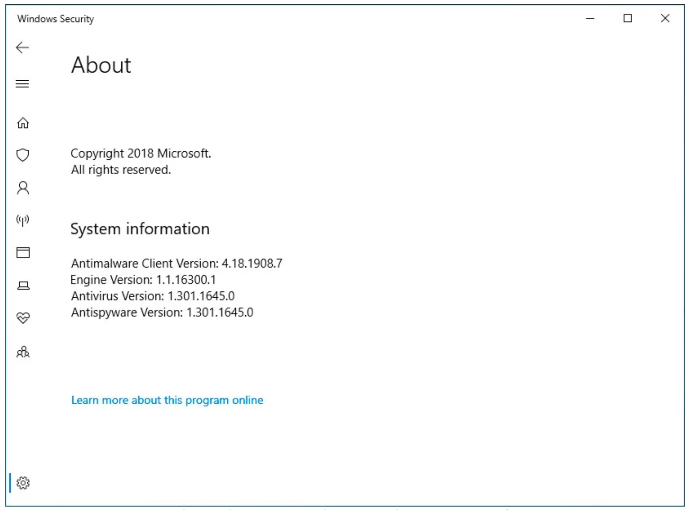

4. **AppVersion**: informa de la versión del cliente antimalware (versión de Windows Defender), como se ve en la anterior imagen. No presenta casi correlación con `EngineVersion`, `AvSigVersion` y `HasDetections` (todas entorno a 0.1). Las 5 versiones más comunes son:

> `train['AppVersion'].value_counts()`

~~~
4.18.1807.18075     5139224
4.18.1806.18062      850929
4.12.16299.15        359871
4.10.209.0           272455
4.13.17134.1         257270
...
~~~

5. **~~AvSigVersion~~**: información acerca del programa de seguridad, tiene 8531 valores únicos y añade más información redundante del mismo tipo que las variables `EngineVersion` y `AppVersion`. Además, se observa como tiene una alta correlación con `EngineVersion` (0.83), por lo que considero prescindir de ella. Las 5 versiones más comunes son:

> `train['AvSigVersion'].value_counts()`

~~~
1.273.1420.0         102317
1.263.48.0            98024
1.275.1140.0          97232
1.275.727.0           92448
1.273.371.0           86967
...
~~~

~~~python
# Veamos la correlación entre la variable categórica con la variable EngineVersion

X = train['EngineVersion']
y = train['AvSigVersion']

aux.corr_categorical(X,y)
> 0.8389188441288544
~~~

~~~python
# Veamos la correlación entre la variable categórica con la variable AppVersion

X = train['AppVersion']
y = train['AvSigVersion']

aux.corr_categorical(X,y)
> 0.16826741826532388
~~~

6. **IsBeta**: indica si el programa de seguridad es una beta o no. Es interesante ver esta variable de acuerdo a la variable target `HasDetections`, ya que se observa como la mayoría no son beta, lo que es lógico. Un software beta, a lo que también se conoce como beta a secas, es un programa que se encuentra cerca de su fase final de desarrollo y que puede ser funcional, pero que carece de los retoques finales que dan forma al producto terminado. Además, existe casi la misma distribución para dispositivos donde se ha detectado malware y donde no.

> `train['IsBeta'].value_counts()`

~~~
0    8921416
1         67
~~~

> `train[['IsBeta', 'HasDetections']].groupby(['IsBeta', 'HasDetections']).size()`

~~~
IsBeta  HasDetections
0       0                4462557
        1                4458859
1       0                     34
        1                     33
~~~

7. **RtpStateBitfield**: no viene información en Kaggle de esta variable, pero lo más probable es que sea estado RTP (habilitado o deshabilitado), es decir, estado de protección en tiempo real, como se dice en https://docs.microsoft.com/en-us/windows/security/threat-protection/windows-defender-antivirus/troubleshoot-windows-defender-antivirus. No obstante, en este caso, debería ser una variable binaria y entera (aunque se encuentre el valor 0), pero pienso que es una variable que aporta información y tiene pocos missings (32318 - 0.36%).

> `train['RtpStateBitfield'].value_counts()`

~~~
7.0     8651487
0.0      190701
NA        32318
8.0       21974
5.0       20328
3.0        3029
1.0        1625
35.0         21
~~~

8. **IsSxsPassiveMode**: no viene información en Kaggle, pero en Internet se dice que es un modo de operación activo/pasivo para Windows Defender, es decir, si existe otro antivirus primario de terceros en el sistema, el Windows Defender ingresa al modo pasivo. El modo pasivo obviamente ofrece una funcionalidad reducida (http://techgenix.com/stick-with-windows-defender/). Los datos muestran que una máquina que está en modo pasivo tiene una mayor prevalencia de malwares (97768).

> `train['IsSxsPassiveMode'].value_counts()`

~~~
0    8766840
1     154643
~~~

> `train[['IsSxsPassiveMode', 'HasDetections']].groupby(['IsSxsPassiveMode', 'HasDetections']).size()`

~~~
IsSxsPassiveMode  HasDetections
0                 0                4364823
                  1                4402017
1                 0                  97768
                  1                  56875
~~~

9. ~~**DefaultBrowsersIdentifier**~~: es el ID para el navegador predeterminado de la máquina. Si juntamos que es un identificador con 2017 valores únicos y que tiene un 95.14% de NA (8488045), se opta por eliminarla.

10. **~~AVProductStatesIdentifier~~**: es el ID para la configuración específica del software antivirus de un usuario, tiene los valores en coma flotante y 28970 valores únicos, donde hay 36221 missings (0.41%). Se obtiene que está correlacionada de forma negativa con `AVProductsInstalled`. Las cinco primeros son:

> `train['AVProductStatesIdentifier'].value_counts()`

~~~
53447.0    5824565
7945.0      475897
47238.0     327656
62773.0     266764
46413.0     112878
...
~~~

~~~python
# Veamos la correlación con AVProductsInstalled y AVProductsEnabled

aux.plot_corr(aux.corr(train, ['AVProductStatesIdentifier', 'AVProductsInstalled', 'AVProductsEnabled']))
~~~

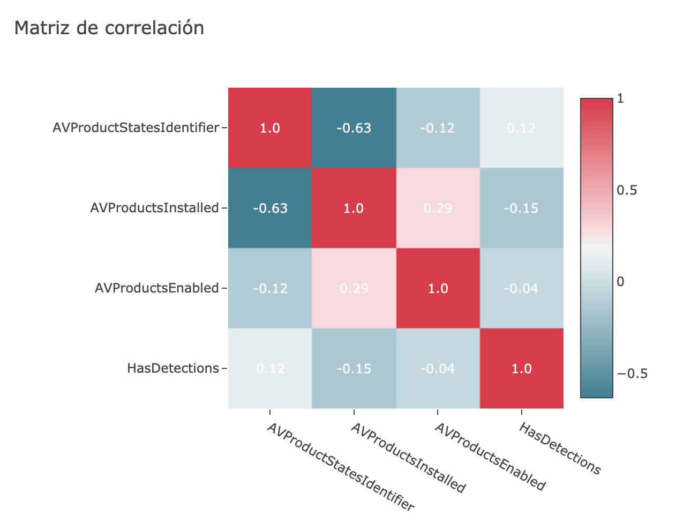

11. **AVProductsInstalled**: no viene información en Kaggle de esta variable, pero parece que es el número de productos antivirus instalados, en donde el 90% de las máquinas tienen 1-2 productos instalados. Tiene 36221 missings (0.41%).

> `train['AVProductsInstalled'].value_counts()`

~~~
1.0    6208893
2.0    2459008
3.0     208103
NA       36221
4.0       8757
5.0        471
6.0         28
7.0          1
0.0          1
~~~

12. **AVProductsEnabled**: no viene información en Kaggle de esta variable, pero puede ser el número de productos antivirus instalados que están habilitados. Es interesante que esté está variable, ya que un antivirus instalado no tiene porqué estar habilitado. Tiene 36221 missings (0.41%).

> `train['AVProductsEnabled'].value_counts()`

~~~
1.0    8654101
2.0     198652
NA       36221
0.0      25958
3.0       6075
4.0        453
5.0         23
~~~

13. **HasTpm**: esta variable indica VERDADERO si la máquina tiene TPM, es decir, un Trusted Platform Module (TPM) que es un chip especializado en un dispositivo de punto final que almacena las claves de cifrado RSA específicas del sistema host para la autenticación de hardware. Cada chip TPM contiene un par de claves RSA llamado clave de respaldo (Endorsement Key - EK), en donde, el par se mantiene dentro del chip y el software no puede acceder a él.

> `train['HasTpm'].value_counts()`

~~~
1    8814167
0     107316
~~~

14. **CountryIdentifier**: indica el ID del país en el que se encuentra la máquina (https://en.wikipedia.org/wiki/List_of_countries_by_United_Nations_geoscheme). Tiene 222 valores únicos. Por ejemplo, si se trata de códigos de país exactos, Austria (43) tiene el mayor número de filas en este conjunto de datos, mientras que EE. UU. (001) tiene solo el 2%. Los más comunes son:

> `train['CountryIdentifier'].value_counts()`

~~~
43     397172
29     347991
141    333411
93     283625
171    280572
...
~~~

~~~python
# Veamos la correlación con las variables ID de regiones que hay

aux.plot_corr(aux.corr(train, ['CountryIdentifier', 'GeoNameIdentifier', 'CityIdentifier',
                              'OrganizationIdentifier', 'LocaleEnglishNameIdentifier']))
~~~

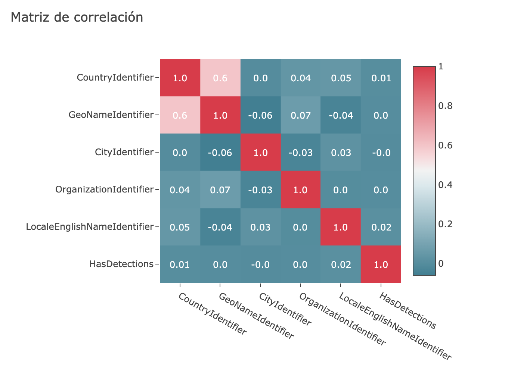

15. **CityIdentifier**: es la identificación de la ciudad en la que se encuentra la máquina, tiene 107366 ciudades únicas y algunos missings (325409 - 3.65%). Los valores más comunes son:

> `train['CityIdentifier'].value_counts()`

~~~
NA         325409
130775.0    94812
16668.0     84780
82373.0     83312
10222.0     71814
61668.0     66845
...
~~~

16. **OrganizationIdentifier**: indica el ID de la organización a la que pertenece la máquina, el ID de la organización se asigna tanto para compañías específicas como industrias amplias. Hay 49 organizaciones únicas, donde el 50% de las máquinas están bajo una organización, otro 25% no clasificado. Tiene 2751518 missings (30.84%). Los más comunes son:

> `train['OrganizationIdentifier'].value_counts()`

~~~
27.0    4196457
NA      2751518
18.0    1764175
48.0      63845
50.0      45502
...
~~~

17. **~~GeoNameIdentifier~~**: es el ID para la región geográfica en la que se encuentra una máquina, tiene 292 valores distintos, pero ya tenemos dos variables `CountryIdentifier` y `CityIdentifier`, que indican la localización de la máquina. Además, `CountryIdentifier` tiene 202 valores distintos, pero en la correlación entre `CityIdentifier`, `CountryIdentifier` y `GeoNameIdentifier`, con la variable target (`HasDetections`), tenemos un un valor de 0.6 de la correlación Pearson entre las variables `CountryIdentifier` y `GeoNameIdentifier`. Además, en Kaggle se dice que *The `CountryIdentifier` is highly associated with `GeoNameIdentifier`, `LocaleEnglishNameIdentifier`, `Census_OSInstallLanguageIdentifier`, `Census_OSUILocaleIdentifier`, and `Wdft_RegionIdentifier` as seen in the below correlation plot*. Tiene 213 missings (0.00%).

~~~python
# Veamos la correlación con esas variables

aux.plot_corr(aux.corr(train, ['CountryIdentifier', 'GeoNameIdentifier', 'LocaleEnglishNameIdentifier',
                              'Census_OSInstallLanguageIdentifier', 'Census_OSUILocaleIdentifier']))
~~~

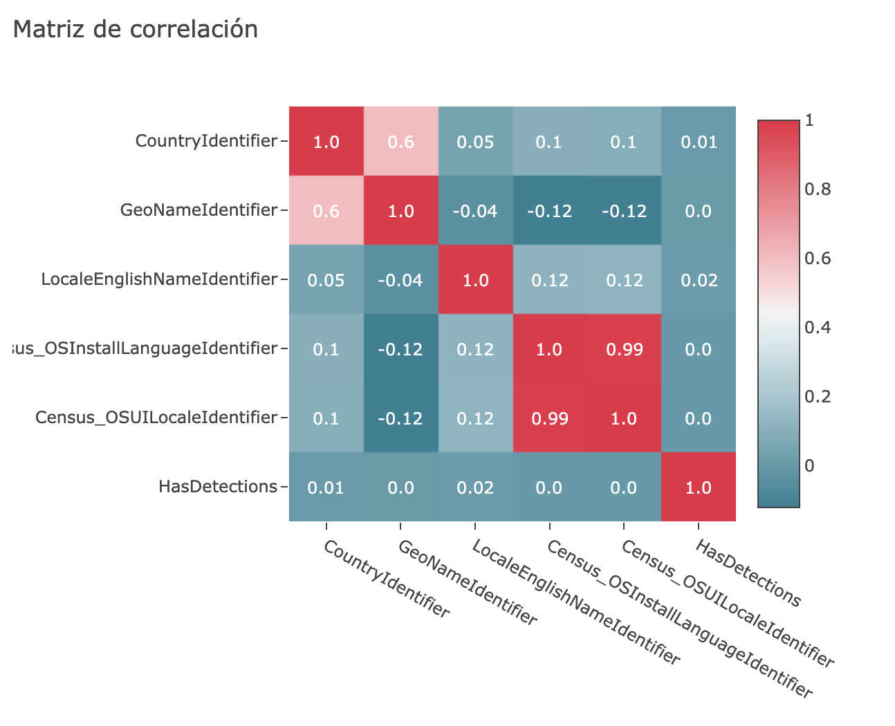

18. **LocaleEnglishNameIdentifier**: es el nombre en inglés del ID de configuración regional del usuario actual. Tiene una correlación baja con `CountryIdentifier` (0.05). Por ejempo, si `CountryIdentifier` = 43 es `GeoNameIdentifier` = 53 es `LocaleEnglishNameIdentifier` = 42. (https://www.kaggle.com/c/microsoft-malware-prediction/discussion/78873). La variable contiene 276 valores únicos, es importante saber que "una localidad no es un idioma ni un país, el mismo idioma se puede hablar en varios países (a menudo con diferencias sutiles) y un solo país puede hablar varios idiomas. Por lo tanto, una localidad es un área donde se habla un idioma en particular que puede (o no) alinearse con los límites geográficos y/o políticos" (https://ss64.com/locale.html).

19. **Platform**: indica el nombre de la plataforma (propiedades relacionadas con el sistema operativo y el procesador).

> `train['Platform'].value_counts()`

~~~
windows10      8618715
windows8        194508
windows7         93889
windows2016      14371
~~~

20. **Processor**: es la arquitectura del sistema operativo instalado. El paquete X86 es para Windows de 32 bits y el paquete de X64 es para Windows de 64 bits. De ARM64 podemos decir que es una evolución de la arquitectura ARM, compatible con el procesamiento de datos de 64 bits y otorga una mayor potencia computacional, y poco a poco se está convirtiendo en el estándar en la mayoría de móviles modernos (https://www.xatakandroid.com/aplicaciones-android/arm-arm64-x86-dpi-como-saber-que-apk-descargarte-para-tu-movil).

> `train['Processor'].value_counts()`

~~~
x64      8105435
x86       815702
arm64        346
~~~

21. **OsVer**: indica la versión del sistema operativo actual. Las 5 versiones más usadas son:

> `train['OsVer'].value_counts()`

~~~
10.0.0.0        8632545
6.3.0.0          194447
6.1.1.0           93268
6.1.0.0             582
10.0.3.0            225
...
~~~

22. **OsBuild**: indica la compilación del sistema operativo actual. Tiene 76 valores únicos, de los cuales 5 forman la mayoría. La distribución de los 8 valores principales son:

> `train['OsBuild'].value_counts()`

~~~
17134    3915521
16299    2503681
15063     780270
14393     730819
10586     411606
10240     270192
9600      194508
7601       93306
...
~~~

23. **OsSuite**: indica la máscara del conjunto de productos para el sistema operativo actual, se observa como tiene una distribución muy sesgada.

> `train['OsSuite'].value_counts()`

~~~
768    5560661
256    3346251
272      12092
400        793
16         731
...
~~~

~~~python
# Veamos la correlación entre OsSuite y OsBuild

aux.plot_corr(aux.corr(train, ['OsSuite', 'OsBuild']))
~~~

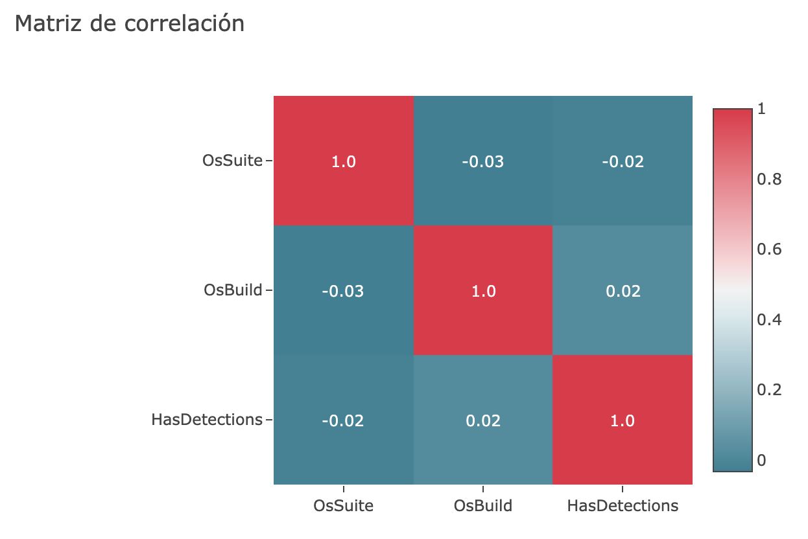

24. **OsPlatformSubRelease**: contiene la sub-versión de la plataforma SO (es menos sesgada que `OsSuite`). En el siguiente enlace https://support.lenovo.com/es/es/solutions/HT502786 se encuentran las versiones de Windows 10 con los nombres en clave de esta variable.

> `train['OsPlatformSubRelease'].value_counts()`

~~~
rs4           3915526
rs3           2503681
rs2            780270
rs1            730819
th2            411606
th1            270192
windows8.1     194508
windows7        93889
prers5          20992
~~~

25. **~~OsBuildLab~~**: tiene información del compilador generada por el sistema operativo (17134.1.amd64fre.rs4_release.180410-1804). Tiene 21 missings (0.00%). Se observa cómo junta información de las variables `OsBuild`, `OsPlatformSubRelease` y `Processor`, entre otros, por lo que esta variable aporta información redundante, ya que dicha información está particiona en otras variables y considerado disponer de la información de forma separada:

~~~
OsBuildLab[0]             17134.1.amd64fre.rs4_release.180410-1804
OsPlatformSubRelease[0]                                        rs4
OsBuild[0]                                                   17134
Processor[0]                                                   x64
~~~

26. **SkuEdition**: esta variable tiene como objetivo definir el tipo de producto en el MSDN, con el fin de asignar un nombre 'SKU-Edition' que sea útil en los informes de población. Los tipos de productos válidos se definen en `%sdxroot%\data\windowseditions.xml`. Además, esta API se ha utilizado desde Vista y Server 2008, por lo que hay muchos tipos de productos que no se aplican a Windows 10. Es conveniente, pasar a minúsculas todas las etiquetas.

> `train['SkuEdition'].value_counts()`

~~~
Home               5514341
Pro                3224164
Invalid              78054
Education            40694
Enterprise           34357
Enterprise LTSB      20702
Cloud                 5589
Server                3582
...
~~~

27. **IsProtected**: es una variable calculada (a partir de Spynet Report's AV Products) que nos dice si una máquina está protegida. La variable puede tomar tres valores: VERDADERA si hay al menos un producto antivirus activo y actualizado ejecutándose en la máquina; FALSA si no hay un producto AV activo en esa máquina, o si el AV está activo, pero no recibe las últimas actualizaciones; y NA si no hay productos antivirus en el informe. Es importante saber que una máquina que no está protegida por un antivirus tiene más posibilidades de malware que una que está protegida. Tiene 36044 missings (0.40%).

> `train['IsProtected'].value_counts()`

~~~
1.0    8402282
0.0     483157
NA       36044
~~~

> `train[['IsProtected', 'HasDetections']].groupby(['IsProtected', 'HasDetections']).size()`

~~~
IsProtected  HasDetections
0.0          0                 298904
             1                 184253
1.0          0                4141184
             1                4261098
~~~

28. **~~AutoSampleOptIn~~**: en Kaggle pone que es el valor `SubmitSamplesConsent` pasado del servicio, disponible en CAMP 9+, pero en las búsquedas en Internet, no he localizado que es exactamente. Puesto que tiene solo 258 valores para una categoría, donde el 99.99% pertenecen a la otra, he optado por eliminarlo.

> `train['AutoSampleOptIn'].value_counts()`

~~~
0    8921225
1        258
~~~

29. **PuaMode**: indica si está el modo PUA habilitado desde el servicio (a función de protección de aplicaciones potencialmente no deseadas (PUA) en Windows Defender Antivirus puede identificar y bloquear la descarga e instalación de PUA en puntos finales de su red). Es importante saber que estas aplicaciones no se consideran virus, malware u otros tipos de amenazas, pero pueden realizar acciones en puntos finales que afectan negativamente su rendimiento o uso, también puede referirse a aplicaciones que se consideran que tienen una mala reputación (https://www.tenforums.com/tutorials/32236-enable-disable-windows-defender-pua-protection-windows-10-a.html). Tiene 8919174 missings (99.97%).

> `train['PuaMode'].value_counts()`

~~~
NA    8919174
on       2307
audit       2
~~~

30. **SMode**: este campo se establece en VERDADERO cuando se sabe que el dispositivo está en modo S (como en el modo S de Windows 10), donde solo se pueden instalar aplicaciones de la tienda Microsoft. Tiene 537759 missings (6.03%).

> `train['SMode'].value_counts()`

~~~
0.0    8379843
NA      537759
1.0       3881
~~~

31. **IeVerIdentifier**: no viene información en Kaggle sobre esta variable, pero esta variable dice que versión de Internet Explorer se está ejecutando en el dispositivo o máquina (https://docs.microsoft.com/en-us/windows/privacy/basic-level-windows-diagnostic-events-and-fields-1703#census-events). Tiene 303 valores únicos y 58894 missings (0.66%), los valores más frecuentes son:

> `train['IeVerIdentifier'].value_counts()`

~~~
137.0    3885842
117.0    1767931
108.0     474390
111.0     467828
98.0      354411
135.0     217458
53.0      204952
...
~~~


32. **SmartScreen**: es el valor de cadena habilitado para SmartScreen del registro. Esto se obtiene marcando en orden `HKLM\SOFTWARE\Policies\Microsoft\Windows\System\SmartScreenEnabled` y `HKLM\SOFTWARE\Microsoft\Windows\CurrentVersion\Explorer\SmartScreenEnabled`. Si el valor existe pero está en blanco, el valor "ExistsNotSet" se envía por telemetría. Entonces, SmartScreen de Windows Defender ayuda a proteger a los usuarios de si intentan visitar sitios que anteriormente se informaron como sitios web de phishing o malware, o si un usuario intenta descargar archivos potencialmente maliciosos. Esto solo se aplica a Windows 10 y Windows 10 Mobile. Tiene 3177011 missings (35.61%), en donde es necesario pasar a minúscula todas las etiquetas, ya que se ve como *Off* y *off* dicen lo mismo. Los más comunes son:

> `train['SmartScreen'].value_counts()`

~~~
RequireAdmin    4316183
ExistsNotSet    1046183
NA              3177011
Off              186553
Warn             135483
Prompt            34533
Block             22533
off                1350
On                  731
...
~~~

33. **Firewall**: indica si el firewall está habilitado, siendo VERDADERO (1) para Windows 8.1 y superior. Un firewall (llamado también «cortafuegos»), es un sistema que permite proteger a una computadora o una red de computadoras de las intrusiones que provienen de una tercera red (generalmente de Internet). El firewall es un sistema que permite filtrar los paquetes de datos que andan por la red, puede ser un programa (software) o un equipo (hardware) que actúa como intermediario entre la red local (o la computadora local) y una o varias redes externas. Tiene 91350 missings (1.02%).

> `train['Firewall'].value_counts()`

~~~
1.0    8641014
0.0     189119
NA       91350
~~~

34. **UacLuaenable**: este atributo informa si el tipo de usuario "administrador en Admin Approval Mode" está deshabilitado o habilitado en UAC. El valor informado se obtiene leyendo la clave de acceso `HKLM\SOFTWARE\Microsoft\Windows\CurrentVersion\Policies\System\EnableLUA`. UAC significa User Access Control (Control de Acceso de Usuario). En el enlace https://www.reddit.com/r/Windows10/comments/8dxzcz/uac_do_you_want_to_allow_this_app_to_make_changes/, hay una discusión acerca de esto. Tiene 10838 missings (0.12%).

> `train['UacLuaenable'].value_counts()`

~~~
1.0           8856517
0.0             53851
48.0              206
2.0                30
49.0               17
6357062.0          13
3.0                 6
5.0                 2
16777216.0          1
7798884.0           1
255.0               1
~~~    

35. **Census_MDC2FormFactor**: es una agrupación basada en una combinación de características de hardware de nivel de Device Census. La lógica utilizada para definir el factor, se basa en los estándares comerciales e industriales y se alinea con la forma en que las personas piensan acerca de su dispositivo. (ejemplos: Smartphone, Small Tablet, All in One, Convertible...). Tiene 623 missings (0.01%) y debemos pasar las categorías a minúsculas.

> `train['Census_MDC2FormFactor'].value_counts()`

~~~
Notebook        5723319
Desktop         1951086
Convertible      405378
Detachable       298233
AllInOne         292077
PCOther          139955
...
~~~

~~~python
# Veamos la correlación con la variable Census_ChassisTypeName

X = train['Census_ChassisTypeName']
y = train['Census_MDC2FormFactor']

aux.corr_categorical(X,y)
> 0.45525073155024554
~~~

~~~python
# Veamos la correlación con la variable Census_PowerPlatformRoleName

X = train['Census_PowerPlatformRoleName']
y = train['Census_MDC2FormFactor']

aux.corr_categorical(X,y)
> 0.4758266883436838
~~~

36. **Census_DeviceFamily**: indica el tipo de dispositivo para el que está destinada una edición del sistema operativo (AKA DeviceClass). Tiene una alta proporción para Windows Desktop y baja para Windows Server y Windows. De igual manera, deberemos pasar a minúsculas.

> `train['Census_DeviceFamily'].value_counts()`

~~~
Windows.Desktop    8907053
Windows.Server       14410
Windows                 20
~~~

~~~python
# Veamos la correlación con la variable Census_DeviceFamily

X = train['Census_MDC2FormFactor']
y = train['Census_DeviceFamily']

aux.corr_categorical(X,y)
> 0.5937915311557042
~~~

37. **Census_OEMNameIdentifier**: no viene información sobre esta variable en Kaggle y no he encontrado nada acerca en Google. Tiene 95478 missings (1.07%).

> `train['Census_OEMNameIdentifier'].value_counts()`    

~~~
2668.0    1287275
2102.0    1038567
1443.0     949531
2206.0     924349
585.0      895452
525.0      842364
4589.0     310701
4730.0     304102
1980.0     285600
~~~

38. **Census_OEMModelIdentifier**: no viene información de esta variable en Kaggle y no he encontrado nada acerca en Google. Tiene 102233 missings (1.15%).

> `train['Census_OEMModelIdentifier'].value_counts()`

~~~
313586.0    304782
242491.0    263382
317701.0    139035
317708.0    115257
228975.0     79878
...
~~~   

~~~python
# Veamos la correlación con la variable Census_OEMNameIdentifier

aux.plot_corr(aux.corr(train, ['Census_OEMModelIdentifier', 'Census_OEMNameIdentifier']))
~~~

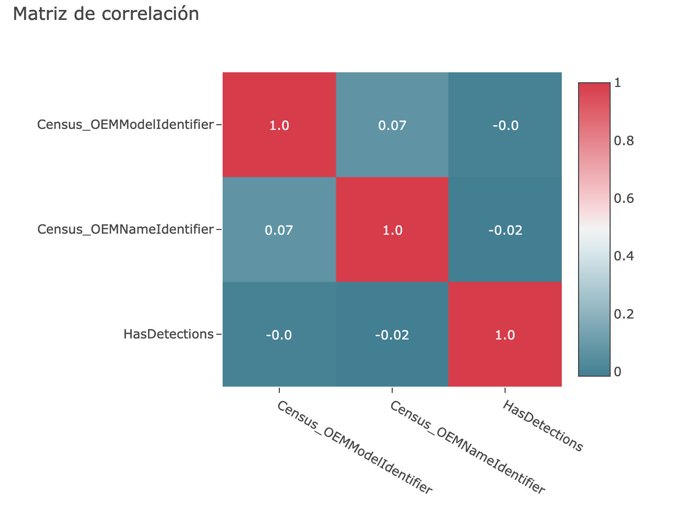

39. **Census_ProcessorCoreCount**: es el número de núcleos lógicos en el procesador. Tiene 45 valores únicos, donde 4 procesadores son los más comunes. Tiene 41306	missings (0.46%).

> `train['Census_ProcessorCoreCount'].value_counts()`

~~~
4.0      5430193
2.0      2311969
8.0       865004
12.0       92702
1.0        70390
6.0        69910
16.0       18551
...
~~~

40. **Census_ProcessorManufacturerIdentifier**: no viene información sobre esta variable en Kaggle y no he encontrado nada acerca en Google. Tiene 41306 missings (0.46%).

> `train['Census_ProcessorManufacturerIdentifier'].value_counts()`

~~~
5.0     7839318
1.0     1040292
10.0        339
3.0         218
9.0           1
7.0           1
4.0           1
~~~

41. **~~Census_ProcessorModelIdentifier~~**: no viene información en Kaggle sobre esta variable. Tiene 41306	missings (0.46%), 3428 valores únicos y presenta una alta correlación con la variable `Census_ProcessorManufacturerIdentifier` de 0.8, por lo se quita.

> `train['Census_ProcessorModelIdentifier'].value_counts()`

~~~
2697.0    289283
1998.0    267397
2660.0    191392
2373.0    175407
1992.0    171728
2382.0    170651
2640.0    153719
...
~~~

~~~python
# Veamos la correlación con la variable Census_ProcessorManufacturerIdentifier

aux.plot_corr(aux.corr(train, ['Census_ProcessorManufacturerIdentifier',
                               'Census_ProcessorModelIdentifier']))
~~~

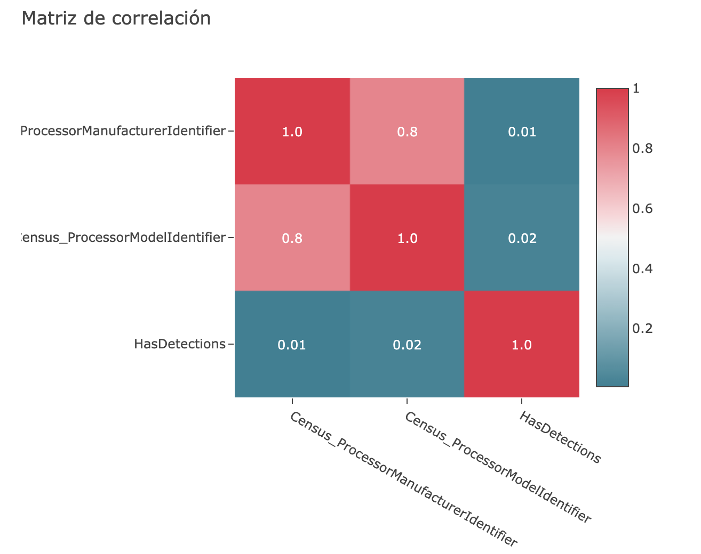    

42. **~~Census_ProcessorClass~~**: da una clasificación de procesadores en alta/media/baja. Esta variable se usaba inicialmente para precios de SKU pero ya no se mantiene ni se actualiza en el pograma de seguridad. Además, cuenta con 8884852 missings (99.59%) por lo que se opta por eliminar, ya que a partir de `SkuEdition` y `Processor` se puede deducir a que gama pertenece el procesador.

> `train['Census_ProcessorClass'].value_counts()`

~~~
NA    8884852
mid     20914
low      9621
high     6096
~~~

43. **Census_PrimaryDiskTotalCapacity**: es la cantidad de espacio en disco en el disco primario de la máquina en MB. Tiene 5735 valores únicos (53016 missings - 0.59%). Está en MB, estaría interesante ver si mejora al pasarlo a GB. Los tamaños de disco más populares son 500GB y 1TB.

> `train['Census_PrimaryDiskTotalCapacity'].value_counts()`

~~~
476940.0     2841530
953869.0     2175780
305245.0      474616
122104.0      469060
...
~~~

44. **Census_PrimaryDiskTypeName**: es el nombre descriptivo del tipo de disco primario (HDD o SSD). Se ve como HDD es mucho más popular que SSD y que UNKNOWN y Unspecified, denotan lo mismo (se deberá pasar a minúscula). Tiene 12844 missings (0.14%).

> `train['Census_PrimaryDiskTypeName'].value_counts()`

~~~
HDD            5806804
SSD            2466808
UNKNOWN         358251
Unspecified     276776
NA               12844
~~~

45. **Census_SystemVolumeTotalCapacity**: es el tamaño de la partición en la que está instalado el volumen del sistema en MB (estaría interesante pasarlos a GB). Existen 536848 tamaños de volumen de sistema únicos (53002 missings - 0.59%).

> `train['Census_SystemVolumeTotalCapacity'].value_counts()`

~~~
28542.0     51998
926992.0    50430
476389.0    44435
953253.0    41572
102400.0    41257
476324.0    40925
...
~~~

46. **Census_HasOpticalDiskDrive**: esta variable es VERDADERO si indica que la máquina tiene una unidad de disco óptico (CD/DVD). La mayoría de los sistemas no tienen una unidad de disco. Por lo que, esta variable podría proporcionar una idea de la antigüedad del hardware, ya que el hardware más antiguo podría correlacionarse con tasas de malware más altas.

> `train['Census_HasOpticalDiskDrive'].value_counts()`

~~~
0    8232858
1     688625
~~~

47. **Census_TotalPhysicalRAM**: da información acerca de la RAM física en MB. Como están en MB, sería interesante convertirlo a GB dividiendo por 1024 y luego crear un grupo de frecuencias. La mayoría de las RAM tienen entre 2 y 8 GB de RAM. Tiene 80533 missings (0.90%).

> `train['Census_TotalPhysicalRAM'].value_counts()`

~~~
4096.0      4094512
8192.0      2196505
2048.0      1097474
16384.0      531558
6144.0       398671
12288.0      159894
...
~~~

48. **Census_ChassisTypeName**: define qué tipo de hardware tiene la máquina (tiene valores numéricos y no numéricos). Los más populares no parecen ser mutuamente excluyentes. Además, tanto Notebook como Portable podrían usarse indistintamente, ya que un Notebook es un Portable, pero a diferencia de una Laptop, un Notebook posee un (ligeramente) menor rendimiento que un Laptop (https://difiere.com/diferencia-laptop-y-notebook/) y también debe pasar a minúscula. Los 5 tipos más comunes son:

> `train['Census_ChassisTypeName'].value_counts()`

~~~
Notebook               5248812
Desktop                1872125
Laptop                  685581
Portable                360903
AllinOne                204295
...
~~~

49. **Census_InternalPrimaryDiagonalDisplaySizeInInches**: da la longitud diagonal física en pulgadas de la pantalla principal. Contiene 785 tamaños de pantalla únicos. Esta variable se puede usar junto con `Census_ChassisTypeName` para diferenciar aún más a los dispositivos.  Lo más probable es que las pantallas más grandes tengan una resolución más alta. Tiene 47134 missings	(0.53%) y los más comunes son:

> `train['Census_InternalPrimaryDiagonalDisplaySizeInInches'].value_counts()`

~~~
15.500000    3047431
13.900000     952078
14.000000     542450
11.600000     319376
21.500000     275337
...
~~~

50. **Census_InternalPrimaryDisplayResolutionHorizontal**: devuelve el número de píxeles en la dirección horizontal de la pantalla interna (número de líneas verticales). Tiene 2180 valores únicos, en donde, los más populares son 1366 y 1920 de resolución. Tiene 46986 missings (0.53%). Estos valores pueden indicar la edad del dispositivo. Las resoluciones más altas probablemente significan que los dispositivos son relativamente nuevos, en comparación con el resto (https://calibracionhd.com/resoluciones-de-pantalla/). Además, tiene una correlación muy alta con `Census_InternalPrimaryDisplayResolutionVertical` (0.9).

> `train['Census_InternalPrimaryDisplayResolutionHorizontal'].value_counts()`

~~~
1366.0    4515064
1920.0    2220648
1280.0     527430
1600.0     501288
1024.0     342620
...
~~~

~~~python
# Veamos la correlación con las demás variables de la resolución

aux.plot_corr(aux.corr(train, ['Census_InternalPrimaryDiagonalDisplaySizeInInches',
                               'Census_InternalPrimaryDisplayResolutionHorizontal',
                               'Census_InternalPrimaryDisplayResolutionVertical']))
~~~

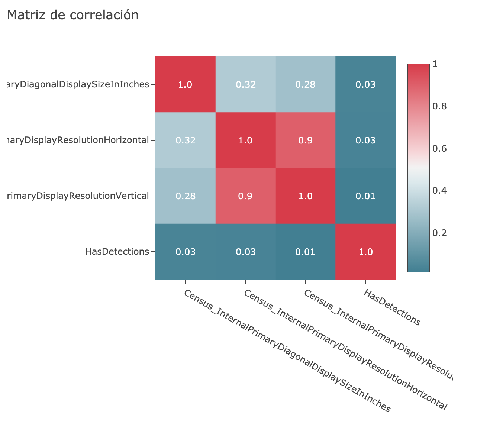    

51. **~~Census_InternalPrimaryDisplayResolutionVertical~~**: devuelve el número de píxeles en la dirección vertical de la pantalla interna (número de líneas horizontales). Tiene 46986 missings (0.53%). Como tiene una correlación muy alta con `Census_InternalPrimaryDisplayResolutionHorizontal` (0.9), puesto que la resolución horizontal y vertical son dependientes, se opta por prescindir de ella, ya que se puede usar la medida de la resolución horizontal para obtener la de la resolución vertical. Tiene 1560 valores únicos, los más comunes son:

> `train['Census_InternalPrimaryDisplayResolutionVertical'].value_counts()`

~~~
768.0     4973621
1080.0    2148402
900.0      655155
800.0      262058
1024.0     186322
...
~~~

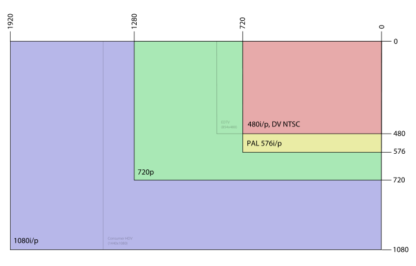   

52. **Census_PowerPlatformRoleName**: indica el perfil de administración de energía preferido por el OEM. Este valor ayuda a identificar el factor de forma básico del dispositivo, tiene una correlación intermedia con las variables `Census_ChassisTypeName` y `Census_MDC2FormFactor`. Tiene 55 missings (0.00%), se debe pasar a minúsculas y combinar Unspecified con UNKNOWN.

> `train['Census_PowerPlatformRoleName'].value_counts()`

~~~
Mobile               6182908
Desktop              2066620
Slate                 492537
Workstation           109683
SOHOServer             37841
UNKNOWN                20628
EnterpriseServer        7094
AppliancePC             4015
PerformanceServer         97
Unspecified                5
~~~

~~~python
# Veamos la correlación con la variable Census_ChassisTypeName

X = train['Census_ChassisTypeName']
y = train['Census_PowerPlatformRoleName']

aux.corr_categorical(X,y)
> 0.46746623939526544
~~~

~~~python
# Veamos la correlación con la variable Census_MDC2FormFactor

X = train['Census_MDC2FormFactor']
y = train['Census_PowerPlatformRoleName']

aux.corr_categorical(X,y)
> 0.4758266883436838
~~~

53. **~~Census_InternalBatteryType~~**: no viene información en Kaggle de esta variable. Esta variable tiene 6338429 missings (71.05%). Aparecen muchas categorías con nombres inconsistentes, como por ejemplo: '#', 'lion', '4cel', 'l & # TAB #'. La mayoría de los dispositivos están entre las 10 primeras categorías. Algunas de estas etiquetas parecen similares, por ejemplo: lion, li-i y liio podrían ser marcadores de posición para baterías de iones de litio, pero debido a estas inconsistencias se opta por prescindir de ella.

> `train['Census_InternalBatteryType'].value_counts()`

~~~
lion        2028256
li-i         245617
#            183998
lip           62099
liio          32635
li p           8383
li             6708
nimh           4614
real           2744
...
~~~

54. **Census_InternalBatteryNumberOfCharges**: no viene información en Kaggle sobre esta variable, pero se puede suponer que es el número de ciclos de batería. Si los ciclos de la batería se establecen en cero, se puede suponer que estos dispositivos se encuentran en el primer ciclo de carga de la batería. Se observa como el 56% de las máquinas están en su primer ciclo de carga de la batería o no funcionan con batería, puesto que al iniciar un ordenador por primera vez, éste debe de estar conectado a la corriente. Tiene 268755 missings (3.01%).

> `train['Census_InternalBatteryNumberOfCharges'].value_counts()`

~~~
0.000000e+00    5053404
4.294967e+09    2252338
1.000000e+00      53810
...
~~~

55. **~~Census_OSVersion~~**: indica la versión del SO de forma numérica (10.0.17134.228). Contiene 469 valores únicos. Se observa como es una variable compuesta por otras (`OsVer`, `Census_OSBuildRevision`, `Census_OSBuildNumber`), por lo que se puede eliminar, ya que se prefiere tener la información de forma separada.

> `train['Census_OSVersion'].value_counts()`

~~~
10.0.17134.228      1413627
10.0.17134.165       899711
10.0.16299.431       546546
10.0.17134.285       470280
10.0.16299.547       346853
10.0.17134.112       346410
...
~~~  

> `train['Census_OSVersion'].head()`

~~~
0    10.0.17134.165
1      10.0.17134.1
2    10.0.17134.165
~~~

> `train['OsVer'].head()`    

~~~
0    10.0.0.0
1    10.0.0.0
2    10.0.0.0
~~~

> `train['Census_OSBuildRevision'].head()`

~~~
0    165
1      1
2    165
~~~

> `train['Census_OSBuildNumber'].head()`

~~~
0    17134
1    17134
2    17134
~~~

~~~python
# Veamos la correlación con la variable OsVer

X = train['OsVer']
y = train['Census_OSVersion']

aux.corr_categorical(X,y)
> 0.0846079076423891
~~~

~~~python
# Veamos la correlación con la variable Platform

X = train['Platform']
y = train['Census_OSVersion']

aux.corr_categorical(X,y)
> 0.5320779917302222
~~~

~~~python
# Veamos la correlación con la variable Census_OSBuildRevision

X = train['Census_OSVersion']
y = train['Census_OSBuildRevision']

aux.corr_categorical(X,y)
> 0.9999891195324985
~~~

56. **~~Census_OSArchitecture~~**: es la arquitectura en la que se basa el sistema operativo. Ya hay una variable `Processor` que nos da esta información (alta correlación de 0.99), por lo que se elimina.

> `train['Census_OSArchitecture'].value_counts()`

~~~
amd64    8105885
x86       815252
arm64        346
~~~

~~~python
# Veamos la correlación con la variable Processor

X = train['Census_OSArchitecture']
y = train['Processor']

aux.corr_categorical(X,y)
> 0.9947207910769047
~~~

57. **~~Census_OSBranch~~**: es la rama del sistema operativo extraída de `OsVersionFull`, tiene 32 valores únicos. Da más información acerca del tipo de plataforma que es. Como amplía a la variable `OsPlatformSubRelease`, es posible prescindir de ella, puesto que es una jerarquía de la misma y tiene una alta correlación con dicha variable. Entonces, se opta por eliminarla, puesto que los primeros valores hacen referencia a los mismos que en `OsVersionFull`.

> `train['Census_OSBranch'].value_counts()`

~~~
rs4_release                  4009158
rs3_release                  1237321
rs3_release_svc_escrow       1199767
rs2_release                   797066
rs1_release                   785534
...
~~~

> `train['OsPlatformSubRelease'].value_counts()`

~~~
rs4           3915526
rs3           2503681
rs2            780270
rs1            730819
...
~~~

> `train[['OsPlatformSubRelease','Census_OSBranch']].groupby(['OsPlatformSubRelease','Census_OSBranch']).size()`

~~~python
# Veamos la correlación que tiene con OsPlatformSubRelease

X = train['Census_OSBranch']
y = train['OsPlatformSubRelease']

aux.corr_categorical(X,y)
> 0.8522534071924249
~~~

58. **~~Census_OSBuildNumber~~**: indica número de compilación del sistema operativo extraído de `OsVersionFull`. Tiene 165 valores únicos y una alta correlación con la variable `OsBuild`, por lo que se elimina.

> `train['Census_OSBuildNumber'].value_counts()`    

~~~
17134    4008881
16299    2443249
15063     797049
14393     785450
10586     593527
...
~~~

~~~python
# Veamos la correlación que tiene con OsBuild

aux.plot_corr(aux.corr(train, ['Census_OSBuildNumber','OsBuild']))
~~~

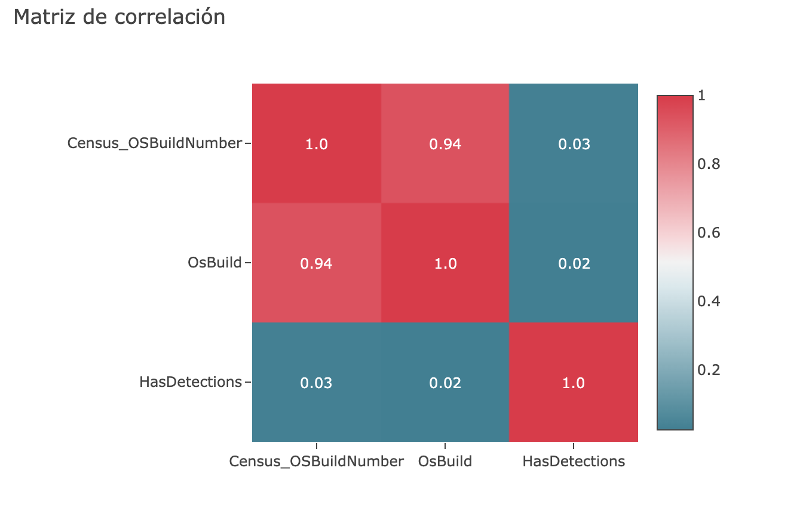    

59. **Census_OSBuildRevision**: indica el valor de compilación del SO extraída de `OsVersionFull` (`OsBuildRevision` = 1000 o 16458). Se observa como coincide con el final de la variable `Census_OSVersion`, por lo que podemos prescindir de `Census_OSVersion`. Tiene 285 valores únicos, los más comunes son:

> `train['Census_OSBuildRevision'].value_counts()`

~~~
228      1413633
165       899712
431       546548
285       470280
547       346853
112       346488
...
~~~

> `train['Census_OSVersion'].value_counts()`

~~~
10.0.17134.228      1413627
10.0.17134.165       899711
10.0.16299.431       546546
10.0.17134.285       470280
10.0.16299.547       346853
10.0.17134.112       346410
...
~~~   

~~~python
# Veamos la correlación con la variable OsBuild

X = train['OsBuild']
y = train['Census_OSBuildRevision']

aux.corr_categorical(X,y)
> 0.31649314140803825
~~~

~~~python
# Veamos la correlación con la variable Census_OSBuildRevision

X = train['Census_OSVersion']
y = train['Census_OSBuildRevision']

aux.corr_categorical(X,y)
> 0.9999891195324985
~~~

60. **Census_OSEdition**: indica la edición del sistema operativo actual, procedente de `HKLM\Software\Microsoft\Windows NT\CurrentVersion@EditionID` en el registro. Tiene 33 valores únicos, los cuales deberán pasarse a minúsculas. Esta columna también puede estar vinculada al tipo de licencia (`Census_ActivationChannel`). Los 5 más comunes son:

> `train['Census_OSEdition'].value_counts()`   

~~~
Core                           3469991
Professional                   3130566
CoreSingleLanguage             1945461
CoreCountrySpecific             166100
ProfessionalEducation            56698
Education                        40704
Enterprise                       35603
ProfessionalN                    28341
...
~~~

~~~python
# Veamos la correlación con la variable Census_ActivationChannel
X = train['Census_ActivationChannel']
y = train['Census_OSEdition']

aux.corr_categorical(X,y)
> 0.5131328802764941
~~~

61. **~~Census_OSSkuName~~**: indica el nombre descriptivo de la edición del sistema operativo (actualmente solo Windows). Tiene 30 valores únicos. Está muy sesgada por un gran número de: 'CORE', 'PROFESSIONAL', 'CORE_SINGLELANGUAGE' y 'CORE_COUNTRYSPECIFIC' y presenta una alta correlación con `Census_OSEdition`. De igual manera, tendremos que pasar a minúscula los valores.

> `train['Census_OSSkuName'].value_counts()`

~~~
CORE                            3469869
PROFESSIONAL                    3187913
CORE_SINGLELANGUAGE             1945133
CORE_COUNTRYSPECIFIC             165886
EDUCATION                         40827
ENTERPRISE                        35602
PROFESSIONAL_N                    28522
ENTERPRISE_S                      20022
...
~~~    

~~~python
# Veamos la correlación con la variable Census_OSEdition

X = train['Census_OSEdition']
y = train['Census_OSSkuName']

aux.corr_categorical(X,y)
> 0.9050844970826697
~~~

62. **Census_OSInstallTypeName**: indica la descripción de qué instalación se utilizó en la máquina. Debemos convertir los valores en minúscula y arreglar inconsistencias ortográficas y/o gramaticales, puesto que he buscado si existe 'UUPUpgrade', y no he encontrado nada.

> `train['Census_OSInstallTypeName'].value_counts()`

~~~
UUPUpgrade        2608037
IBSClean          1650733
Update            1593308
Upgrade           1251559
Other              840121
Reset              649201
Refresh            205842
Clean               69073
CleanPCRefresh      53609
~~~

63. **Census_OSInstallLanguageIdentifier**: no viene información en Kaggle de esta variable, pero parece que está relacionada con el identificador del idioma para el SO. Tiene 39 valores únicos y 60084 missings (0.67%). Presenta una alta correlación con la variable `Census_OSUILocaleIdentifier`.

> `train['Census_OSInstallLanguageIdentifier'].value_counts()`  

~~~
8.0     3179262
9.0     1034201
7.0      512753
29.0     492267
14.0     432503
37.0     403190
...
~~~

~~~python
# Veamos la correlación con otras variables de este mismo tipo

aux.plot_corr(aux.corr(train, ['Census_OSInstallLanguageIdentifier','Census_OSUILocaleIdentifier',
                              'LocaleEnglishNameIdentifier', 'CountryIdentifier', 'CityIdentifier',
                              'OrganizationIdentifier', 'GeoNameIdentifier']))
~~~

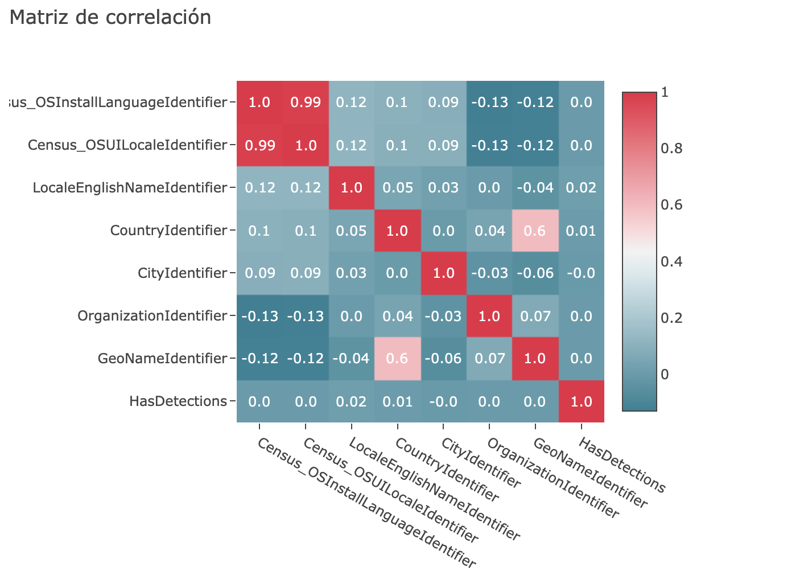    

64. **~~Census_OSUILocaleIdentifier~~**: no viene información en Kaggle de esta variable, tiene 147 valores únicos, en donde los valores que toman 31, 34 y 30 son los 3 principales identificadores locales. Presenta una alta correlación con la variable `Census_OSInstallLanguageIdentifier`, por lo que se opta por eliminar esta variable.

> `train['Census_OSUILocaleIdentifier'].value_counts()`

~~~
31     3170824
34     1040042
30      513995
125     498236
...
~~~

~~~python
# Veamos la correlación con la variable Census_OSInstallLanguageIdentifier

X = train['Census_OSUILocaleIdentifier']
y = train['Census_OSInstallLanguageIdentifier']

aux.corr_categorical(X,y)
> 0.9911874845849825
~~~

65. **Census_OSWUAutoUpdateOptionsName**: indica el nombre descriptivo de la configuración de actualización automática de WindowsUpdate en la máquina. De igual manera, deberemos pasarlos a minúscula.

> `train['Census_OSWUAutoUpdateOptionsName'].value_counts()`

~~~
FullAuto                                 3954497
UNKNOWN                                  2519925
Notify                                   2034254
AutoInstallAndRebootAtMaintenanceTime     371475
Off                                        26961
DownloadNotify                             14371
~~~

66. **Census_IsPortableOperatingSystem**: indica si el sistema operativo se inicia y ejecuta a través de Windows-To-Go en una memoria USB, suponiendo que 0 es FALSO para la portabilidad, es decir, que no se ejecuta en una memoria USB.

> `train['Census_IsPortableOperatingSystem'].value_counts()`

~~~
0    8916619
1       4864
~~~

67. **Census_GenuineStateName**: es el nombre de OSGenuineStateID. Según parece, hace referencia a si la licencia para Windows es original (https://answers.microsoft.com/en-us/windows/forum/windows_7-winapps/genuine-windows7/04a6fe05-56ba-40cc-81d9-93d5dd7a4105, https://support.microsoft.com/en-us/help/4487266/activation-failures-and-not-genuine-notifications-on-vl-win-7-kms-clie). De igual manera, deberemos pasarlos a minúscula.

> `train['Census_GenuineStateName'].value_counts()`

~~~
IS_GENUINE         7877597
INVALID_LICENSE     801692
OFFLINE             228366
UNKNOWN              13826
TAMPERED                 2
~~~

68. **Census_ActivationChannel**: clave de licencia comercial o clave de licencia por volumen para una máquina (https://social.microsoft.com/Forums/en-US/44179f86-f8a6-4dc2-8692-b1637e72280b/windows-license-types-explained?forum=genuinewindows7). De igual manera, deberemos pasarlos a minúscula.

    - *Retail*: las claves de productos minoristas son lo que obtiene el cliente cuando compra un producto empaquetado  de Windows de un comerciante minorista o compra Windows en línea en la tienda de Microsoft.
    - *OEM SLP y COA SLP*: las claves de producto OEM SLP y COA SLP son emitidas por grandes fabricantes de computadoras y utilizan la tecnología SLP (System Locked Pre-installation) para vincular la licencia a la placa base original a través del BIOS y el software.
    - *OEM System Builder*: las claves de producto son para el uso de constructores de sistemas más pequeños, talleres informáticos, consultores y otros que proporcionan computadoras y servicios a sus clientes. La licencia de System Builder define a un creador de sistemas como "un fabricante de equipos originales, un ensamblador, un restaurador o un preinstalador de software que vende los sistemas del dliente a un tercero".
    - *GVLK* (clave de licencia por volumen de grupo): es solo un acrónimo de una versión de licencia por volumen de Windows. Principalmente disponible para grandes empresas e instituciones gubernamentales y viene con soporte premium. GLVK también necesita un KMS (servicio de administración de claves) para la implementación.
    - *OEM NON-SLP*: significa claves de licencia de un OEM pero no está vinculado a un System Locked Pre-installation. Las claves OEM no se pueden revender y no se pueden transferir a otra computadora. Sin embargo, pueden transferirse con la computadora si la computadora se transfiere a una nueva propiedad.
    - *Volume MAK*: las claves de producto KMS Client y Volume MAK son claves de licencia por volumen que no se pueden revender. Son emitidos por organizaciones para su uso en equipos cliente asociados de alguna manera con la organización. Las claves de licencia por volumen no se pueden transferir con la computadora si la computadora cambia de propietario.

> `train['Census_ActivationChannel'].value_counts()`

~~~
Retail            4727589
OEM:DM            3413350
Volume:GVLK        450954
OEM:NONSLP         317980
Volume:MAK           8028
Retail:TB:Eval       3582
~~~

69. **~~Census_IsFlightingInternal~~**: en el contexto de Windows Defender, 'flighting' significa poner a disposición nuevas funciones de desarrollo lo antes posible, durante el ciclo de desarrollo. Esto no se refiere a un lanzamiento público. Probablemente, hace referencia a desarollos internos referentes a la comunidad de Windows Insider (https://docs.microsoft.com/en-us/windows/deployment/update/waas-overview). Tiene 7408759 missings (83.04%) y 21 observaciones solo para una categoría, por lo que se elimina.

> `train['Census_IsFlightingInternal'].value_counts()`

~~~
NA     7408759
0.0    1512703
1.0         21
~~~

70. **Census_IsFlightsDisabled**: indica si la variable está en 'flighting'. Se ve como la mayoría de los dispositivos tienen habilitado el 'flighting'. Lo que significa que la mayoría de estas máquinas son del programa Windows Insider. Con Windows 10, esta función permite a los Insiders de Windows consumir e implementar código de preproducción en sus máquinas de prueba, obteniendo visibilidad temprana en la próxima compilación. En el pasado, cuando Microsoft desarrollaba nuevas versiones de Windows, generalmente lanzaba avances técnicos cerca del final del proceso, cuando Windows estaba casi listo para su lanzamiento. Con Windows 10, las nuevas características se entregarán a la comunidad de Windows Insider lo antes posible, durante el ciclo de desarrollo, a través de un proceso llamado 'flighting', para que las organizaciones puedan ver exactamente lo que Microsoft está desarrollando y comenzar sus pruebas lo antes posible (https://docs.microsoft.com/en-us/windows/deployment/update/waas-overview). Tiene 160523 missings (1.80%).

> `train['Census_IsFlightsDisabled'].value_counts()`

~~~
0.0    8760872
1.0         88
~~~

71. **Census_FlightRing**: indica el anillo para el que el usuario del dispositivo desea recibir 'flights'. De igual manera, deberemos pasarlos a minúscula.

> `train['Census_FlightRing'].value_counts()`

~~~
Retail      8355679
NOT_SET      287803
Unknown      243438
WIS           10648
WIF           10322
RP             9860
Disabled       3722
OSG               7
Canary            3
Invalid           1
~~~

72. **~~Census_ThresholdOptIn~~**: no viene información en Kaggle sobre esta variable. Tiene 5667325 missings (63.52%) y 816 valores para una categoría, siendo predominante el 0, por lo se opta por prescindir de ella.

> `train['Census_ThresholdOptIn'].value_counts()`

~~~
NA     5667325
0.0    3253342
1.0        816
~~~

73. **Census_FirmwareManufacturerIdentifier**: no viene información en Kaggle de esta variable, pero es el identificador de fabricantes del firmware. El firmware, también conocido como soporte lógico inalterable, es el programa básico que controla los circuitos electrónicos de cualquier dispositivo (https://www.xataka.com/basics/que-firmware-que-se-diferencia-drivers). Tiene 712 valores únicos, con la mayoría concentrada en los 5 principales (tiene 183257 missings - 2.05%).

> `train['Census_FirmwareManufacturerIdentifier'].value_counts()`

~~~
142.0     2699078
628.0     1229140
554.0     1175137
355.0      941793
556.0      800536
...
~~~

74. **Census_FirmwareVersionIdentifier**: no viene información en Kaggle sobre esta varaible, pero puede ser el identificador de la versión del firmware. Tiene alrededor de 50K valores únicos y 160133 missings (1.79%). No presenta correlación con la variable `Census_FirmwareManufacturerIdentifier`.

> `train['Census_FirmwareVersionIdentifier'].value_counts()`

~~~
33105.0    89611
33111.0    61583
33054.0    56626
33108.0    55040
11778.0    53785
....
~~~

75. **Census_IsSecureBootEnabled**: indica si el modo de arranque seguro está habilitado. Microsoft Secure Boot es un componente del sistema operativo Windows 8 de Microsoft que se basa en la funcionalidad de inicio seguro de la especificación UEFI para ayudar a evitar que se carguen aplicaciones de software malicioso y sistemas operativos "no autorizados" durante el proceso de inicio del sistema. Se ve como este criterio se reparte en 50-50 observaciones, por lo que nos puede parecer que es una variable determinante a la hora de decidir si el dispositivo se va a infectar o no.

> `train['Census_IsSecureBootEnabled'].value_counts()`

~~~
0    4585438
1    4336045
~~~

76. **~~Census_IsWIMBootEnabled~~**: no viene información de esta variable en Kaggle. WimBoot es una forma alternativa para que los OEM implementen Windows. Una implementación de WimBoot arranca y ejecuta Windows directamente desde un archivo de imagen comprimido de Windows (WIM). Este archivo WIM es inmutable y el acceso al mismo es administrado por un nuevo controlador de filtro del sistema de archivos (WoF.sys). El resultado es una reducción significativa en el espacio en disco requerido para instalar Windows. Tiene solo un único valor para (1), y 5659703 missings (63.44%), por lo que podemos prescindir de ella (https://docs.microsoft.com/en-us/windows/win32/w8cookbook/windows-image-file-boot--wimboot-).


> `train['Census_IsWIMBootEnabled'].value_counts()`

~~~
NA     5659703
0.0    3261779
1.0          1
~~~

77. **Census_IsVirtualDevice**: identifica si es una máquina virtual. Tiene 15953 missings (0.18%).

> `train['Census_IsVirtualDevice'].value_counts()`

~~~
0.0    8842840
1.0      62690
NA       15953
~~~

78. **Census_IsTouchEnabled**: responde a la pregunta de si es un dispositivo táctil, donde la mayoría (0) no lo son.

> `train['Census_IsTouchEnabled'].value_counts()`

~~~
0    7801452
1    1120031
~~~

> `train[['Census_IsTouchEnabled','HasDetections']].groupby(['Census_IsTouchEnabled','HasDetections']).size()`

~~~
Census_IsTouchEnabled  HasDetections
0                      0                3842617
                       1                3958835
1                      0                 619974
                       1                 500057
~~~

79. **Census_IsPenCapable**: responde a la pregunta de si el dispositivo es capaz de introducir el lápiz (relacionado un poco con si el dispositivo es táctil o no), donde la mayoría (0) no lo son.

> `train['Census_IsPenCapable'].value_counts()`

~~~
0    8581834
1     339649
~~~

~~~python
# Veamos la correlación que tiene con Census_IsTouchEnabled

aux.plot_corr(aux.corr(train, ['Census_IsPenCapable','Census_IsTouchEnabled']))
~~~

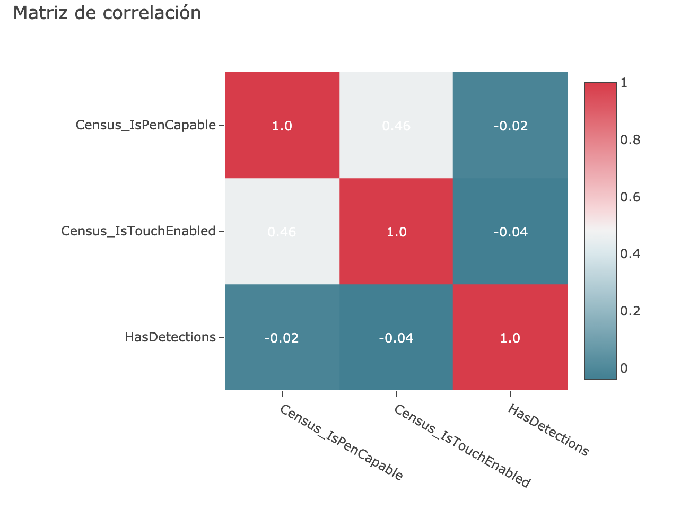    

80. **Census_IsAlwaysOnAlwaysConnectedCapable**: recupera información sobre si la batería permite que el dispositivo se conecte Always-On-Always-Connected. Por ejemplo, para especificar si el Wi-Fi debe permanecer encendido cuando la pantalla entra en reposo, se establece Always-On-Always-Connected (https://docs.microsoft.com/en-us/previous-versions/system-center/system-center-2012-R2/gg682088(v=technet.10)?redirectedfrom=MSDN). La variable vale 0 o DESACTIVADO si se desactiva el Wi-Fi cuando la pantalla se apaga. Para mantener la opción de Wi-Fi activado es en `Configuración > Wi-Fi> Manage`. La variable vale 1 o ACTIVADO si permite que el Wi-Fi esté siempre activado de manera predeterminada cuando la pantalla se apaga. Tiene 71343 missings	(0.80%).

> `train['Census_IsAlwaysOnAlwaysConnectedCapable'].value_counts()`
~~~
0.0    8341972
1.0     508168
NA       71343
~~~

81. **Wdft_IsGamer**: indica si el dispositivo es un dispositivo de jugador o no según su combinación de hardware, puesto que de normal las prestaciones de un ordenador gamer suelen ser muy altas. Tiene 303451 missings (3.40%).

> `train['Wdft_IsGamer'].value_counts()`

~~~
0.0    6174143
1.0    2443889
NA      303451
~~~

> `train[['Wdft_IsGamer', 'HasDetections']].groupby(['Wdft_IsGamer', 'HasDetections']).size()`

~~~
Wdft_IsGamer  HasDetections
0.0           0                3197504
              1                2976639
1.0           0                1119559
              1                1324330
~~~

82. **Wdft_RegionIdentifier**: no hay información sobre esta variable en Kaggle, tiene 15 valores únicos. La documentación de Microsoft menciona que es un identificador regional. Como no tiene casi correlación con otras variables, la dejamos. Tiene 303451 missings (3.40%).

> `train['Wdft_RegionIdentifier'].value_counts()`

~~~
10.0    1800105
11.0    1347828
3.0     1295892
1.0     1232258
15.0    1017591
7.0      597297
8.0      276029
13.0     225130
5.0      205372
12.0     163711
6.0      158163
4.0      135567
9.0       79882
2.0       79385
14.0       3822
~~~

~~~python
# Veamos la correlación con los demás identificadores de "regiones"

aux.plot_corr(aux.corr(train, ['Wdft_RegionIdentifier','CountryIdentifier',
                               'CityIdentifier','OrganizationIdentifier','GeoNameIdentifier']))
~~~

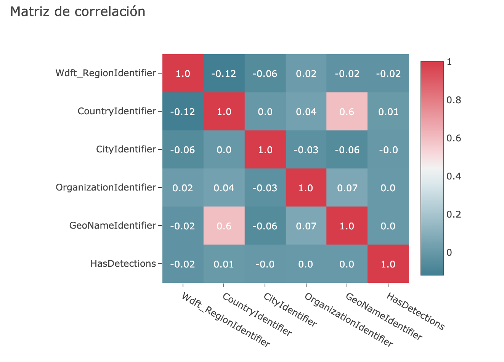    

83. **HasDetections**: es la variable target, la que tenemos que predecir, y está partida en un 50% para ordenadores sin malware (0) y en otro 50% para ordenadores con malware (1).

> `train['HasDetections'].value_counts()`

~~~
0    4462591
1    4458892
~~~

----

**Estudio de que variables tenedríamos que quitar, a partir de los análisis que hemos realizado previamente**

Con el análisis exhaustivo que acabamos de realizar de las variables, tendríamos que quitar las siguientes variables (las justificaciones se pueden encontrar en la explicación de cada variable). De primeras, este estudio es el que tengo en cuenta para limpiar el dataset. A continuación, una vez eliminadas, paso a estudiar en el preprocesamientos correlación, outliers, asimetría... (ver notebook `2-MicrosoftMalwarePrediction-Preprocesamiento.ipynb`)

1. `MachineIdentifier`
2. `AvSigVersion`
3. `DefaultBrowsersIdentifier`
4. `AVProductStatesIdentifier`
5. `GeoNameIdentifier`
6. `OsBuildLab`
7. `AutoSampleOptIn`
8. `Census_ProcessorModelIdentifier`
9. `Census_ProcessorClass`
10. `Census_InternalPrimaryDisplayResolutionVertical`
11. `Census_InternalBatteryType`
12. `Census_OSVersion`
13. `Census_OSArchitecture`
14. `Census_OSBranch`
15. `Census_OSBuildNumber`
16. `Census_OSSkuName`
17. `Census_IsFlightingInternal`
18. `Census_ThresholdOptIn`
19. `Census_OSUILocaleIdentifier`
20. `Census_IsWIMBootEnabled`

Como hemos visto, respecto al análisis para saber aquellas variables que tienen más de un 60% de missings, tendríamos que quitar:

- ~~`DefaultBrowsersIdentifier`~~
- `PuaMode` (se estudia en el notebook de `2-MicrosoftMalwarePrediction-Preprocesamiento.ipynb`)
- ~~`Census_ProcessorClass`~~
- ~~`Census_InternalBatteryType`~~
- ~~`Census_IsFlightingInternal`~~
- ~~`Census_ThresholdOptIn`~~
- ~~`Census_IsWIMBootEnabled`~~

Como hemos visto, respecto el análisis realizado para saber la asimetría de las variables tendríamos que quitar estas las variables que tienen más de un 80% de observaciones para la primera categoría. No obstante, aplicar esta medida reduciría de manera considerable la dimensionalidad del dataset, eliminando información importante como hemos comentado antes, por ejemplo `IsBeta` que nos indica si el programa de seguridad es una beta o no.

- ~~`Census_IsWIMBootEnabled`~~
- `IsBeta`
- `Census_IsFlightsDisabled`
- ~~`Census_IsFlightingInternal`~~
- ~~`AutoSampleOptIn`~~
- ~~`Census_ThresholdOptIn`~~
- `SMode`
- `Census_IsPortableOperatingSystem`
- `PuaMode` (se estudia en el notebook de 2-MicrosoftMalwarePrediction-Preprocesamiento.ipynb)
- `Census_DeviceFamily`
- `UacLuaenable`
- `Census_IsVirtualDevice`
- `ProductName`
- `HasTpm`
- `IsSxsPassiveMode`
- `Firewall`
- `AVProductsEnabled`
- `RtpStateBitfield`
- `OsVer`
- `Platform`
- `Census_IsPenCapable`
- `IsProtected`
- `Census_IsAlwaysOnAlwaysConnectedCapable`
- `Census_FlightRing`
- `Census_HasOpticalDiskDrive`
- ~~`Census_OSArchitecture`~~
- `Processor`
- `Census_GenuineStateName`
- `Census_ProcessorManufacturerIdentifier`
- `Census_IsTouchEnabled`

----
