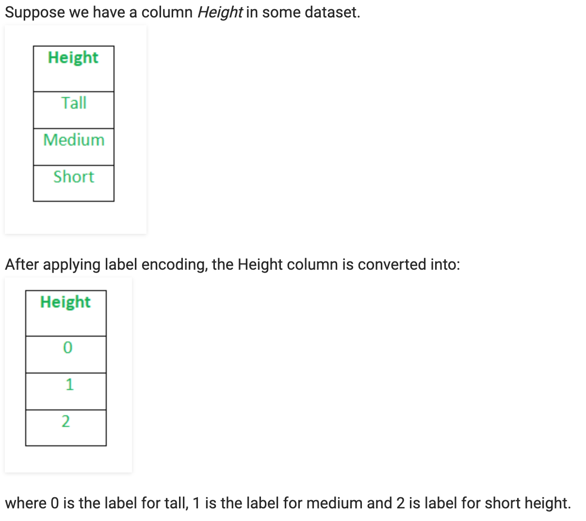

#### Contenido - Preprocesamiento de los Datos (tratar y limpiar los datos)

- [0. Importación de las librerías](#0.-Importación-de-las-librerías)
- [3. Preprocesamiento de los datos](#3.-Preprocesamiento-de-los-datos)
    - [Lectura de los datos](#Lectura-de-los-datos)
    - [Eliminar variables que no aportan información](#Eliminar-variables-que-no-aportan-información)
    - [Análisis de Componentes Principales (PCA)](#Análisis-de-Componentes-Principales-(PCA))
    - [Missings](#Missings)
        - [Missings por columnas](#Missings-por-columnas)
        - [Missings por filas](#Missings-por-filas)
    - [Pasar a minúsculas las variables categóricas](#Pasar-a-minúsculas-las-variables-categóricas)
    - [Transformar variables](#Transformar-variables)
        - [(1) Transformar missings a 'unknown' en variables categóricas](#(1)-Transformar-missings-a-'unknown'-en-variables-categóricas)
        - [(2) Fusionar la etiqueta 'unspecified' con 'unknown'](#(2)-Fusionar-la-etiqueta-'unspecified'-con-'unknown')
        - [(3) Fusionar la etiqueta 'portable' con 'notebook' en `Census_ChassisTypeName`](#(3)-Fusionar-la-etiqueta-'portable'-con-'notebook'-en-Census_ChassisTypeName)
        - [(4) Cambiar la etiqueta 'promt' por 'prompt' en `SmartScreen`](#(4)-Cambiar-la-etiqueta-'promt'-por-'prompt'-en-SmartScreen)
        - [(5) Arreglar `Census_OSEdition`](#(5)-Arreglar-Census_OSEdition)
        - [(6) Arreglar `Census_OSInstallTypeName`](#(6)-Arreglar-Census_OSInstallTypeName)
        - [(7) Agrupar valores de `Census_TotalPhysicalRAM`](#(7)-Agrupar-valores-de-Census_TotalPhysicalRAM)
        - [(8) Agrupar valores de `Census_SystemVolumeTotalCapacity`](#(8)-Agrupar-valores-de-Census_SystemVolumeTotalCapacity)
        - [(9) Agrupar valores de `Census_PrimaryDiskTotalCapacity`](#(9)-Agrupar-valores-de-Census_PrimaryDiskTotalCapacity)
    - [Outliers](#Outliers)
    - [Correlación](#Correlación)
        - [Label Encoding para columnas categóricas](#Label-Encoding-para-columnas-categóricas)
        - [Estudiar la correlación](#Estudiar-la-correlación)
    - [Guardar los datos](#Guardar-los-datos)    

# Microsoft Malware Prediction 

## Preprocesamiento de los Datos (tratar y limpiar los datos) 

Una vez que disponemos de un análisis descriptivo de los datos, vamos a realizar el preprocesamiento y tratamiento a los mismos.

-----

## 0. Importación de las librerías <a name="0.-Importación-de-las-librerías"></a>


```python
import pandas as pd
import plotly.graph_objs as go
import plotly.express as px
import scipy.stats as ss
import fun_auxiliares as aux
import numpy as np

from plotly import tools
from plotly.offline import init_notebook_mode, iplot
from sklearn.preprocessing import LabelEncoder

pd.set_option('display.max_columns', 500)
```

------

## 3. Preprocesamiento de los datos <a name="3.-Preprocesamiento-de-los-datos"></a>

Debemos tener en cuenta, que los cambios que hagamos para train, deberán aplicarse inmediatamente al conjunto test, así que iremos aplicando a la par las modificaciones para ambos juntos de datos.

### Lectura de los datos <a name="Lectura-de-los-datos"></a>

Tal y como hemos visto en el notebook `1-MicrosoftMalwarePrediction-CargarVisualizar`, es necesario cambiar el tipo de los datos, si queremos reducir el espacio de memoria ocupada. Para ello, hemos guardado en un fichero JSON, el diccionario con las variables y sus nuevos tipos de datos.


```python
# Leemos el fichero json
import json

with open('datos/datatype.json', 'r') as myfile:
    data = myfile.read()

# Obtenemos los tipos de datos para el train
dtypes_train = json.loads(data) # Parse file

# Hacemos una copia de los tipos de datos a modificar para test
dtypes_test = dtypes_train.copy()

# Eliminamos la variable 'target'
del dtypes_test['HasDetections']
```


```python
# Lectura de nuevo del conjunto de entrenamiento, con los tipos de datos que hemos definido
train = pd.read_csv("./datos/train_malware.csv", dtype = dtypes_train)
```


```python
# Lectura de nuevo del conjunto de test, con los tipos de datos que hemos definido
test = pd.read_csv("./datos/test_malware.csv", dtype = dtypes_test)
```

### Eliminar variables que no aportan información <a name="Eliminar-variables-que-no-aportan-información"></a>

A partir de lo comentado anteriormente vamos a quitar las siguientes variables, cuya justificación se puede ver en el notebook `1-MicrosoftMalwarePrediction-CargarVisualizar`.

1. `MachineIdentifier`
2. `AvSigVersion`
3. `DefaultBrowsersIdentifier`
4. `AVProductStatesIdentifier`
5. `GeoNameIdentifier`
6. `OsBuildLab`
7. `AutoSampleOptIn`
8. `Census_ProcessorModelIdentifier`
9. `Census_ProcessorClass`
10. `Census_InternalPrimaryDisplayResolutionVertical`
11. `Census_InternalBatteryType`
12. `Census_OSVersion`
13. `Census_OSArchitecture`
14. `Census_OSBranch`
15. `Census_OSBuildNumber`
16. `Census_OSSkuName`
17. `Census_IsFlightingInternal`
18. `Census_ThresholdOptIn`
19. `Census_OSUILocaleIdentifier`
20. `Census_IsWIMBootEnabled`


```python
# Definimos las variables a eliminar
variables_eliminar0 = ['MachineIdentifier', 'AvSigVersion', 'DefaultBrowsersIdentifier', 'AVProductStatesIdentifier',
                       'GeoNameIdentifier', 'OsBuildLab', 'AutoSampleOptIn', 'Census_ProcessorModelIdentifier',
                       'Census_ProcessorClass', 'Census_InternalPrimaryDisplayResolutionVertical',
                       'Census_InternalBatteryType', 'Census_OSVersion', 'Census_OSArchitecture',
                       'Census_OSBranch', 'Census_OSBuildNumber', 'Census_OSSkuName', 'Census_IsFlightingInternal',
                       'Census_ThresholdOptIn', 'Census_OSUILocaleIdentifier', 'Census_IsWIMBootEnabled']
```

<ins>Conjunto train<ins>


```python
# Hacemos una copia del conjunto de datos
train_reduce = train.copy()

# Eliminamos las variables en el conjunto train
train_reduce.drop(variables_eliminar0, axis=1, inplace=True)

# Obtenemos la dimensión
("Original:", train.shape, 'Filtrado:', train_reduce.shape)
```


    ('Original:', (8921483, 83), 'Filtrado:', (8921483, 63))


<ins>Conjunto test<ins>


```python
# Hacemos una copia del conjunto de datos
test_reduce = test.copy()

# Eliminamos las variables en el conjunto test
test_reduce.drop(variables_eliminar0, axis=1, inplace=True)

# Obtenemos la dimensión
("Original:", test.shape, 'Filtrado:', test_reduce.shape)
```


    ('Original:', (7853253, 82), 'Filtrado:', (7853253, 62))


Por tanto, hemos pasado de tener **83 variables a 63 para train**, y de **82 a 62 para test**, por lo que hemos conseguido reducir dimensionalidad y la carga de trabajo que pueda ser. A continuación, veamos como está la **distribución de las variables categóricas, numéricas y binarias, con las nuevas variables eliminadas**, solamente para el conjunto de datos train.


```python
# Encontrar variables binarias
variables_binarias = [c for c in train_reduce.columns if train_reduce[c].nunique() == 2]

# Encontrar variables categóricas
variables_categoricas = [c for c in train_reduce.select_dtypes(include='category').columns
                         if (c not in variables_binarias)]

# Encontrar variables numéricas
variables_numericas = [c for c in train_reduce.columns if (c not in variables_categoricas)
                       & (c not in variables_binarias)]

# La suma de la longitud de las tres variables debe de dar 65
longitud = len(variables_binarias)+len(variables_categoricas)+len(variables_numericas)
print("Las variables totales para train son", longitud)

variables = {
    'binarias': len(variables_binarias),
    'numericas': len(variables_numericas),
    'categoricas': len(variables_categoricas),
}

pie = go.Pie(labels=list(variables.keys()), values=list(variables.values()))
layout = dict(title="Tipos de variables para TRAIN filtrado", title_x=0, height=400, width=700)
fig = dict(data=[pie], layout=layout)
iplot(fig)
```

    Las variables totales para train son 63


----

### Análisis de Componentes Principales (PCA) <a name="Análisis-de-Componentes-Principales-(PCA)"></a>

El **método de componentes principales** tiene por objeto transformar un conjunto de variables, a las que se denomina originales, en un nuevo conjunto de variables denominadas componentes principales. Estas últimas se caracterizan por estar incorrelacionadas entre sí y, además, pueden ordenarse de acuerdo con la información que llevan incorporada (http://www.estadistica.net/Master-Econometria/Componentes_Principales.pdf). No obstante, dado que al realizar un análisis de componentes principales, perdemos la interpretabilidad de los datos, no se obta por realizar este tipo de procesos, puesto que nuestro objetivo final reside en que podamos tener el significado de cada variable.

----

### Missings <a name="Missings"></a>

#### Missings por columnas <a name="Missings-por-columnas"></a>

En el notebook `1-MicrosoftMalwarePrediction-CargarVisualizar`, obtuvimos que 7 variables tienen más de 60% de observaciones vacías, no obstante 6 de ellas, fueron eliminadas en el estudio de las variables. Como se observa `PuaMode` no ha sido eliminada, veamos si la vamos a eliminar o no.

1. ~~`DefaultBrowsersIdentifier`~~
2. `PuaMode`
3. ~~`Census_ProcessorClass`~~
4. ~~`Census_InternalBatteryType`~~
5. ~~`Census_IsFlightingInternal`~~
6. ~~`Census_ThresholdOptIn`~~
7. ~~`Census_IsWIMBootEnabled`~~


```python
# Obtener las variables con más de un 60% de observaciones vacías (solo queda 1)
train_reduceNA = aux.assess_NA(train_reduce)
train_reduce60 = train_reduceNA.loc[train_reduceNA['PorcentajeNA'] > 60]
train_reduce60.sort_values('PorcentajeNA', ascending=False)
```

    /Users/gema/Desktop/TFM/codigo/fun_auxiliares.py:44: FutureWarning:

    Sorting because non-concatenation axis is not aligned. A future version
    of pandas will change to not sort by default.

    To accept the future behavior, pass 'sort=False'.

    To retain the current behavior and silence the warning, pass 'sort=True'.


<div>

<table border="1" class="dataframe">
  <thead>
    <tr style="text-align: right;">
      <th></th>
      <th>TotalNA</th>
      <th>PorcentajeNA</th>
    </tr>
  </thead>
  <tbody>
    <tr>
      <th>PuaMode</th>
      <td>8919174</td>
      <td>99.97</td>
    </tr>
  </tbody>
</table>
</div>


<ins>`PuaMode`<ins>

Esta variable indica si está el modo PUA habilitado desde el servicio (a función de protección de aplicaciones potencialmente no deseadas (PUA) en Windows Defender Antivirus puede identificar y bloquear la descarga e instalación de PUA en puntos finales de su red). Como tiene casi un 99.97% de variables faltantes, además, con una categoría fuertemente predominante, se decide prescindir de ella (eliminar tanto en train como test).


```python
train_reduce['PuaMode'].value_counts()
```


    on       2307
    audit       2
    Name: PuaMode, dtype: int64


```python
# Definimos las variables a eliminar
variables_eliminar1 = ['PuaMode']

# Eliminamos las variables en el conjunto train
train_reduce.drop(variables_eliminar1, axis=1, inplace=True)

# Eliminamos las variables en el conjunto test
test_reduce.drop(variables_eliminar1, axis=1, inplace=True)
```

#### Missings por filas <a name="Missings-por-filas"></a>

No solamente es importante eliminas columnas (variables), sino que es interesante ver que filas totales (observaciones) podemos eliminar. En el notebook `1-MicrosoftMalwarePrediction-CargarVisualizar`, comentamos que una buena idea para reducir la dimensionalidad del dataset, era eliminar las celdas de las variables que disponían de un bajo número de missings, en relación al conjunto total. Para ello, vamos a obtener aquellas variables que tienen menos de un 0.5% de missings:

- `Census_ProcessorCoreCount`
- `Census_ProcessorManufacturerIdentifier`
- `AVProductsEnabled`
- `AVProductsInstalled`
- `IsProtected`
- `RtpStateBitfield`
- `Census_IsVirtualDevice`
- `Census_PrimaryDiskTypeName`
- `UacLuaenable`
- `Census_ChassisTypeName`
- `Census_PowerPlatformRoleName`

El hecho de haber cogido las variables con menos de un 0.5% de missings, se ha debido a que la variable `IsProtected`, la cual se considera muy importante para discriminar si se ha infectado o no un dispositivo de malware, tiene 0.4% de observaciones vacías, por lo que al eliminar dichas filas, estamos eliminando ruido que puede perjudicar a la predicción.


```python
# Obtener las variables con menos de un 0.5 de observaciones vacías (6)
train_reduceNA = aux.assess_NA(train_reduce)
train_reduce05 = train_reduceNA.loc[train_reduceNA['PorcentajeNA'] < 0.5]
train_reduce05.sort_values('PorcentajeNA', ascending=False)
```


<div>
<table border="1" class="dataframe">
  <thead>
    <tr style="text-align: right;">
      <th></th>
      <th>TotalNA</th>
      <th>PorcentajeNA</th>
    </tr>
  </thead>
  <tbody>
    <tr>
      <th>Census_ProcessorCoreCount</th>
      <td>41306</td>
      <td>0.46</td>
    </tr>
    <tr>
      <th>Census_ProcessorManufacturerIdentifier</th>
      <td>41313</td>
      <td>0.46</td>
    </tr>
    <tr>
      <th>AVProductsEnabled</th>
      <td>36221</td>
      <td>0.41</td>
    </tr>
    <tr>
      <th>AVProductsInstalled</th>
      <td>36221</td>
      <td>0.41</td>
    </tr>
    <tr>
      <th>IsProtected</th>
      <td>36044</td>
      <td>0.40</td>
    </tr>
    <tr>
      <th>RtpStateBitfield</th>
      <td>32318</td>
      <td>0.36</td>
    </tr>
    <tr>
      <th>Census_IsVirtualDevice</th>
      <td>15953</td>
      <td>0.18</td>
    </tr>
    <tr>
      <th>Census_PrimaryDiskTypeName</th>
      <td>12844</td>
      <td>0.14</td>
    </tr>
    <tr>
      <th>UacLuaenable</th>
      <td>10838</td>
      <td>0.12</td>
    </tr>
    <tr>
      <th>Census_ChassisTypeName</th>
      <td>623</td>
      <td>0.01</td>
    </tr>
    <tr>
      <th>Census_PowerPlatformRoleName</th>
      <td>55</td>
      <td>0.00</td>
    </tr>
  </tbody>
</table>
</div>


```python
# Obtenemos las variables de las cuales vamos a eliminar sus datos faltantes
filas_eliminar0 = list(train_reduce05.index.values)

# Eliminamos en train con 'dropna' o exlucuyendo los nulls
# train_new[train_new["variable"].notnull()]
for f in filas_eliminar0: train_reduce = train_reduce.dropna(subset=[f])
```


```python
print("Original", train.shape, "- Filtrado", train_reduce.shape)
print("Eliminados", train.shape[0]-train_reduce.shape[0])
```

    Original (8921483, 83) - Filtrado (8774060, 62)
    Eliminados 147423


**Esta operación que acabamos de hacer aquí, no se realizará en el conjunto test**.

Por otro lado, se ha obviado imputar los valores perdidos, porque como bien dijimos, esta opción la he descartado por varias razones, la principal es que las medidas o características de una máquina que disponemos en los datos, pueden ser determinantes para decidir si una máquina se va infectar o no de malware, por lo que en muchos casos el valor faltante beneficiría en lugar de su imputación. Además, disponemos tanto de variables categóricas como numéricas, algunas con muchos valores, por lo que tendríamos un bajo porcentaje para aceptar el dato de la celda correspondiente. Otra opción que se podría aplicar aquí, sería imputar valores faltantes a partir de filas completas, es decir, rellenar los datos faltantes a partir de similitudes con filas completas que sí tengan ese dato faltante. Sin embargo, descarto esta opción por el mismo motivo que antes, y es que una máquina puede coincidir con las mismas características que otra, excepto en un valor, en donde dicho valor puede ser determinante para diagnosticar el dispositivo.

----

### Pasar a minúsculas las variables categóricas <a name="Pasar-a-minúsculas-las-variables-categóricas"></a>

Como vimos en `1-MicrosoftMalwarePrediction-CargarVisualizar`, hay variables categóricas con etiquetas o valores en mayúsculas y minúsculas. También hay algunas inconsistencias, como que la variable `SmartScreen` tiene *Off* y *off* y que significan lo mismo. Por tanto, vamos a analizar dichas variables categóricas para pasar todos los valores a minúsculas en train y test.


```python
# Obtenemos las variables categóricas que hemos calculado antes
variables_categoricas
```


    ['ProductName',
     'EngineVersion',
     'AppVersion',
     'Platform',
     'Processor',
     'OsVer',
     'OsPlatformSubRelease',
     'SkuEdition',
     'SmartScreen',
     'Census_MDC2FormFactor',
     'Census_DeviceFamily',
     'Census_PrimaryDiskTypeName',
     'Census_ChassisTypeName',
     'Census_PowerPlatformRoleName',
     'Census_OSEdition',
     'Census_OSInstallTypeName',
     'Census_OSWUAutoUpdateOptionsName',
     'Census_GenuineStateName',
     'Census_ActivationChannel',
     'Census_FlightRing']


De las variables anteriores, las únicas que tienen valores tanto en mayúsculas como en minúsculas son las siguientes(no obstante, pasaremos a minúscula todas):

- `SkuEdition`
- `SmartScreen`
- `Census_MDC2FormFactor`
- `Census_DeviceFamily`
- `Census_PrimaryDiskTypeName`
- `Census_ChassisTypeName`
- `Census_PowerPlatformRoleName`
- `Census_OSEdition`
- `Census_OSInstallTypeName`
- `Census_OSWUAutoUpdateOptionsName`
- `Census_ActivationChannel`

<ins>Conjunto train<ins>


```python
# Convertir a minúscula las variables categóricas para train
train_reduce[variables_categoricas] = train_reduce[variables_categoricas].apply(lambda x: x.str.lower())
```

<ins>Conjunto test<ins>


```python
# Convertir a minúscula las variables categóricas para test
test_reduce[variables_categoricas] = test_reduce[variables_categoricas].apply(lambda x: x.str.lower())
```

Acabamos de pasar a minúsculas todas las variables categóricas. Para entender porqué hemos hecho este procedimiento, podemos visualizar los valores únicos que tiene la variable `SmartScreen` y ver como por ejemplo la etiqueta _off_ aparece también en mayúscula _OFF_ (lo mismo para otras variables).

~~~
RequireAdmin    4316183
ExistsNotSet    1046183
Off              186553
Warn             135483
Prompt            34533
Block             22533
off                1350
On                  731
&#x02;              416
&#x01;              335
on                  147
requireadmin         10
OFF                   4
0                     3
Promt                 2
requireAdmin          1
Enabled               1
prompt                1
warn                  1
00000000              1
&#x03;                1
~~~

Al haber realizado esta modificación, obtenemos que la distribución de la variable `SmartScreen` ha cambiado, mejorando su clasificación. Ahora mismo sólo estamos centrándonos en las mayúsculas y minúsculas, no en las inconsistencias como _prompt_ o _promt_.

~~~
requireadmin    4316194
existsnotset    1046183
off              187907
warn             135484
prompt            34534
block             22533
on                  878
&#x02;              416
&#x01;              335
0                     3
promt                 2
&#x03;                1
enabled               1
00000000              1
~~~

Al realizar esta operación, debemos tener cuidado, puesto que cambia el formato de los datos que creamos anteriormente, por lo que tenemos que transformar dichos tipos de nuevo. Por regla general, siempre que se realice una modificación a los datos, estos volverán a su tipo original.

> `train_new.info()`

~~~
<class 'pandas.core.frame.DataFrame'>
RangeIndex: 8921483 entries, 0 to 8921482
Data columns (total 67 columns):
ProductName                                          object
EngineVersion                                        object
AppVersion                                           object
IsBeta                                               int8
RtpStateBitfield                                     float16
IsSxsPassiveMode                                     int8
AVProductsInstalled                                  float16
AVProductsEnabled                                    float16
...
~~~


```python
# Leemos el fichero json
import json

with open('datos/datatype.json', 'r') as myfile:
    data_remove = myfile.read()

# Obtenemos los tipos de datos para el train (parseamos el fichero)
dtypes_train_remove = json.loads(data_remove)
# Eliminamos para train aquellas variables que eliminamos previamente
dtypes_train_remove = {key: dtypes_train_remove[key] for key in dtypes_train_remove
                       if key not in variables_eliminar0}
del dtypes_train_remove['PuaMode']

# Hacemos una copia de los tipos de datos a modificar para test
dtypes_test_remove = dtypes_train_remove.copy()
# Eliminamos la variable 'target'
del dtypes_test_remove['HasDetections']

# Cambiamos los tipos de nuevos tanto para train como test
train_reduce = train_reduce.astype(dtypes_train_remove)
test_reduce = test_reduce.astype(dtypes_test_remove)
```

----

### Transformar variables <a name="Transformar-variables"></a>

#### (1) Transformar missings a 'unknown' en variables categóricas <a name="(1)-Transformar-missings-a-'unknown'-en-variables-categóricas"></a>

Es importante saber que hay variables categóricas con valores missings, por lo que es necesario para futuras pruebas, transformar estos valores a _unknown_. Por ejemplo, la variable `SmartScreen` tiene 3177011 missings (35.61%), que a priori no se contabilizaban, así que después de realizar esta operación, vemos como la variable `SmartScreen` con 3177011 missings, tiene las siguientes etiquetas:

~~~
requireadmin    4301761   
existsnotset    1043594
off              186856
warn             134948
prompt            34373
block             22431
on                  875
&#x02;              416
&#x01;              331
0                     3
promt                 2
enabled               1
00000000              1
&#x03;                1
~~~

~~~
requireadmin    4301761
unknown         3156057 *
existsnotset    1043594
off              186856
warn             134948
prompt            34373
block             22431
on                  875
&#x02;              416
&#x01;              331
0                     3
promt                 2
&#x03;                1
00000000              1
enabled               1
~~~


```python
# Cambiamos los np.nan por unknown, en las variables categóricas
cambiar_palabas0 = {np.nan: 'unknown'}
train_reduce, test_reduce = aux.transform_categorical(cambiar_palabas0, variables_categoricas,
                                                      train_reduce, test_reduce)
```

#### (2) Fusionar la etiqueta 'unspecified' con 'unknown' <a name="(2)-Fusionar-la-etiqueta-'unspecified'-con-'unknown'"></a>

Hay algunas variables que ya contabilizan algo como "no especificado", por lo que debemos detectarlo y juntarlo todo a ''unknown'.

> `train_reduce['Census_PrimaryDiskTypeName'].value_counts()`

~~~
hdd            5744261
ssd            2446206
unknown         309926 *
unspecified     273667 *
~~~

~~~
hdd        5744261
ssd        2446206
unknown     583593 *
~~~

> `train_reduce['Census_PowerPlatformRoleName'].value_counts()`

~~~
mobile               6095023
desktop              2029765
slate                 488938
workstation           107488
sohoserver             37049
unknown                 9184 *
appliancepc             3966
enterpriseserver        2579
performanceserver         63
unspecified                5 *
~~~

~~~
mobile               6095023
desktop              2029765
slate                 488938
workstation           107488
sohoserver             37049
unknown                 9189 *
appliancepc             3966
enterpriseserver        2579
performanceserver         63
~~~


```python
# Cambiamos los unspecified por unknown, en las variables categóricas
cambiar_palabas1 = {'unspecified': 'unknown'}
train_reduce, test_reduce = aux.transform_categorical(cambiar_palabas1, variables_categoricas,
                                                      train_reduce, test_reduce)
```

#### (3) Fusionar la etiqueta 'portable' con 'notebook' en `Census_ChassisTypeName` <a name="(3)-Fusionar-la-etiqueta-'portable'-con-'notebook'-en-Census_ChassisTypeName"></a>

En `Census_ChassisTypeName` se define qué tipo de hardware tiene la máquina (hay etiquetas numéricas y no numéricas). Por ejemplo, tanto 'Notebook' como 'Portable' podrían usarse indistintamente, ya que un 'Notebook' es un 'Portable', pero a diferencia de una Laptop, un Notebook posee un (ligeramente) menor rendimiento que un Laptop (https://difiere.com/diferencia-laptop-y-notebook/).

> `train_reduce['Census_ChassisTypeName'].value_counts()`

~~~
notebook               5184825 *
desktop                1843932
laptop                  677737
portable                356027 *
allinone                201861
convertible              83586
minitower                83532
other                    70243
unknown                  53567
detachable               51143
lowprofiledesktop        49385
handheld                 45641
spacesaving              28582
tablet                   13477
tower                    10815
mainserverchassis         8295
minipc                    4372
lunchbox                  3919
rackmountchassis           815
subnotebook                795
busexpansionchassis        713
30                         242
stickpc                    140
0                          131
35                          48
pizzabox                    46
multisystemchassis          45
blade                       34
sealedcasepc                29
subchassis                  16
31                          11
32                           8
88                           8
127                          7
25                           6
expansionchassis             5
44                           4
36                           3
81                           2
compactpci                   2
dockingstation               2
28                           1
112                          1
45                           1
39                           1
49                           1
76                           1
82                           1
iotgateway                   1
bladeenclosure               1
~~~


```python
# Cambiamos portable por notebook, en Census_ChassisTypeName
cambiar_palabas2 = {'portable': 'notebook'}

# Hacemos el cambio en train
train_reduce.replace({'Census_ChassisTypeName': cambiar_palabas2}, inplace=True)
# Hacemos el cambio en test
test_reduce.replace({'Census_ChassisTypeName': cambiar_palabas2}, inplace=True)
```

#### (4) Cambiar la etiqueta 'promt' por 'prompt' en `SmartScreen` <a name="(4)-Cambiar-la-etiqueta-'promt'-por-'prompt'-en-SmartScreen"></a>

La variable `SmartScreen` tiene algunas insconsistencias como _prompt_ y _promt_.

> `train_reduce['SmartScreen'].value_counts()`

~~~
requireadmin    4266939
unknown         3108503
existsnotset    1032045
off              176181
warn             133970
prompt            32572 *
block             22237
on                  869
&#x02;              415
&#x01;              321
0                     3
promt                 2 *
enabled               1
&#x03;                1
00000000              1
~~~


```python
# Cambiamos promt por prompt, en SmartScreen
cambiar_palabas3 = {'promt': 'prompt'}

# Hacemos el cambio en train
train_reduce.replace({'SmartScreen': cambiar_palabas3}, inplace=True)
# Hacemos el cambio en test
test_reduce.replace({'SmartScreen': cambiar_palabas3}, inplace=True)
```

#### (5) Arreglar `Census_OSEdition` <a name="(5)-Arreglar-Census_OSEdition"></a>

Para la variable `Census_OSEdition`, tenemos errores ortográficos que tenemos que arreglar como:

> `train_reduce['Census_OSEdition'].value_counts()`

~~~
core                           3423090 -
professional                   3080091 -
coresinglelanguage             1915102
corecountryspecific             163269
professionaleducation            55938 -
education                        40540 -
enterprise                       35157 -
professionaln                    27757 *
enterprises                      19762 *
cloud                             6109
coren                             4700 *
educationn                         928 *
enterprisesn                       874 *
enterprisen                        345 *
professionaleducationn             191 *
professionalworkstation            123 -
serverstandard                      24
serverdatacenter                    14
professionalworkstationn            12 *
cloudn                               8 *
professionalcountryspecific          5
ultimate                             4
home                                 4
serverrdsh                           4
professionalsinglelanguage           3
homepremium                          2
enterprise 2015 ltsb                 1
pro                                  1
serverdatacenteracor                 1
serversolution                       1
~~~

~~~
core                           3427790 -
professional                   3107848 -
coresinglelanguage             1915102
corecountryspecific             163269
enterprise                       56138 -
professionaleducation            56129
education                        41468 -
cloud                             6117 -
professionalworkstation            135 -
serverstandard                      24
serverdatacenter                    14
professionalcountryspecific          5
ultimate                             4
home                                 4
serverrdsh                           4
professionalsinglelanguage           3
homepremium                          2
pro                                  1
enterprise 2015 ltsb                 1
serverdatacenteracor                 1
serversolution                       1
~~~


```python
# Arreglamos variables en Census_OSEdition
cambiar_palabas4 = {'professionaln':'professional', 'educationn':'education', 'cloudn':'cloud',
                    'coren':'core', 'enterprisesn':'enterprise', 'enterprises':'enterprise',
                    'enterprisen':'enterprise', 'professionalworkstationn':'professionalworkstation',
                    'professionaleducationn':'professionaleducation'}

# Hacemos el cambio en train
train_reduce.replace({'Census_OSEdition': cambiar_palabas4}, inplace=True)
# Hacemos el cambio en test
test_reduce.replace({'Census_OSEdition': cambiar_palabas4}, inplace=True)
```

#### (6) Arreglar `Census_OSInstallTypeName` <a name="(6)-Arreglar-Census_OSInstallTypeName"></a>

Para la variable `Census_OSInstallTypeName`, tenemos 'uupupgrade' que es 'upgrade', puesto que se ha buscado dicho término, pero al no encontrar nada, vemos que es un error.

> `train_reduce['Census_OSInstallTypeName'].value_counts()`

~~~
uupupgrade        2591707 *
ibsclean          1596788
update            1563566
upgrade           1238735 *
other              825219
reset              638474
refresh            199121
clean               68532
cleanpcrefresh      51918
~~~

~~~
upgrade           3830442 *
ibsclean          1596788
update            1563566
other              825219
reset              638474
refresh            199121
clean               68532
cleanpcrefresh      51918
~~~


```python
# Cambiamos uupupgrade por upgrade, en Census_OSInstallTypeName
cambiar_palabas5 = {'uupupgrade': 'upgrade'}

# Hacemos el cambio en train
train_reduce.replace({'Census_OSInstallTypeName': cambiar_palabas5}, inplace=True)
# Hacemos el cambio en test
test_reduce.replace({'Census_OSInstallTypeName': cambiar_palabas5}, inplace=True)
```

#### (7) Agrupar valores de `Census_TotalPhysicalRAM` <a name="(7)-Agrupar-valores-de-Census_TotalPhysicalRAM"></a>

La variable `Census_TotalPhysicalRAM` da información acerca de la RAM física en MB, la mayoría de las RAM tienen entre 2 y 8 GB de RAM. Tiene 3290 valores únicos, hay algunos tamaños de la RAM con decimales, por ejemplo 3.99 equivaldría a decir 4GB de RAM, así que vamos hacer las siguientes operaciones sobre una variable copia (`Census_TotalPhysicalRAMGB`) a la variable original. Además, de normal cuando se dice el tamó físico de la RAM se suelen usar valores entores. Realizando las dos operaciones siguientes pasamos de 3290 valores únicos a 91.

1. Pasar los valores de MB a GB.
2. Asociar un valor en GB con decimales a entero, donde con la función `round()` se devolverá un número entero según las reglas del redondeo.

> `train_reduce['Census_TotalPhysicalRAMGB'] = train_reduce['Census_TotalPhysicalRAM']`
> `train_reduce['Census_TotalPhysicalRAM'].value_counts()`

~~~
# Valores en MB
4096.0      4094512
8192.0      2196505
2048.0      1097474
16384.0      531558
6144.0       398671
12288.0      159894
...
~~~

> `train_reduce['Census_TotalPhysicalRAMGB'] = train_reduce['Census_TotalPhysicalRAMGB'] / 1024`
> `train_reduce['Census_TotalPhysicalRAMGB'].value_counts()`

~~~
# Valores en GB
4.000000      4045529
8.000000      2172708
2.000000      1085256
16.000000      524371
6.000000       393128
12.000000      158039
...
2.500000         4244
3.999023         3915
20.000000        3855
1.999023         3731
7.999023         1522
...
~~~

> `train_reduce['Census_TotalPhysicalRAMGB'] = round(train_reduce['Census_TotalPhysicalRAMGB'])`
> `train_reduce['Census_TotalPhysicalRAMGB'].value_counts()`

~~~
4.0       4053524
8.0       2176426
2.0       1100648
16.0       525131
6.0        394664
12.0       15842
...
~~~


```python
# Hacemos una copia de la variable Census_TotalPhysicalRAM en train
train_reduce['Census_TotalPhysicalRAMGB'] = train_reduce['Census_TotalPhysicalRAM']
# Convertimos de MB a GB
train_reduce['Census_TotalPhysicalRAMGB'] = train_reduce['Census_TotalPhysicalRAMGB'] / 1024
# Redondeamos los valores
train_reduce['Census_TotalPhysicalRAMGB'] = round(train_reduce['Census_TotalPhysicalRAMGB'])
# Eliminamos la variable original
del train_reduce['Census_TotalPhysicalRAM']
```


```python
# Hacemos una copia de la variable Census_TotalPhysicalRAM en test
test_reduce['Census_TotalPhysicalRAMGB'] = test_reduce['Census_TotalPhysicalRAM']
# Convertimos de MB a GB
test_reduce['Census_TotalPhysicalRAMGB'] = test_reduce['Census_TotalPhysicalRAMGB'] / 1024
# Redondeamos los valores
test_reduce['Census_TotalPhysicalRAMGB'] = round(test_reduce['Census_TotalPhysicalRAMGB'])
# Eliminamos la variable original
del test_reduce['Census_TotalPhysicalRAM']
```

#### (8) Agrupar valores de `Census_SystemVolumeTotalCapacity` <a name="(8)-Agrupar-valores-de-Census_SystemVolumeTotalCapacity"></a>

La variable `Census_SystemVolumeTotalCapacity` nos dice el tamaño de la partición en la que está instalado el volumen del sistema en MB, lo primero que vamos hacer es pasar los MB a GB y luego redonderar dichos valores. Realizando estas dos operaciones pasamos de 534310 valores únicos a 2044.

> `train_reduce['Census_SystemVolumeTotalCapacityGB'] = train_reduce['Census_SystemVolumeTotalCapacity']`
> `train_reduce['Census_SystemVolumeTotalCapacity'].value_counts()`

~~~
28542.0     51706
926992.0    50120
476389.0    43871
953253.0    40967
102400.0    40794
...
~~~

> `train_reduce['Census_SystemVolumeTotalCapacityGB'] = train_reduce['Census_SystemVolumeTotalCapacityGB'] / 1024`
> `train_reduce['Census_SystemVolumeTotalCapacityGB'].value_counts()`

~~~
27.873047      51706
905.265625     50120
465.223633     43871
930.911133     40967
100.000000     40794
465.160156     40384
...
~~~

> `train_reduce['Census_SystemVolumeTotalCapacityGB'] = round(train_reduce['Census_SystemVolumeTotalCapacityGB'])`
> `train_reduce['Census_SystemVolumeTotalCapacityGB'].value_counts()`

~~~
465.0      558653
28.0       336903
931.0      267345
930.0      216153
118.0      208457
232.0      199637
...
~~~


```python
# Hacemos una copia de la variable Census_TotalPhysicalRAM en train
train_reduce['Census_SystemVolumeTotalCapacityGB'] = train_reduce['Census_SystemVolumeTotalCapacity']
# Convertimos de MB a GB
train_reduce['Census_SystemVolumeTotalCapacityGB'] = train_reduce['Census_SystemVolumeTotalCapacityGB'] / 1024
# Redondeamos los valores
train_reduce['Census_SystemVolumeTotalCapacityGB'] = round(train_reduce['Census_SystemVolumeTotalCapacityGB'])
# Eliminamos la variable original
del train_reduce['Census_SystemVolumeTotalCapacity']
```


```python
# Hacemos una copia de la variable Census_TotalPhysicalRAM en test
test_reduce['Census_SystemVolumeTotalCapacityGB'] = test_reduce['Census_SystemVolumeTotalCapacity']
# Convertimos de MB a GB
test_reduce['Census_SystemVolumeTotalCapacityGB'] = test_reduce['Census_SystemVolumeTotalCapacityGB'] / 1024
# Redondeamos los valores
test_reduce['Census_SystemVolumeTotalCapacityGB'] = round(test_reduce['Census_SystemVolumeTotalCapacityGB'])
# Eliminamos la variable original
del test_reduce['Census_SystemVolumeTotalCapacity']
```

#### (9) Agrupar valores de `Census_PrimaryDiskTotalCapacity` <a name="(9)-Agrupar-valores-de-Census_PrimaryDiskTotalCapacity"></a>

La variable `Census_PrimaryDiskTotalCapacity` nos dice es la cantidad de espacio en disco en el disco primario de la máquina en MB, lo primero que vamos hacer es pasar los MB a GB y luego redonderar dichos valores. Realizando estas dos operaciones pasamos de 5735 valores únicos a 804.

> `train_reduce['Census_PrimaryDiskTotalCapacityGB'] = train_reduce['Census_PrimaryDiskTotalCapacity']`
> `train_reduce['Census_PrimaryDiskTotalCapacity'].value_counts()`

~~~
476940.0     2804238
953869.0     2150402
305245.0      468354
122104.0      465686
244198.0      448849
...
~~~

> `train_reduce['Census_PrimaryDiskTotalCapacityGB'] = train_reduce['Census_PrimaryDiskTotalCapacityGB'] / 1024`
> `train_reduce['Census_PrimaryDiskTotalCapacityGB'].value_counts()`

~~~
465.761719     2804238
931.512695     2150402
298.090820      468354
119.242188      465686
238.474609      448849
...
~~~

> `train_reduce['Census_PrimaryDiskTotalCapacityGB'] = round(train_reduce['Census_PrimaryDiskTotalCapacityGB'])`
> `train_reduce['Census_PrimaryDiskTotalCapacityGB'].value_counts()`

~~~
466.0      2837135
932.0      2167118
298.0       479125
119.0       469078
238.0       452852
...
~~~


```python
# Hacemos una copia de la variable Census_PrimaryDiskTotalCapacity en train
train_reduce['Census_PrimaryDiskTotalCapacityGB'] = train_reduce['Census_PrimaryDiskTotalCapacity']
# Convertimos de MB a GB
train_reduce['Census_PrimaryDiskTotalCapacityGB'] = train_reduce['Census_PrimaryDiskTotalCapacityGB'] / 1024
# Redondeamos los valores
train_reduce['Census_PrimaryDiskTotalCapacityGB'] = round(train_reduce['Census_PrimaryDiskTotalCapacityGB'])
# Eliminamos la variable original
del train_reduce['Census_PrimaryDiskTotalCapacity']
```


```python
# Hacemos una copia de la variable Census_PrimaryDiskTotalCapacity en test
test_reduce['Census_PrimaryDiskTotalCapacityGB'] = test_reduce['Census_PrimaryDiskTotalCapacity']
# Convertimos de MB a GB
test_reduce['Census_PrimaryDiskTotalCapacityGB'] = test_reduce['Census_PrimaryDiskTotalCapacityGB'] / 1024
# Redondeamos los valores
test_reduce['Census_PrimaryDiskTotalCapacityGB'] = round(test_reduce['Census_PrimaryDiskTotalCapacityGB'])
# Eliminamos la variable original
del test_reduce['Census_PrimaryDiskTotalCapacity']
```

----

### Outliers <a name="Outliers"></a>

Vamos a detectar los valores atípicos de las variables numéricas. Un valor atípico es algo separado / diferente de la multitud (https://towardsdatascience.com/ways-to-detect-and-remove-the-outliers-404d16608dba). En este caso, partimos de no eliminar ningún outlier, dado que no sabemos su procedencia y no podemos constrastar dicho cambio. Sin embargo, las siguientes variables tienen algunos valores que puede ser atípicos, por lo que consideramos que estaría bien estudiarlos de forma separada:

- `RtpStateBitfield`:  (posible outlier 35.0) no viene información en Kaggle de esta variable, pero lo más probable es que sea estado RTP (habilitado o deshabilitado), es decir, estado de protección en tiempo real. Por otro lado, en Internet no he encontrado nada acerca de ese valor, por lo que se deja.
- `OsBuild`: (tiene valores comprendidos entre 18244 y 7601) indica la compilación del sistema operativo actual con 75 posibles valores. Es lógico que haya valores tan amplios.
- `UacLuaenable`: (tiene valores dispersos) este atributo informa si el tipo de usuario "administrador en Admin Approval Mode" está deshabilitado o habilitado en UAC (User Access Control, Control de Acceso de Usuario). Por otro lado, en Internet no he encontrado nada acerca de ese valor, por lo que se deja.
- `Census_PrimaryDiskTotalCapacityGB`, `Census_SystemVolumeTotalCapacityGB` y `Census_TotalPhysicalRAMGB` son tamaños en GB, es normal que haya valores dispersos, puesto que puede haber datos recogidos de ordenadores muy potentes.
- `Census_InternalBatteryNumberOfCharges`: (posible outlier 4.29B) se puede suponer que es el número de ciclos de batería, vamos a estudiar más en detalle este valor, puesto que dista mucho del resto. Para ese outlier hay 2221894 celdas, por lo que no se elimina.
- `Census_OSBuildRevision`: (poisble outlier 41736) indica la versión del SO de forma numérica, por lo que es normal que tenga valores dispersos.


```python
# Estudiar outlier en Census_InternalBatteryNumberOfCharges
train_reduce.loc[train_reduce['Census_InternalBatteryNumberOfCharges'] > 4.29e+09].shape
```


    (2233409, 62)


```python
# Volvemos a coger las variables numéricas, puesto que ha habido cambios en ellas
# ya que han desaparecido algunas y creado nuevas

# Encontrar variables binarias
variables_binarias = [c for c in train_reduce.columns if train_reduce[c].nunique() == 2]
# Encontrar variables categóricas
variables_categoricas = [c for c in train_reduce.select_dtypes(include='category').columns
                         if (c not in variables_binarias)]
# Encontrar variables numéricas
variables_numericas = [c for c in train_reduce.columns if (c not in variables_categoricas)
                       & (c not in variables_binarias)]
```


```python
# Representamos las gráficas de cajas y bigotes (BoxPlot) para
# las variables numéricas de train
for col in variables_numericas:
    y = train_reduce[col].unique()
    fig = px.box(train_reduce, y=y, title=col)
    fig.show()
```


----


```python
len(variables_categoricas)
```


    14


### Correlación <a name="Correlación"></a>

Aunque ya hayamos visto la correlación en `1-MicrosoftMalwarePrediction-CargarVisualizar`, vamos a volver a comprobarlo, después de haber realizado las anteriores modificaciones. Para poder comparar todas las variables a la vez (tanto numéricas como categóricas), es necesario realizar un **Label Enconding**.

#### Label Encoding para columnas categóricas <a name="Label-Encoding-para-columnas-categóricas"></a>

El label enconding se refiere a convertir las etiquetas (categóricas) en forma numérica para convertirlas en una forma legible por la máquina. Los algoritmos de ML pueden decidir de una mejor manera sobre cómo se deben operar esas etiquetas. Es un paso importante de preprocesamiento para el conjunto de datos estructurados en el aprendizaje supervisado (https://www.geeksforgeeks.org/ml-label-encoding-of-datasets-in-python/).



Es importante saber que para convertir las etiquetas categóricas a numéricas, no sólo disponemos de **Label Enconding**, sino que existe otra metodología llamada **One Hot Encoding**. Básicamente, este método se refiere a dividir la columna que contiene los datos categóricos numéricos en muchas columnas, dependiendo del número de categorías presentes en esa columna. Cada columna contiene "0" o "1" correspondiente a la columna que se ha colocado.


Se ha descartado hacer uso de **One Hot Encoding**, dado que disponemos de 14 variables categóricas, cada una con muchas etiquetas, por lo que realizar **One Hot Encoding** aumentaría considerablemente el tiempo de computación a la par que la dimensionalidad del dataset. Es por eso, que se ha considerado aplicar **Label Enconding** a las columnas categóricas.


```python
# Hacemos una copia de los ficheros train y test
train_label_encoding = train_reduce.copy()
test_label_encoding = test_reduce.copy()
```


```python
# Aplicamos Label Enconding a ambos conjuntos de datos pero solo a variables categóricas
train_label_encoding = train_label_encoding.astype('category').apply(LabelEncoder().fit_transform)
test_label_encoding = test_label_encoding.astype('category').apply(LabelEncoder().fit_transform)
```


```python
(train_reduce.shape, train_label_encoding.shape)
```


    ((8774060, 62), (8774060, 62))


A continuación, vamos a visualizar un fragmento donde se observa el cambio de las etiquetas:


```python
train_reduce.head()
```


<div>

<table border="1" class="dataframe">
  <thead>
    <tr style="text-align: right;">
      <th></th>
      <th>ProductName</th>
      <th>EngineVersion</th>
      <th>AppVersion</th>
      <th>IsBeta</th>
      <th>RtpStateBitfield</th>
      <th>IsSxsPassiveMode</th>
      <th>AVProductsInstalled</th>
      <th>AVProductsEnabled</th>
      <th>HasTpm</th>
      <th>CountryIdentifier</th>
      <th>CityIdentifier</th>
      <th>OrganizationIdentifier</th>
      <th>LocaleEnglishNameIdentifier</th>
      <th>Platform</th>
      <th>Processor</th>
      <th>OsVer</th>
      <th>OsBuild</th>
      <th>OsSuite</th>
      <th>OsPlatformSubRelease</th>
      <th>SkuEdition</th>
      <th>IsProtected</th>
      <th>SMode</th>
      <th>IeVerIdentifier</th>
      <th>SmartScreen</th>
      <th>Firewall</th>
      <th>UacLuaenable</th>
      <th>Census_MDC2FormFactor</th>
      <th>Census_DeviceFamily</th>
      <th>Census_OEMNameIdentifier</th>
      <th>Census_OEMModelIdentifier</th>
      <th>Census_ProcessorCoreCount</th>
      <th>Census_ProcessorManufacturerIdentifier</th>
      <th>Census_PrimaryDiskTypeName</th>
      <th>Census_HasOpticalDiskDrive</th>
      <th>Census_ChassisTypeName</th>
      <th>Census_InternalPrimaryDiagonalDisplaySizeInInches</th>
      <th>Census_InternalPrimaryDisplayResolutionHorizontal</th>
      <th>Census_PowerPlatformRoleName</th>
      <th>Census_InternalBatteryNumberOfCharges</th>
      <th>Census_OSBuildRevision</th>
      <th>Census_OSEdition</th>
      <th>Census_OSInstallTypeName</th>
      <th>Census_OSInstallLanguageIdentifier</th>
      <th>Census_OSWUAutoUpdateOptionsName</th>
      <th>Census_IsPortableOperatingSystem</th>
      <th>Census_GenuineStateName</th>
      <th>Census_ActivationChannel</th>
      <th>Census_IsFlightsDisabled</th>
      <th>Census_FlightRing</th>
      <th>Census_FirmwareManufacturerIdentifier</th>
      <th>Census_FirmwareVersionIdentifier</th>
      <th>Census_IsSecureBootEnabled</th>
      <th>Census_IsVirtualDevice</th>
      <th>Census_IsTouchEnabled</th>
      <th>Census_IsPenCapable</th>
      <th>Census_IsAlwaysOnAlwaysConnectedCapable</th>
      <th>Wdft_IsGamer</th>
      <th>Wdft_RegionIdentifier</th>
      <th>HasDetections</th>
      <th>Census_TotalPhysicalRAMGB</th>
      <th>Census_SystemVolumeTotalCapacityGB</th>
      <th>Census_PrimaryDiskTotalCapacityGB</th>
    </tr>
  </thead>
  <tbody>
    <tr>
      <th>0</th>
      <td>win8defender</td>
      <td>1.1.15100.1</td>
      <td>4.18.1807.18075</td>
      <td>0</td>
      <td>7.0</td>
      <td>0</td>
      <td>1.0</td>
      <td>1.0</td>
      <td>1</td>
      <td>29</td>
      <td>128035.0</td>
      <td>18.0</td>
      <td>171</td>
      <td>windows10</td>
      <td>x64</td>
      <td>10.0.0.0</td>
      <td>17134</td>
      <td>256</td>
      <td>rs4</td>
      <td>pro</td>
      <td>1.0</td>
      <td>0.0</td>
      <td>137.0</td>
      <td>unknown</td>
      <td>1.0</td>
      <td>1.0</td>
      <td>desktop</td>
      <td>windows.desktop</td>
      <td>2668.0</td>
      <td>9124.0</td>
      <td>4.0</td>
      <td>5.0</td>
      <td>hdd</td>
      <td>0</td>
      <td>desktop</td>
      <td>18.9</td>
      <td>1440.0</td>
      <td>desktop</td>
      <td>4.294967e+09</td>
      <td>165</td>
      <td>professional</td>
      <td>upgrade</td>
      <td>26.0</td>
      <td>unknown</td>
      <td>0</td>
      <td>is_genuine</td>
      <td>retail</td>
      <td>0.0</td>
      <td>retail</td>
      <td>628.0</td>
      <td>36144.0</td>
      <td>0</td>
      <td>0.0</td>
      <td>0</td>
      <td>0</td>
      <td>0.0</td>
      <td>0.0</td>
      <td>10.0</td>
      <td>0</td>
      <td>4.0</td>
      <td>292.0</td>
      <td>466.0</td>
    </tr>
    <tr>
      <th>1</th>
      <td>win8defender</td>
      <td>1.1.14600.4</td>
      <td>4.13.17134.1</td>
      <td>0</td>
      <td>7.0</td>
      <td>0</td>
      <td>1.0</td>
      <td>1.0</td>
      <td>1</td>
      <td>93</td>
      <td>1482.0</td>
      <td>18.0</td>
      <td>64</td>
      <td>windows10</td>
      <td>x64</td>
      <td>10.0.0.0</td>
      <td>17134</td>
      <td>256</td>
      <td>rs4</td>
      <td>pro</td>
      <td>1.0</td>
      <td>0.0</td>
      <td>137.0</td>
      <td>unknown</td>
      <td>1.0</td>
      <td>1.0</td>
      <td>notebook</td>
      <td>windows.desktop</td>
      <td>2668.0</td>
      <td>91656.0</td>
      <td>4.0</td>
      <td>5.0</td>
      <td>hdd</td>
      <td>0</td>
      <td>notebook</td>
      <td>13.9</td>
      <td>1366.0</td>
      <td>mobile</td>
      <td>1.000000e+00</td>
      <td>1</td>
      <td>professional</td>
      <td>ibsclean</td>
      <td>8.0</td>
      <td>unknown</td>
      <td>0</td>
      <td>offline</td>
      <td>retail</td>
      <td>0.0</td>
      <td>not_set</td>
      <td>628.0</td>
      <td>57858.0</td>
      <td>0</td>
      <td>0.0</td>
      <td>0</td>
      <td>0</td>
      <td>0.0</td>
      <td>0.0</td>
      <td>8.0</td>
      <td>0</td>
      <td>4.0</td>
      <td>100.0</td>
      <td>466.0</td>
    </tr>
    <tr>
      <th>2</th>
      <td>win8defender</td>
      <td>1.1.15100.1</td>
      <td>4.18.1807.18075</td>
      <td>0</td>
      <td>7.0</td>
      <td>0</td>
      <td>1.0</td>
      <td>1.0</td>
      <td>1</td>
      <td>86</td>
      <td>153579.0</td>
      <td>18.0</td>
      <td>49</td>
      <td>windows10</td>
      <td>x64</td>
      <td>10.0.0.0</td>
      <td>17134</td>
      <td>768</td>
      <td>rs4</td>
      <td>home</td>
      <td>1.0</td>
      <td>0.0</td>
      <td>137.0</td>
      <td>requireadmin</td>
      <td>1.0</td>
      <td>1.0</td>
      <td>desktop</td>
      <td>windows.desktop</td>
      <td>4909.0</td>
      <td>317701.0</td>
      <td>4.0</td>
      <td>5.0</td>
      <td>ssd</td>
      <td>0</td>
      <td>desktop</td>
      <td>21.5</td>
      <td>1920.0</td>
      <td>desktop</td>
      <td>4.294967e+09</td>
      <td>165</td>
      <td>core</td>
      <td>upgrade</td>
      <td>7.0</td>
      <td>fullauto</td>
      <td>0</td>
      <td>is_genuine</td>
      <td>oem:nonslp</td>
      <td>0.0</td>
      <td>retail</td>
      <td>142.0</td>
      <td>52682.0</td>
      <td>0</td>
      <td>0.0</td>
      <td>0</td>
      <td>0</td>
      <td>0.0</td>
      <td>0.0</td>
      <td>3.0</td>
      <td>0</td>
      <td>4.0</td>
      <td>111.0</td>
      <td>112.0</td>
    </tr>
    <tr>
      <th>3</th>
      <td>win8defender</td>
      <td>1.1.15100.1</td>
      <td>4.18.1807.18075</td>
      <td>0</td>
      <td>7.0</td>
      <td>0</td>
      <td>1.0</td>
      <td>1.0</td>
      <td>1</td>
      <td>88</td>
      <td>20710.0</td>
      <td>NaN</td>
      <td>115</td>
      <td>windows10</td>
      <td>x64</td>
      <td>10.0.0.0</td>
      <td>17134</td>
      <td>256</td>
      <td>rs4</td>
      <td>pro</td>
      <td>1.0</td>
      <td>0.0</td>
      <td>137.0</td>
      <td>existsnotset</td>
      <td>1.0</td>
      <td>1.0</td>
      <td>desktop</td>
      <td>windows.desktop</td>
      <td>1443.0</td>
      <td>275890.0</td>
      <td>4.0</td>
      <td>5.0</td>
      <td>unknown</td>
      <td>0</td>
      <td>minitower</td>
      <td>18.5</td>
      <td>1366.0</td>
      <td>desktop</td>
      <td>4.294967e+09</td>
      <td>228</td>
      <td>professional</td>
      <td>upgrade</td>
      <td>17.0</td>
      <td>fullauto</td>
      <td>0</td>
      <td>is_genuine</td>
      <td>oem:nonslp</td>
      <td>0.0</td>
      <td>retail</td>
      <td>355.0</td>
      <td>20050.0</td>
      <td>0</td>
      <td>0.0</td>
      <td>0</td>
      <td>0</td>
      <td>0.0</td>
      <td>0.0</td>
      <td>3.0</td>
      <td>1</td>
      <td>4.0</td>
      <td>222.0</td>
      <td>233.0</td>
    </tr>
    <tr>
      <th>4</th>
      <td>win8defender</td>
      <td>1.1.15100.1</td>
      <td>4.18.1807.18075</td>
      <td>0</td>
      <td>7.0</td>
      <td>0</td>
      <td>1.0</td>
      <td>1.0</td>
      <td>1</td>
      <td>18</td>
      <td>37376.0</td>
      <td>NaN</td>
      <td>75</td>
      <td>windows10</td>
      <td>x64</td>
      <td>10.0.0.0</td>
      <td>17134</td>
      <td>768</td>
      <td>rs4</td>
      <td>home</td>
      <td>1.0</td>
      <td>0.0</td>
      <td>137.0</td>
      <td>requireadmin</td>
      <td>1.0</td>
      <td>1.0</td>
      <td>notebook</td>
      <td>windows.desktop</td>
      <td>1443.0</td>
      <td>331929.0</td>
      <td>4.0</td>
      <td>5.0</td>
      <td>hdd</td>
      <td>0</td>
      <td>notebook</td>
      <td>14.0</td>
      <td>1366.0</td>
      <td>mobile</td>
      <td>0.000000e+00</td>
      <td>191</td>
      <td>core</td>
      <td>update</td>
      <td>8.0</td>
      <td>fullauto</td>
      <td>0</td>
      <td>is_genuine</td>
      <td>retail</td>
      <td>0.0</td>
      <td>retail</td>
      <td>355.0</td>
      <td>19844.0</td>
      <td>0</td>
      <td>0.0</td>
      <td>0</td>
      <td>0</td>
      <td>0.0</td>
      <td>0.0</td>
      <td>1.0</td>
      <td>1</td>
      <td>6.0</td>
      <td>100.0</td>
      <td>466.0</td>
    </tr>
  </tbody>
</table>
</div>


```python
train_label_encoding.head()
```


<div>

<table border="1" class="dataframe">
  <thead>
    <tr style="text-align: right;">
      <th></th>
      <th>ProductName</th>
      <th>EngineVersion</th>
      <th>AppVersion</th>
      <th>IsBeta</th>
      <th>RtpStateBitfield</th>
      <th>IsSxsPassiveMode</th>
      <th>AVProductsInstalled</th>
      <th>AVProductsEnabled</th>
      <th>HasTpm</th>
      <th>CountryIdentifier</th>
      <th>CityIdentifier</th>
      <th>OrganizationIdentifier</th>
      <th>LocaleEnglishNameIdentifier</th>
      <th>Platform</th>
      <th>Processor</th>
      <th>OsVer</th>
      <th>OsBuild</th>
      <th>OsSuite</th>
      <th>OsPlatformSubRelease</th>
      <th>SkuEdition</th>
      <th>IsProtected</th>
      <th>SMode</th>
      <th>IeVerIdentifier</th>
      <th>SmartScreen</th>
      <th>Firewall</th>
      <th>UacLuaenable</th>
      <th>Census_MDC2FormFactor</th>
      <th>Census_DeviceFamily</th>
      <th>Census_OEMNameIdentifier</th>
      <th>Census_OEMModelIdentifier</th>
      <th>Census_ProcessorCoreCount</th>
      <th>Census_ProcessorManufacturerIdentifier</th>
      <th>Census_PrimaryDiskTypeName</th>
      <th>Census_HasOpticalDiskDrive</th>
      <th>Census_ChassisTypeName</th>
      <th>Census_InternalPrimaryDiagonalDisplaySizeInInches</th>
      <th>Census_InternalPrimaryDisplayResolutionHorizontal</th>
      <th>Census_PowerPlatformRoleName</th>
      <th>Census_InternalBatteryNumberOfCharges</th>
      <th>Census_OSBuildRevision</th>
      <th>Census_OSEdition</th>
      <th>Census_OSInstallTypeName</th>
      <th>Census_OSInstallLanguageIdentifier</th>
      <th>Census_OSWUAutoUpdateOptionsName</th>
      <th>Census_IsPortableOperatingSystem</th>
      <th>Census_GenuineStateName</th>
      <th>Census_ActivationChannel</th>
      <th>Census_IsFlightsDisabled</th>
      <th>Census_FlightRing</th>
      <th>Census_FirmwareManufacturerIdentifier</th>
      <th>Census_FirmwareVersionIdentifier</th>
      <th>Census_IsSecureBootEnabled</th>
      <th>Census_IsVirtualDevice</th>
      <th>Census_IsTouchEnabled</th>
      <th>Census_IsPenCapable</th>
      <th>Census_IsAlwaysOnAlwaysConnectedCapable</th>
      <th>Wdft_IsGamer</th>
      <th>Wdft_RegionIdentifier</th>
      <th>HasDetections</th>
      <th>Census_TotalPhysicalRAMGB</th>
      <th>Census_SystemVolumeTotalCapacityGB</th>
      <th>Census_PrimaryDiskTotalCapacityGB</th>
    </tr>
  </thead>
  <tbody>
    <tr>
      <th>0</th>
      <td>4</td>
      <td>62</td>
      <td>59</td>
      <td>0</td>
      <td>4</td>
      <td>0</td>
      <td>1</td>
      <td>1</td>
      <td>1</td>
      <td>28</td>
      <td>81302</td>
      <td>15</td>
      <td>168</td>
      <td>0</td>
      <td>1</td>
      <td>0</td>
      <td>9</td>
      <td>0</td>
      <td>4</td>
      <td>6</td>
      <td>1</td>
      <td>0</td>
      <td>97</td>
      <td>12</td>
      <td>1</td>
      <td>1</td>
      <td>2</td>
      <td>1</td>
      <td>1668</td>
      <td>4451</td>
      <td>3</td>
      <td>3</td>
      <td>0</td>
      <td>0</td>
      <td>24</td>
      <td>148</td>
      <td>689</td>
      <td>1</td>
      <td>40983</td>
      <td>38</td>
      <td>10</td>
      <td>7</td>
      <td>25</td>
      <td>4</td>
      <td>0</td>
      <td>1</td>
      <td>2</td>
      <td>0</td>
      <td>4</td>
      <td>405</td>
      <td>24663</td>
      <td>0</td>
      <td>0</td>
      <td>0</td>
      <td>0</td>
      <td>0</td>
      <td>0</td>
      <td>9</td>
      <td>0</td>
      <td>4</td>
      <td>287</td>
      <td>403</td>
    </tr>
    <tr>
      <th>1</th>
      <td>4</td>
      <td>52</td>
      <td>26</td>
      <td>0</td>
      <td>4</td>
      <td>0</td>
      <td>1</td>
      <td>1</td>
      <td>1</td>
      <td>92</td>
      <td>966</td>
      <td>15</td>
      <td>61</td>
      <td>0</td>
      <td>1</td>
      <td>0</td>
      <td>9</td>
      <td>0</td>
      <td>4</td>
      <td>6</td>
      <td>1</td>
      <td>0</td>
      <td>97</td>
      <td>12</td>
      <td>1</td>
      <td>1</td>
      <td>8</td>
      <td>1</td>
      <td>1668</td>
      <td>42463</td>
      <td>3</td>
      <td>3</td>
      <td>0</td>
      <td>0</td>
      <td>37</td>
      <td>98</td>
      <td>616</td>
      <td>3</td>
      <td>1</td>
      <td>1</td>
      <td>10</td>
      <td>2</td>
      <td>7</td>
      <td>4</td>
      <td>0</td>
      <td>2</td>
      <td>2</td>
      <td>0</td>
      <td>2</td>
      <td>405</td>
      <td>40539</td>
      <td>0</td>
      <td>0</td>
      <td>0</td>
      <td>0</td>
      <td>0</td>
      <td>0</td>
      <td>7</td>
      <td>0</td>
      <td>4</td>
      <td>95</td>
      <td>403</td>
    </tr>
    <tr>
      <th>2</th>
      <td>4</td>
      <td>62</td>
      <td>59</td>
      <td>0</td>
      <td>4</td>
      <td>0</td>
      <td>1</td>
      <td>1</td>
      <td>1</td>
      <td>85</td>
      <td>97844</td>
      <td>15</td>
      <td>47</td>
      <td>0</td>
      <td>1</td>
      <td>0</td>
      <td>9</td>
      <td>3</td>
      <td>4</td>
      <td>4</td>
      <td>1</td>
      <td>0</td>
      <td>97</td>
      <td>11</td>
      <td>1</td>
      <td>1</td>
      <td>2</td>
      <td>1</td>
      <td>3054</td>
      <td>156123</td>
      <td>3</td>
      <td>3</td>
      <td>1</td>
      <td>0</td>
      <td>24</td>
      <td>174</td>
      <td>1150</td>
      <td>1</td>
      <td>40983</td>
      <td>38</td>
      <td>1</td>
      <td>7</td>
      <td>6</td>
      <td>1</td>
      <td>0</td>
      <td>1</td>
      <td>1</td>
      <td>0</td>
      <td>4</td>
      <td>83</td>
      <td>36952</td>
      <td>0</td>
      <td>0</td>
      <td>0</td>
      <td>0</td>
      <td>0</td>
      <td>0</td>
      <td>2</td>
      <td>0</td>
      <td>4</td>
      <td>106</td>
      <td>107</td>
    </tr>
    <tr>
      <th>3</th>
      <td>4</td>
      <td>62</td>
      <td>59</td>
      <td>0</td>
      <td>4</td>
      <td>0</td>
      <td>1</td>
      <td>1</td>
      <td>1</td>
      <td>87</td>
      <td>13332</td>
      <td>178971</td>
      <td>112</td>
      <td>0</td>
      <td>1</td>
      <td>0</td>
      <td>9</td>
      <td>0</td>
      <td>4</td>
      <td>6</td>
      <td>1</td>
      <td>0</td>
      <td>97</td>
      <td>7</td>
      <td>1</td>
      <td>1</td>
      <td>2</td>
      <td>1</td>
      <td>870</td>
      <td>133450</td>
      <td>3</td>
      <td>3</td>
      <td>2</td>
      <td>0</td>
      <td>35</td>
      <td>144</td>
      <td>616</td>
      <td>1</td>
      <td>40983</td>
      <td>51</td>
      <td>10</td>
      <td>7</td>
      <td>16</td>
      <td>1</td>
      <td>0</td>
      <td>1</td>
      <td>1</td>
      <td>0</td>
      <td>4</td>
      <td>217</td>
      <td>14095</td>
      <td>0</td>
      <td>0</td>
      <td>0</td>
      <td>0</td>
      <td>0</td>
      <td>0</td>
      <td>2</td>
      <td>1</td>
      <td>4</td>
      <td>217</td>
      <td>227</td>
    </tr>
    <tr>
      <th>4</th>
      <td>4</td>
      <td>62</td>
      <td>59</td>
      <td>0</td>
      <td>4</td>
      <td>0</td>
      <td>1</td>
      <td>1</td>
      <td>1</td>
      <td>17</td>
      <td>24235</td>
      <td>179005</td>
      <td>72</td>
      <td>0</td>
      <td>1</td>
      <td>0</td>
      <td>9</td>
      <td>3</td>
      <td>4</td>
      <td>4</td>
      <td>1</td>
      <td>0</td>
      <td>97</td>
      <td>11</td>
      <td>1</td>
      <td>1</td>
      <td>8</td>
      <td>1</td>
      <td>870</td>
      <td>165973</td>
      <td>3</td>
      <td>3</td>
      <td>0</td>
      <td>0</td>
      <td>37</td>
      <td>99</td>
      <td>616</td>
      <td>3</td>
      <td>0</td>
      <td>42</td>
      <td>1</td>
      <td>6</td>
      <td>7</td>
      <td>1</td>
      <td>0</td>
      <td>1</td>
      <td>2</td>
      <td>0</td>
      <td>4</td>
      <td>217</td>
      <td>13969</td>
      <td>0</td>
      <td>0</td>
      <td>0</td>
      <td>0</td>
      <td>0</td>
      <td>0</td>
      <td>0</td>
      <td>1</td>
      <td>6</td>
      <td>95</td>
      <td>403</td>
    </tr>
  </tbody>
</table>
</div>


#### Estudiar la correlación <a name="Estudiar-la-correlación"></a>

Visualizamos la correlación entre todas las variables con Label Encoding, dado que después de realizar todas estas modificaciones es posible que haya variables que se correlacionen.


```python
# Representamos la correlación
aux.plot_corr(aux.corr(train_label_encoding, list(train_label_encoding.columns[0:8])))
aux.plot_corr(aux.corr(train_label_encoding, list(train_label_encoding.columns[8:16])))
aux.plot_corr(aux.corr(train_label_encoding, list(train_label_encoding.columns[16:24])))
aux.plot_corr(aux.corr(train_label_encoding, list(train_label_encoding.columns[24:32])))
aux.plot_corr(aux.corr(train_label_encoding, list(train_label_encoding.columns[32:40])))
aux.plot_corr(aux.corr(train_label_encoding, list(train_label_encoding.columns[40:48])))
aux.plot_corr(aux.corr(train_label_encoding, list(train_label_encoding.columns[48:56])))
aux.plot_corr(aux.corr(train_label_encoding, list(train_label_encoding.columns[56:train_reduce.shape[1]])))
```


Después de realizar la correlación entre todas las variables obtenemos que hay algunas que aún siguen estando muy correladas con otras. En concreto, tenemos que estudiar las siguientes variables:

<ins> `IsSxsPassiveMode` y `RtpStateBitfield` <ins>

Se observa como ambas variables están relacionadas negativamente. La variable `IsSxsPassiveMode` es un modo de operación activo/pasivo para Windows Defender, es decir, si existe otro antivirus primario de terceros en el sistema, el Windows Defender ingresa al modo pasivo. La variable `RtpStateBitfield` hace referencia al estado RTP (habilitado o deshabilitado), es decir, estado de protección en tiempo real. Según esto, parece necesario eliminar alguna de las dos variables, ya que en ambos casos casos la primera categoría abarca más de un 96% de los datos, en donde `IsSxsPassiveMode` tiene 2 categorías y la primera contienen el 98.266622 del total y `RtpStateBitfield` tiene 7 categoría y la primera contiene un 97.326206 del total. Por tanto, **vamos a eliminar ~~`RtpStateBitfield`~~~**, ya que tiene más categorías y nos metería ruido.

> `train_label_encoding['IsSxsPassiveMode'].value_counts()`

~~~
0    8620377
1     153683
~~~

> `train_label_encoding['RtpStateBitfield'].value_counts()`

~~~
4    8539394
0     188504
5      21398
3      20155
2       2984
1       1604
6         21
~~~

> `train_label_encoding[['IsSxsPassiveMode','RtpStateBitfield']].groupby(['IsSxsPassiveMode','RtpStateBitfield']).size()`

~~~
0                 0                     35853
                  1                      1313
                  2                      2276
                  3                     20153
                  4                   8539365
                  5                     21396
                  6                        21
1                 0                    152651
                  1                       291
                  2                       708
                  3                         2
                  4                        29
                  5                         2
~~~


```python
aux.plot_corr(aux.corr(train_label_encoding, ['IsSxsPassiveMode', 'RtpStateBitfield']))
```


<ins> `OsVer` y `Platform` <ins>

La variable `OsVer` indica la versión del sistema operativo actual y la variable `Platform` indica el nombre de la plataforma (propiedades relacionadas con el sistema operativo y el procesador). Ambas tienen una alta correlación, por lo que se observa como las tres primeras categorías de ambas tienen más o menos la misma distribución, así que para quitar ruido **se va a eliminar ~~`OsVer`~~**.

> `train_label_encoding['OsVer'].value_counts()`

~~~
0     8506990
43     183165
36      82785
34        501
19        223
8         136
15         30
39         25
...
~~~~

> `train_label_encoding['Platform'].value_counts()`

~~~
0    8507521
2     183220
1      83319
~~~

> `train_label_encoding[['Platform','OsVer']].groupby(['Platform','OsVer']).size()`

~~~
Platform  OsVer
0         0        8506990
          1              4
          2             10
...

1         34           501
          35             1
          36         82785
...
2         43        183165
          44             1
          45             1
...
~~~


```python
aux.plot_corr(aux.corr(train_label_encoding, ['OsVer', 'Platform']))
```


<ins> `OsSuite` y `SkuEdition` <ins>

La variable `OsSuite`  indica la máscara del conjunto de productos para el sistema operativo actual, se observa como tiene una distribución muy sesgada. La variable `SkuEdition` tiene como objetivo definir el tipo de producto en el MSDN, con el fin de asignar un nombre 'SKU-Edition' que sea útil en los informes de población ('Home', 'Pro', 'Invalid', 'Education'...). Ambas tienen una alta correlación negativa, por lo que se observa como las dos primeras categorías de ambas tienen más o menos la misma distribución, así que para quitar ruido **se va a eliminar ~~`SkuEdition`~~**, ya que tiene más categorías.


> `train_label_encoding['OsSuite'].value_counts()`

~~~
3    5481593
0    3292269
4        196
2          1
1          1
~~~

> `train_label_encoding['SkuEdition'].value_counts()`

~~~
4    5440924
6    3172904
5      59760
1      40584
2      33978
3      20444
0       5466
~~~

> `train_label_encoding[['OsSuite','SkuEdition']].groupby(['OsSuite','SkuEdition']).size()`

~~~
OsSuite  SkuEdition
0        0                5466
         1               40584
         2               33978
         3               20444
         5               18985
         6             3172812
1        6                   1
2        4                   1
3        4             5440727
         5               40775
         6                  91
4        4                 196
~~~


```python
aux.plot_corr(aux.corr(train_label_encoding, ['OsSuite', 'SkuEdition']))
```


<ins> `Wdft_IsGamer` y `Wdft_RegionIdentifier` <ins>

La variable `Wdft_IsGamer`  indica si el dispositivo es un dispositivo de jugador o no según su combinación de hardware. La variable `Wdft_RegionIdentifier` indica la documentación de Microsoft que es un identificador regional. Dado que tiene una correlación de 0.77 y que a priori no parece que una explique el comportamiento de la otra, **no se elimina ninguna**.

> `train_label_encoding['Wdft_IsGamer'].value_counts()`

~~~
0         6064813
1         2427095
84567           1
76379           1
...
~~~

> `train_label_encoding['Wdft_RegionIdentifier'].value_counts()`

~~~
9         1772525
10        1331198
2         1276471
0         1217528
14        1002578
6          587736
...
~~~


```python
aux.plot_corr(aux.corr(train_label_encoding, ['Wdft_IsGamer', 'Wdft_RegionIdentifier']))
```


<ins> `Census_PrimaryDiskTotalCapacityGB` y `Census_SystemVolumeTotalCapacityGB` <ins>

La variable `Census_PrimaryDiskTotalCapacityGB` es la cantidad de espacio en disco en el disco primario de la máquina en GB. La variable `Census_SystemVolumeTotalCapacityGB`es el tamaño de la partición en la que está instalado el volumen del sistema en GB. Hay una correlación 0.76 entre ambas, pero tienen una distribución nos sesgada y no hay una clasificación que a priori nos diga que una puede sustituir a otra. Por lo tanto, **no se elimina ninguna**.

> `train_label_encoding['Census_PrimaryDiskTotalCapacityGB'].value_counts()`

~~~
403      2837135
572      2167118
285       479125
114       469078
...
~~~

> `train_label_encoding['Census_SystemVolumeTotalCapacityGB'].value_counts()`

~~~
460      558653
23       336903
926      267345
925      216153
113      208457
...
~~~


```python
aux.plot_corr(aux.corr(train_label_encoding, ['Census_SystemVolumeTotalCapacityGB',
                                              'Census_PrimaryDiskTotalCapacityGB']))
```


Por tanto, vamos a eliminar las variables ahora tanto en el conjunto de datos normal como en el de Label Encoding.


```python
# Definimos las variables a eliminar
variable_eliminar2 = ['RtpStateBitfield', 'OsVer', 'SkuEdition']

# Eliminamos las variables en el conjunto normal de train y test
train_reduce.drop(variable_eliminar2, axis=1, inplace=True)
test_reduce.drop(variable_eliminar2, axis=1, inplace=True)

# Eliminamos las variables en el conjunto de label encoding de train y test
train_label_encoding.drop(variable_eliminar2, axis=1, inplace=True)
test_label_encoding.drop(variable_eliminar2, axis=1, inplace=True)
```


```python
((train_reduce.shape, train_label_encoding.shape), (test_reduce.shape, test_label_encoding.shape))
```


    (((8774060, 59), (8774060, 59)), ((7853253, 58), (7853253, 58)))


-----

### Guardar los datos <a name="Guardar-los-datos"></a>

Tenemos dos conjuntos de datos, uno con Label Encoding (`train_label_encoding`) y otro sin Label Encoding (`train_reduce`).


```python
# Guardar los conjuntos de datos en CSV

# Sin Label Encoding
train_reduce.to_csv('datos/train_filtrado.csv', index = False, header = True)
test_reduce.to_csv('datos/test_filtrado.csv', index = False, header = True)

# Con Label Encoding
train_label_encoding.to_csv('datos/train_filtrado_encoding.csv', index = False, header = True)
test_label_encoding.to_csv('datos/test_filtrado_encoding.csv', index = False, header = True)
```

----
