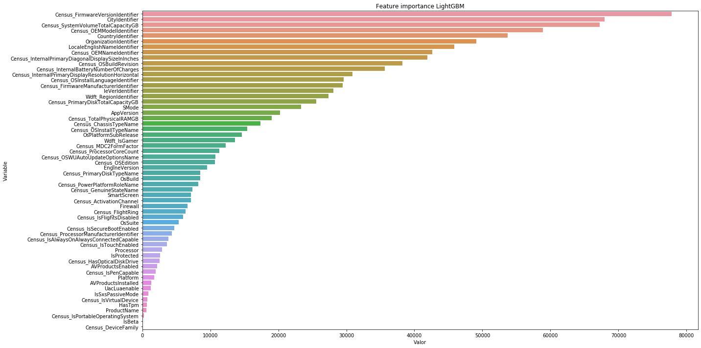

# Microsoft Malware Prediction

## Kaggle - Submission con LightGBM

Aunque nuestro objetivo es poder predecir qué dispositivos se van a infectar de malware, la idea de este TFM no reside solo en predecir. No obstante, dado que hemos realizado una limpieza a los datos, queremos ver cómo de bien se adapta el modelo que vamos a crear a partir de los datos de entrenamiento, para predecir los datos de test (los cuales no disponemos de la variable target). Para ello, vamos hacer uso del algoritmo de LightGBM, dado que he realizado algunas pruebas con él, y hemos obtenido resultados más o menos razonables. Para comprobar la eficacia de nuestro modelo, tendremos que hacer un submission en Kaggle.

**Importamos las librerías**


```python
import pandas as pd
import lightgbm as lgb
import matplotlib.pyplot as plt
import seaborn as sns
import plotly.express as px

from sklearn.model_selection import train_test_split
from sklearn.ensemble import RandomForestClassifier
from time import time
```

    /Users/gema/anaconda3/lib/python3.7/site-packages/lightgbm/__init__.py:48: UserWarning: Starting from version 2.2.1, the library file in distribution wheels for macOS is built by the Apple Clang (Xcode_8.3.3) compiler.
    This means that in case of installing LightGBM from PyPI via the ``pip install lightgbm`` command, you don't need to install the gcc compiler anymore.
    Instead of that, you need to install the OpenMP library, which is required for running LightGBM on the system with the Apple Clang compiler.
    You can install the OpenMP library by the following command: ``brew install libomp``.
      "You can install the OpenMP library by the following command: ``brew install libomp``.", UserWarning)


**Lectura de los datos**


```python
# Leemos los datos originales (para el submission necesitamos la variable identificadora de test)

# Leemos el fichero json
import json

with open('datos/datatype.json', 'r') as myfile:
    data = myfile.read()

# Obtenemos los tipos de datos para el train
dtypes_train = json.loads(data) # Parse file

# Hacemos una copia de los tipos de datos a modificar para test
dtypes_test = dtypes_train.copy()

# Eliminamos la variable 'target'
del dtypes_test['HasDetections']

# Lectura de nuevo del conjunto de train y test, con los tipos de datos que hemos definido
train = pd.read_csv("./datos/train_malware.csv", dtype = dtypes_train)
test = pd.read_csv("./datos/test_malware.csv", dtype = dtypes_test)
```


```python
# Leemos los datos con label encoding
train_label_encoding = pd.read_csv("./datos/train_filtrado_encoding.csv")
test_label_encoding = pd.read_csv("./datos/test_filtrado_encoding.csv")
```

**Partición**


```python
# Dividimos la variable target de
x = train_label_encoding.drop('HasDetections', axis=1)
y = train_label_encoding['HasDetections']
```


```python
# Creamos el conjunto de validación
X_train, X_val, y_train, y_val = train_test_split(x, y, test_size=0.2, random_state = 3)
print(X_train.shape, y_train.shape, X_val.shape, y_val.shape)
```

    (7019248, 58) (7019248,) (1754812, 58) (1754812,)


**Algoritmo de LightGBM**

El algoritmo de LightGBM (abreviatura de Light Gradient Boosted Machine) es una biblioteca desarrollada en Microsoft que proporciona una implementación eficiente del algoritmo de gradient boosting. El beneficio principal de LightGBM son los cambios en el algoritmo de entrenamiento que hacen que el proceso sea dramáticamente más rápido y, en muchos casos, dan como resultado un modelo más efectivo. Así, es un algoritmo basado en los árboles de decisión, el cual es rápido, distribuido y con alto rendimiento del framework de gradient boosting.

- https://www.kaggle.com/kamalchhirang/simple-lightgbm-with-good-parameters
- https://www.analyticsvidhya.com/blog/2017/06/which-algorithm-takes-the-crown-light-gbm-vs-xgboost/
- https://machinelearningmastery.com/gradient-boosting-with-scikit-learn-xgboost-lightgbm-and-catboost/


```python
# Configuración del algoritmo LightGBM
lgb_model = lgb.LGBMClassifier(max_depth=-1, n_estimators=3000, learning_rate=0.1,
                               num_leaves=2**12-1, colsample_bytree=0.28, seed=9,
                               objective='binary')
```


```python
# Entrenamiento del modelo
start_time = time()
lgb_model.fit(X_train, y_train, eval_metric='auc', eval_set=[(X_val, y_val)],
              verbose=400, early_stopping_rounds=400)
elapsed_time = time() - start_time

print("Tiempo de entrenamiento: %.10f segundos" % elapsed_time)
```

    Training until validation scores don't improve for 400 rounds
    [400]	valid_0's auc: 0.730389	valid_0's binary_logloss: 0.603341
    Early stopping, best iteration is:
    [253]	valid_0's auc: 0.73108	valid_0's binary_logloss: 0.602721
    Tiempo de entrenamiento: 1406.6863830090 segundos


Una vez que tenemos entrenado nuestro modelo, calculamos las predicciones para el conjunto test. El objetivo de esto es probar que en Kaggle, nuestro preprocesamiento es lógico y útil


```python
y_pred = lgb_model.predict(X_val)
pred = lgb_model.predict(test_label_encoding)
(pred, len(y_pred))
```


    (array([1, 1, 0, ..., 0, 0, 1]), 1754812)


Para hacer el submission en Kaggle, necesitamos tener los identificadores del conjunto test, así que lo cogemos del conjunto inicial de los datos.


```python
# Cogemos los identificadores del conjunto test
id_test = test['MachineIdentifier']

# Leemos el CSV para realizar el submission
submission = pd.read_csv("./datos/Submissions/GradientBoosting/LightGBM/sample_submission.csv")
# Vemos que 'submission.head()' coincide con 'id_test' de manera ordenada

# Pegamos la lista de los identificadores a la columna submission['HasDetections']
submission['HasDetections'] = pred
submission.head()
```


<table border="1" class="dataframe">
  <thead>
    <tr style="text-align: right;">
      <th></th>
      <th>MachineIdentifier</th>
      <th>HasDetections</th>
    </tr>
  </thead>
  <tbody>
    <tr>
      <th>0</th>
      <td>0000010489e3af074adeac69c53e555e</td>
      <td>1</td>
    </tr>
    <tr>
      <th>1</th>
      <td>00000176ac758d54827acd545b6315a5</td>
      <td>1</td>
    </tr>
    <tr>
      <th>2</th>
      <td>0000019dcefc128c2d4387c1273dae1d</td>
      <td>0</td>
    </tr>
    <tr>
      <th>3</th>
      <td>0000055553dc51b1295785415f1a224d</td>
      <td>0</td>
    </tr>
    <tr>
      <th>4</th>
      <td>00000574cefffeca83ec8adf9285b2bf</td>
      <td>0</td>
    </tr>
  </tbody>
</table>
</div>


```python
# Guardamos el fichero CSV
submission.to_csv('./datos/Submissions/GradientBoosting/LightGBM/sample_submission.csv',
                  index = False, header = True)
```

**Vamos a sacar las variables más importantes**


```python
feature_importance = pd.DataFrame(sorted(zip(lgb_model.feature_importances_,X_train.columns)),
                                  columns=['Valor','Variable'])
```


```python
feature_importance = feature_importance.sort_values('Valor', ascending=False)
feature_importance.head()
```


<table border="1" class="dataframe">
  <thead>
    <tr style="text-align: right;">
      <th></th>
      <th>Valor</th>
      <th>Variable</th>
    </tr>
  </thead>
  <tbody>
    <tr>
      <th>57</th>
      <td>77781</td>
      <td>Census_FirmwareVersionIdentifier</td>
    </tr>
    <tr>
      <th>56</th>
      <td>67979</td>
      <td>CityIdentifier</td>
    </tr>
    <tr>
      <th>55</th>
      <td>67209</td>
      <td>Census_SystemVolumeTotalCapacityGB</td>
    </tr>
    <tr>
      <th>54</th>
      <td>58860</td>
      <td>Census_OEMModelIdentifier</td>
    </tr>
    <tr>
      <th>53</th>
      <td>53719</td>
      <td>CountryIdentifier</td>
    </tr>
  </tbody>
</table>
</div>


```python
fig = px.bar(feature_importance, x='Valor', y='Variable', orientation='h')
fig.update_layout(title_text='Feature importance LightGBM', title_x=0, xaxis=dict(title='Valor'),
                 margin=dict(l=10, r=10, t=100, b=0), template='seaborn',
                  uniformtext_minsize=6,)
fig.show()
```


```python
plt.figure(figsize=(20, 10))
sns.barplot(x="Valor", y="Variable",
            data=feature_importance.sort_values(by="Valor", ascending=False))
plt.title('Feature importance LightGBM')
plt.tight_layout()
plt.show()
```



