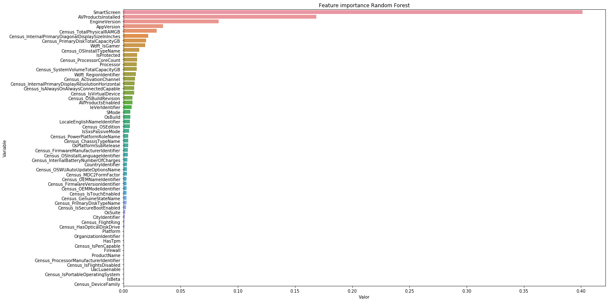

# Microsoft Malware Prediction

## Random Forest

### Importamos las librerías


```python
import pandas as pd
import plotly.express as px
import matplotlib.pyplot as plt
import seaborn as sns
import pickle

from sklearn.model_selection import train_test_split
from sklearn.ensemble import RandomForestClassifier
from sklearn import metrics
from sklearn.metrics import f1_score, precision_score, recall_score
from time import time
```

-----
----

**Lectura de los datos**


```python
# Leemos los datos originales (para el submission necesitamos la variable identificadora de test)

# Leemos el fichero json
import json

with open('datos/datatype.json', 'r') as myfile:
    data = myfile.read()

# Obtenemos los tipos de datos para el train
dtypes_train = json.loads(data) # Parse file

# Hacemos una copia de los tipos de datos a modificar para test
dtypes_test = dtypes_train.copy()

# Eliminamos la variable 'target'
del dtypes_test['HasDetections']

# Lectura de nuevo del conjunto de train y test, con los tipos de datos que hemos definido
train = pd.read_csv("./datos/train_malware.csv", dtype = dtypes_train)
test = pd.read_csv("./datos/test_malware.csv", dtype = dtypes_test)
```


```python
# Leemos los datos con label encoding
train_label_encoding = pd.read_csv("./datos/train_filtrado_encoding.csv")
test_label_encoding = pd.read_csv("./datos/test_filtrado_encoding.csv")
```

**Partición**


```python
# Dividimos la variable target de
x = train_label_encoding.drop('HasDetections', axis=1)
y = train_label_encoding['HasDetections']
```


```python
# Creamos el conjunto de validación
X_train, X_val, y_train, y_val = train_test_split(x, y, test_size=0.25, random_state = 3)
print(X_train.shape, y_train.shape, X_val.shape, y_val.shape)
```

------
----

### Lectura del conjunto de datos particionados


```python
# Lectura del conjunto de datos particionado
X_train = pd.read_csv("./datos/X_train.csv")
X_val = pd.read_csv("./datos/X_val.csv")
y_train = pd.read_csv("./datos/y_train.csv")
y_val = pd.read_csv("./datos/y_val.csv")
```

### Algoritmo de Random Forest

<ins>Partición 80-20<ins>

~~~python
rf = RandomForestClassifier(criterion = 'entropy', max_depth = d, min_samples_split = 2,
                            oob_score=True, n_estimators=100)
~~~

|   |  `max_depth` | `n_estimators` | tiempo (seg.)  | tiempo |   accuracy  |
|---|---|---|---|---|---|
| 1  | 2  | 100  | 885.1690599918  | 14 minutos  | 0.6197803525391894 |
| 2  | 3  | 100  | 1381.4913179874  | 23 minutos  | 0.6198293606380626  |
| 3  | None | 100  | 10573.8996510506  | 2.93 horas  | 0.6500776151519365  |
| 4  | 2  | 300  | 5432.5211529732  | 1.50 horas  | 0.619139828084148  |
| 5  | 3  | 300  | 33088.3806273937  | 9.19 horas  | 0.6200863682263399 |
| 6  | 2  |  700 | 6232.4242198467  | 1.73 horas  | 0.6193934165027365  |

<ins>Partición 75-25, `max_features = "auto"` y `min_samples_leaf = 50`<ins>

~~~python
rf = RandomForestClassifier(criterion = 'entropy', max_depth = d, n_jobs = -1, oob_score = True,
                            n_estimators = 100, max_features = "auto", min_samples_leaf = 50)`    
~~~    

|   |  `max_depth` | `n_estimators` | tiempo (seg.)  | tiempo |   accuracy  |
|---|---|---|---|---|---|
| 1  | 3  | 100  | 503.1005158424  | 9 minutos  | 0.6197803525391894 |
| 2  | 5  | 100  | 711.5991830826  | 12 minutos  | 0.623109028203591  |
| 3  | 9  | 100  | 1596.7300050259  | 27 minutos  | 0.6290889280447136  |
| 4  | 12  | 100  | 1967.6013000011  | 33 minutos  | 0.6345728203363096  |
| 5  | 7  | 150  | 1880.0360009670  | 32 minutos  | 0.6274044171113486  |
| 6  | 4  | 500  | 3667.4405992031  | 1 hora  | 0.6211163361089393  |
| 7  | 6  | 500  |  5644.0747678280 | 1.56 horas | 0.625054307811891  |
| 8  | 8  | 500  | 7002.1717000008  | 1.95 horas  | 0.6281078542886646  |

<ins>**Modelo 1**<ins>


```python
# Configuración del algoritmo Random Forest
rf_model_01 = RandomForestClassifier(criterion = 'entropy', max_depth = 12, n_jobs = -1, oob_score = True,
                                     n_estimators = 100, max_features = "auto", min_samples_leaf = 50)
```


```python
# Entrenamiento del modelo
start_time = time()
rf_model_01.fit(X_train, y_train)
time_rf_model_01 = time() - start_time

y_pred_01 = rf_model_01.predict(X_val)

print("Tiempo de entrenamiento: %.10f segundos" % time_rf_model_01)
print("Accuracy:", metrics.accuracy_score(y_val, y_pred_01))
```

    /Users/gema/anaconda3/lib/python3.7/site-packages/ipykernel_launcher.py:3: DataConversionWarning:

    A column-vector y was passed when a 1d array was expected. Please change the shape of y to (n_samples,), for example using ravel().


    Tiempo de entrenamiento: 2331.5107879639 segundos
    Accuracy: 0.6352534630490332


```python
# Imprimimos algunas métricas
logloss = metrics.log_loss(y_val, y_pred_01)
accuracy = metrics.accuracy_score(y_val, y_pred_01)
F1 = metrics.f1_score(y_val, y_pred_01)
precision = precision_score(y_val, y_pred_01, average='binary')
recall = recall_score(y_val, y_pred_01, average='binary')
auc = metrics.roc_auc_score(y_val, y_pred_01)

metricas = [logloss, accuracy, F1, precision, recall, auc, time_rf_model_01]
nombre_metricas = ['Log loss', 'Accuracy', 'F1 Score', 'Precision', 'Recall', 'AUC', 'Tiempo de entrenamiento']

pd.DataFrame(metricas, nombre_metricas, columns = ['Random Forest']).T
```


<div>
<table border="1" class="dataframe">
  <thead>
    <tr style="text-align: right;">
      <th></th>
      <th>Log loss</th>
      <th>Accuracy</th>
      <th>F1 Score</th>
      <th>Precision</th>
      <th>Recall</th>
      <th>AUC</th>
      <th>Tiempo de entrenamiento</th>
    </tr>
  </thead>
  <tbody>
    <tr>
      <th>Random Forest</th>
      <td>12.598056</td>
      <td>0.635253</td>
      <td>0.644785</td>
      <td>0.628454</td>
      <td>0.661989</td>
      <td>0.635249</td>
      <td>2331.510788</td>
    </tr>
  </tbody>
</table>
</div>


```python
# Guardamos el modelo
pkl_filename = "modelos/random_forest_01.pkl"
with open(pkl_filename, 'wb') as file:
    pickle.dump(rf_model_01, file)
```

<ins>**Modelo 2**<ins>


```python
# Configuración del algoritmo Random Forest
rf_model_02 = RandomForestClassifier(criterion = 'gini', max_depth = 6, n_jobs = -1, oob_score = True,
                                     n_estimators = 200, max_features = "auto", min_samples_leaf = 200)
```


```python
# Entrenamiento del modelo
start_time = time()
rf_model_02.fit(X_train, y_train)
time_rf_model_02 = time() - start_time

y_pred_02 = rf_model_02.predict(X_val)

print("Tiempo de entrenamiento: %.10f segundos" % time_rf_model_02)
print("Accuracy:", metrics.accuracy_score(y_val, y_pred_02))
```

    /Users/gema/anaconda3/lib/python3.7/site-packages/ipykernel_launcher.py:3: DataConversionWarning:

    A column-vector y was passed when a 1d array was expected. Please change the shape of y to (n_samples,), for example using ravel().


    Tiempo de entrenamiento: 2653.1309859753 segundos
    Accuracy: 0.6240723222772582


```python
# Imprimimos algunas métricas
logloss = metrics.log_loss(y_val, y_pred_02)
accuracy = metrics.accuracy_score(y_val, y_pred_02)
F1 = metrics.f1_score(y_val, y_pred_02)
precision = precision_score(y_val, y_pred_02, average='binary')
recall = recall_score(y_val, y_pred_02, average='binary')
auc = metrics.roc_auc_score(y_val, y_pred_02)

metricas = [logloss, accuracy, F1, precision, recall, auc, time_rf_model_02]
nombre_metricas = ['Log loss', 'Accuracy', 'F1 Score', 'Precision', 'Recall', 'AUC', 'Tiempo de entrenamiento']

pd.DataFrame(metricas, nombre_metricas, columns = ['Random Forest']).T
```


<div>
<table border="1" class="dataframe">
  <thead>
    <tr style="text-align: right;">
      <th></th>
      <th>Log loss</th>
      <th>Accuracy</th>
      <th>F1 Score</th>
      <th>Precision</th>
      <th>Recall</th>
      <th>AUC</th>
      <th>Tiempo de entrenamiento</th>
    </tr>
  </thead>
  <tbody>
    <tr>
      <th>Random Forest</th>
      <td>12.984252</td>
      <td>0.624072</td>
      <td>0.641858</td>
      <td>0.612946</td>
      <td>0.673631</td>
      <td>0.624065</td>
      <td>2653.130986</td>
    </tr>
  </tbody>
</table>
</div>


```python
# Guardar el modelo
pkl_filename = "modelos/random_forest_02.pkl"
with open(pkl_filename, 'wb') as file:
    pickle.dump(rf_model_02, file)
```

### Sacamos las variables más importantes del mejor modelo


```python
feature_importance = pd.DataFrame(sorted(zip(rf_model_01.feature_importances_,X_train.columns)),
                                  columns=['Valor','Variable'])
```


```python
feature_importance = feature_importance.sort_values('Valor', ascending=False)
feature_importance.head(10)
```


<div>
<table border="1" class="dataframe">
  <thead>
    <tr style="text-align: right;">
      <th></th>
      <th>Valor</th>
      <th>Variable</th>
    </tr>
  </thead>
  <tbody>
    <tr>
      <th>57</th>
      <td>0.401149</td>
      <td>SmartScreen</td>
    </tr>
    <tr>
      <th>56</th>
      <td>0.168516</td>
      <td>AVProductsInstalled</td>
    </tr>
    <tr>
      <th>55</th>
      <td>0.083330</td>
      <td>EngineVersion</td>
    </tr>
    <tr>
      <th>54</th>
      <td>0.034807</td>
      <td>AppVersion</td>
    </tr>
    <tr>
      <th>53</th>
      <td>0.029097</td>
      <td>Census_TotalPhysicalRAMGB</td>
    </tr>
    <tr>
      <th>52</th>
      <td>0.021547</td>
      <td>Census_InternalPrimaryDiagonalDisplaySizeInInches</td>
    </tr>
    <tr>
      <th>51</th>
      <td>0.019983</td>
      <td>Census_PrimaryDiskTotalCapacityGB</td>
    </tr>
    <tr>
      <th>50</th>
      <td>0.018912</td>
      <td>Wdft_IsGamer</td>
    </tr>
    <tr>
      <th>49</th>
      <td>0.013920</td>
      <td>Census_OSInstallTypeName</td>
    </tr>
    <tr>
      <th>48</th>
      <td>0.012147</td>
      <td>IsProtected</td>
    </tr>
  </tbody>
</table>
</div>


```python
fig = px.bar(feature_importance, x='Valor', y='Variable', orientation='h')
fig.update_layout(title_text='Feature importance Random Forest', title_x=0, xaxis=dict(title='Valor'),
                 margin=dict(l=10, r=10, t=100, b=0), template='seaborn',
                  uniformtext_minsize=6,)
fig.show()
```


```python
plt.figure(figsize=(20, 10))
sns.barplot(x="Valor", y="Variable",
            data=feature_importance.sort_values(by="Valor", ascending=False))
plt.title('Feature importance Random Forest')
plt.tight_layout()
plt.show()
```





**Submission en Kaggle**


```python
pred_rf_model = rf_model.predict(test_label_encoding)
(pred_rf_model, len(y_pred))
```


```python
# Cogemos los identificadores del conjunto test
id_test = test['MachineIdentifier']

# Leemos el CSV para realizar el submission
submission = pd.read_csv("./datos/Submissions/RandomForest/sample_submission.csv")
# Vemos que 'submission.head()' coincide con 'id_test' de manera ordenada

# Pegamos la lista de los identificadores a la columna submission['HasDetections']
submission['HasDetections'] = pred_rf_model
submission.head()
```


```python
# Guardamos el fichero CSV
submission.to_csv('./datos/Submissions/RandomForest/sample_submission.csv', index = False, header = True)
```

-----
