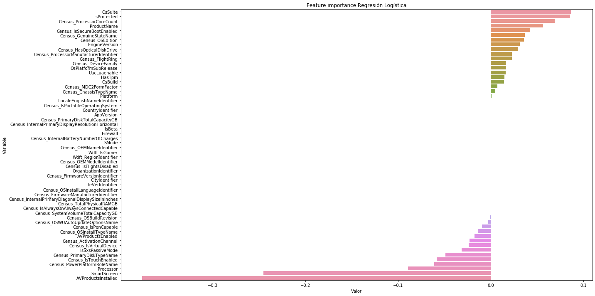

# Microsoft Malware Prediction

### Regresión Logística

https://www.aprendemachinelearning.com/regresion-logistica-con-python-paso-a-paso/

### Importamos las librerías


```python
import pandas as pd
import numpy as np
import matplotlib.pyplot as plt
import seaborn as sb
import pickle
import plotly.express as px
import seaborn as sns

from sklearn.model_selection import train_test_split
from sklearn import linear_model
from sklearn import model_selection
from sklearn.metrics import classification_report
from sklearn.metrics import f1_score, precision_score, recall_score
from sklearn.metrics import confusion_matrix
from sklearn.metrics import accuracy_score
from sklearn import metrics
from time import time
```

-----
-----

**Lectura de los datos**


```python
# Leemos los datos originales (para el submission necesitamos la variable identificadora de test)

# Leemos el fichero json
import json

with open('datos/datatype.json', 'r') as myfile:
    data = myfile.read()

# Obtenemos los tipos de datos para el train
dtypes_train = json.loads(data) # Parse file

# Hacemos una copia de los tipos de datos a modificar para test
dtypes_test = dtypes_train.copy()

# Eliminamos la variable 'target'
del dtypes_test['HasDetections']

# Lectura de nuevo del conjunto de train y test, con los tipos de datos que hemos definido
train = pd.read_csv("./datos/train_malware.csv", dtype = dtypes_train)
test = pd.read_csv("./datos/test_malware.csv", dtype = dtypes_test)
```


```python
# Leemos los datos con label encoding
train_label_encoding = pd.read_csv("./datos/train_filtrado_encoding.csv")
test_label_encoding = pd.read_csv("./datos/test_filtrado_encoding.csv")
```

**Partición**


```python
# Dividimos la variable target de
x = train_label_encoding.drop('HasDetections', axis=1)
y = train_label_encoding['HasDetections']
```


```python
# Creamos el conjunto de validación
X_train, X_val, y_train, y_val = train_test_split(x, y, test_size=0.25, random_state = 3)
print(X_train.shape, y_train.shape, X_val.shape, y_val.shape)
```

----

### Lectura del conjunto de datos particionados


```python
# Lectura del conjunto de datos particionado
X_train = pd.read_csv("./datos/X_train.csv")
X_val = pd.read_csv("./datos/X_val.csv")
y_train = pd.read_csv("./datos/y_train.csv")
y_val = pd.read_csv("./datos/y_val.csv")
```

### Algoritmo de Regresión Logística


1. `LogisticRegression()`
2. `LogisticRegression(n_jobs=-1, max_iter=300)`

|   | tiempo (seg.)  | tiempo |   accuracy  |
|---|---|---|---|
| 1  | 6529.6771960258  | 1.81 horas  | 0.6014360512693098 |
| 2  | 8016.7667407990  |  2.22 horas | 0.6054214354586133  |

<ins>**Modelo 1**<ins>


```python
# Configuración del algoritmo de Regresión Logística
rl_model_01 = linear_model.LogisticRegression()
rl_model_01 # Vemos los hiperparámetros del modelo
```


    LogisticRegression(C=1.0, class_weight=None, dual=False, fit_intercept=True,
              intercept_scaling=1, max_iter=100, multi_class='warn',
              n_jobs=None, penalty='l2', random_state=None, solver='warn',
              tol=0.0001, verbose=0, warm_start=False)


```python
# Entrenamiento del modelo
start_time = time()
rl_model_01.fit(X_train,y_train)
time_rl_model_01 = time() - start_time

y_pred_01 = rl_model_01.predict(X_val)

print("Tiempo de entrenamiento: %.10f segundos" % time_rl_model_01)
print("Accuracy: ", metrics.accuracy_score(y_val, y_pred_01))
```

    /Users/gema/anaconda3/lib/python3.7/site-packages/sklearn/linear_model/logistic.py:433: FutureWarning: Default solver will be changed to 'lbfgs' in 0.22. Specify a solver to silence this warning.
      FutureWarning)
    /Users/gema/anaconda3/lib/python3.7/site-packages/sklearn/utils/validation.py:761: DataConversionWarning: A column-vector y was passed when a 1d array was expected. Please change the shape of y to (n_samples, ), for example using ravel().
      y = column_or_1d(y, warn=True)
    /Users/gema/anaconda3/lib/python3.7/site-packages/sklearn/svm/base.py:931: ConvergenceWarning: Liblinear failed to converge, increase the number of iterations.
      "the number of iterations.", ConvergenceWarning)


    Tiempo de entrenamiento: 6529.6771960258 segundos
    Accuracy:  0.6014360512693098


```python
# Imprimimos algunas métricas
logloss = metrics.log_loss(y_val, y_pred_01)
accuracy = metrics.accuracy_score(y_val, y_pred_01)
F1 = metrics.f1_score(y_val, y_pred_01)
precision = precision_score(y_val, y_pred_01, average='binary')
recall = recall_score(y_val, y_pred_01, average='binary')
auc = metrics.roc_auc_score(y_val, y_pred_01)

metricas = [logloss, accuracy, F1, precision, recall, auc, time_rl_model_01]
nombre_metricas = ['Log loss', 'Accuracy', 'F1 Score', 'Precision', 'Recall', 'AUC', 'Tiempo de entrenamiento']

pd.DataFrame(metricas, nombre_metricas, columns = ['Regresión Logística']).T
```


<div>
<table border="1" class="dataframe">
  <thead>
    <tr style="text-align: right;">
      <th></th>
      <th>Log loss</th>
      <th>Accuracy</th>
      <th>F1 Score</th>
      <th>Precision</th>
      <th>Recall</th>
      <th>AUC</th>
      <th>Tiempo de entrenamiento</th>
    </tr>
  </thead>
  <tbody>
    <tr>
      <th>Regresión Logística</th>
      <td>13.766044</td>
      <td>0.601436</td>
      <td>0.573078</td>
      <td>0.617083</td>
      <td>0.534931</td>
      <td>0.601446</td>
      <td>6529.677196</td>
    </tr>
  </tbody>
</table>
</div>


```python
# Guardamos el modelo
pkl_filename = "modelos/regresion_logistica_01.pkl"
with open(pkl_filename, 'wb') as file:
    pickle.dump(rl_model_01, file)
```

<ins>**Modelo 2**<ins>


```python
# Configuración del algoritmo de Regresión Logística
rl_model_02 = linear_model.LogisticRegression(n_jobs=-1, max_iter=300)
rl_model_02 # Vemos los hiperparámetros del modelo
```


    LogisticRegression(C=1.0, class_weight=None, dual=False, fit_intercept=True,
              intercept_scaling=1, max_iter=300, multi_class='warn', n_jobs=-1,
              penalty='l2', random_state=None, solver='warn', tol=0.0001,
              verbose=0, warm_start=False)


```python
# Entrenamiento del modelo
start_time = time()
rl_model_02.fit(X_train,y_train)
time_rl_model_02 = time() - start_time

y_pred_02 = rl_model_02.predict(X_val)

print("Tiempo de entrenamiento: %.10f segundos" % time_rl_model_02)
print("Accuracy: ", metrics.accuracy_score(y_val, y_pred_02))
```

    /Users/gema/anaconda3/lib/python3.7/site-packages/sklearn/linear_model/logistic.py:433: FutureWarning: Default solver will be changed to 'lbfgs' in 0.22. Specify a solver to silence this warning.
      FutureWarning)
    /Users/gema/anaconda3/lib/python3.7/site-packages/sklearn/utils/validation.py:761: DataConversionWarning: A column-vector y was passed when a 1d array was expected. Please change the shape of y to (n_samples, ), for example using ravel().
      y = column_or_1d(y, warn=True)
    /Users/gema/anaconda3/lib/python3.7/site-packages/sklearn/linear_model/logistic.py:1300: UserWarning: 'n_jobs' > 1 does not have any effect when 'solver' is set to 'liblinear'. Got 'n_jobs' = 4.
      " = {}.".format(effective_n_jobs(self.n_jobs)))


    Tiempo de entrenamiento: 8016.7667407990 segundos
    Accuracy:  0.6054214354586133


```python
# Imprimimos algunas métricas
logloss = metrics.log_loss(y_val, y_pred_02)
accuracy = metrics.accuracy_score(y_val, y_pred_02)
F1 = metrics.f1_score(y_val, y_pred_02)
precision = precision_score(y_val, y_pred_02, average='binary')
recall = recall_score(y_val, y_pred_02, average='binary')
auc = metrics.roc_auc_score(y_val, y_pred_02)

metricas = [logloss, accuracy, F1, precision, recall, auc, time_rl_model_02]
nombre_metricas = ['Log loss', 'Accuracy', 'F1 Score', 'Precision', 'Recall', 'AUC', 'Tiempo de entrenamiento']

pd.DataFrame(metricas, nombre_metricas, columns = ['Regresión Logística']).T
```


<div>
<table border="1" class="dataframe">
  <thead>
    <tr style="text-align: right;">
      <th></th>
      <th>Log loss</th>
      <th>Accuracy</th>
      <th>F1 Score</th>
      <th>Precision</th>
      <th>Recall</th>
      <th>AUC</th>
      <th>Tiempo de entrenamiento</th>
    </tr>
  </thead>
  <tbody>
    <tr>
      <th>Regresión Logística</th>
      <td>13.628411</td>
      <td>0.605421</td>
      <td>0.598193</td>
      <td>0.609451</td>
      <td>0.587343</td>
      <td>0.605424</td>
      <td>8016.766741</td>
    </tr>
  </tbody>
</table>
</div>


```python
# Guardamos el modelo
pkl_filename = "modelos/regresion_logistica_02.pkl"
with open(pkl_filename, 'wb') as file:
    pickle.dump(rl_model_02, file)
```


```python
# Cargamos el modelo 01 (el mejor)
pkl_filename_01 = "modelos/regresion_logistica_01.pkl"
with open(pkl_filename_01, 'rb') as file:
    rl_model_01 = pickle.load(file)
```

### Vamos a sacar las variables más importantes

> Con Regresión Logística no funciona lo mismo que para Random Forest, usar `rl_model_01.coef_`


```python
feature_importance = pd.DataFrame(sorted(zip(rl_model_01.coef_.tolist()[0],X_train.columns)),
                                  columns=['Valor','Variable'])
```


```python
feature_importance = feature_importance.sort_values('Valor', ascending=False)
feature_importance.head(10)
```


<div>
<table border="1" class="dataframe">
  <thead>
    <tr style="text-align: right;">
      <th></th>
      <th>Valor</th>
      <th>Variable</th>
    </tr>
  </thead>
  <tbody>
    <tr>
      <th>57</th>
      <td>0.086621</td>
      <td>OsSuite</td>
    </tr>
    <tr>
      <th>56</th>
      <td>0.085686</td>
      <td>IsProtected</td>
    </tr>
    <tr>
      <th>55</th>
      <td>0.069224</td>
      <td>Census_ProcessorCoreCount</td>
    </tr>
    <tr>
      <th>54</th>
      <td>0.056616</td>
      <td>ProductName</td>
    </tr>
    <tr>
      <th>53</th>
      <td>0.042874</td>
      <td>Census_IsSecureBootEnabled</td>
    </tr>
    <tr>
      <th>52</th>
      <td>0.036846</td>
      <td>Census_GenuineStateName</td>
    </tr>
    <tr>
      <th>51</th>
      <td>0.035804</td>
      <td>Census_OSEdition</td>
    </tr>
    <tr>
      <th>50</th>
      <td>0.031611</td>
      <td>EngineVersion</td>
    </tr>
    <tr>
      <th>49</th>
      <td>0.029470</td>
      <td>Census_HasOpticalDiskDrive</td>
    </tr>
    <tr>
      <th>48</th>
      <td>0.022990</td>
      <td>Census_ProcessorManufacturerIdentifier</td>
    </tr>
  </tbody>
</table>
</div>


```python
fig = px.bar(feature_importance, x='Valor', y='Variable', orientation='h')
fig.update_layout(title_text='Feature importance Regresión Logística', title_x=0, xaxis=dict(title='Valor'),
                 margin=dict(l=10, r=10, t=100, b=0), template='seaborn',
                  uniformtext_minsize=6,)
fig.show()
```


```python
plt.figure(figsize=(20, 10))
sns.barplot(x="Valor", y="Variable",
            data=feature_importance.sort_values(by="Valor", ascending=False))
plt.title('Feature importance Regresión Logística')
plt.tight_layout()
plt.show()
```





**Submission en Kaggle**


```python
pred_rl_model = rl_model.predict(test_label_encoding)
(pred_rl_model, len(y_pred))
```


```python
# Cogemos los identificadores del conjunto test
id_test = test['MachineIdentifier']

# Leemos el CSV para realizar el submission
submission = pd.read_csv("./datos/Submissions/RegresionLogistica/sample_submission.csv")
# Vemos que 'submission.head()' coincide con 'id_test' de manera ordenada

# Pegamos la lista de los identificadores a la columna submission['HasDetections']
submission['HasDetections'] = pred_rl_model
submission.head()
```


```python
# Guardamos el fichero CSV
submission.to_csv('./datos/Submissions/RegresionLogistica/sample_submission.csv', index = False, header = True)
```

### Validación cruzada de nuestro modelo

> No mejora (y tarda más)


```python
'''
name='Logistic Regression'
seed = 7
kfold = model_selection.KFold(n_splits=5, random_state=seed)
cv_results = model_selection.cross_val_score(rl_model_01, X_train, y_train, cv=kfold, scoring='accuracy')
msg = "%s: %f (%f)" % (name, cv_results.mean(), cv_results.std())
print(msg)

predictions = rl_model_01.predict(X_val)
print(accuracy_score(y_val, predictions))
'''
```


    '\nname=\'Logistic Regression\'\nseed = 7\nkfold = model_selection.KFold(n_splits=5, random_state=seed)\ncv_results = model_selection.cross_val_score(rl_model_01, X_train, y_train, cv=kfold, scoring=\'accuracy\')\nmsg = "%s: %f (%f)" % (name, cv_results.mean(), cv_results.std())\nprint(msg)\n\npredictions = rl_model_01.predict(X_val)\nprint(accuracy_score(y_val, predictions))\n'
