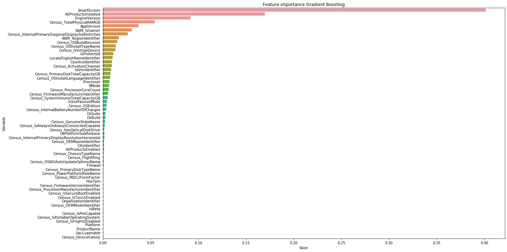
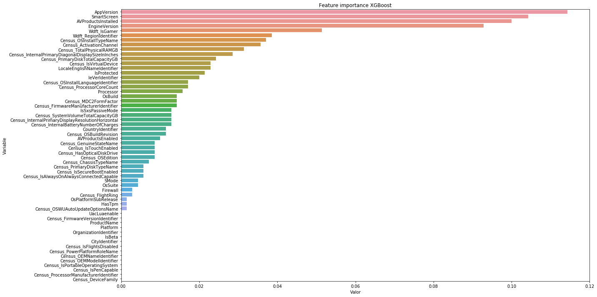

# Microsoft Malware Prediction

## Gradient Boosting y sus variantes

### Importamos las librerías


```python
import pandas as pd
import numpy as np
import pickle
import matplotlib.pyplot as plt
import json
import plotly.express as px
import matplotlib.pyplot as plt
import seaborn as sns

from sklearn import metrics
from time import time
from sklearn.preprocessing import MinMaxScaler
from sklearn.model_selection import train_test_split
from sklearn.metrics import classification_report, confusion_matrix
from sklearn import metrics
from sklearn.metrics import f1_score, precision_score, recall_score
from sklearn.ensemble import GradientBoostingClassifier
from xgboost import XGBClassifier
```

-----

**Lectura de los datos**


```python
# Leemos los datos originales (para el submission necesitamos la variable identificadora de test)

# Leemos el fichero json
import json

with open('datos/datatype.json', 'r') as myfile:
    data = myfile.read()

# Obtenemos los tipos de datos para el train
dtypes_train = json.loads(data) # Parse file

# Hacemos una copia de los tipos de datos a modificar para test
dtypes_test = dtypes_train.copy()

# Eliminamos la variable 'target'
del dtypes_test['HasDetections']

# Lectura de nuevo del conjunto de train y test, con los tipos de datos que hemos definido
train = pd.read_csv("./datos/train_malware.csv", dtype = dtypes_train)
test = pd.read_csv("./datos/test_malware.csv", dtype = dtypes_test)
```


```python
# Leemos los datos con label encoding
train_label_encoding = pd.read_csv("./datos/train_filtrado_encoding.csv")
test_label_encoding = pd.read_csv("./datos/test_filtrado_encoding.csv")
```

**Partición**


```python
# Dividimos la variable target de
x = train_label_encoding.drop('HasDetections', axis=1)
y = train_label_encoding['HasDetections']
```


```python
# Creamos el conjunto de validación
X_train, X_val, y_train, y_val = train_test_split(x, y, test_size=0.25, random_state = 3)
print(X_train.shape, y_train.shape, X_val.shape, y_val.shape)
```

    (6580545, 58) (6580545,) (2193515, 58) (2193515,)


----

### Lectura del conjunto de datos particionados


```python
# Lectura del conjunto de datos particionado
X_train = pd.read_csv("./datos/X_train.csv")
X_val = pd.read_csv("./datos/X_val.csv")
y_train = pd.read_csv("./datos/y_train.csv")
y_val = pd.read_csv("./datos/y_val.csv")
```

### Algoritmo de `GradientBoostingClassifier`

<ins>Partición 75-25<ins>

~~~python
gb_model = GradientBoostingClassifier(n_estimators=100, learning_rate=l,
                                      max_depth=3, validation_fraction=0.15, random_state=9)  
~~~    

|   |  `learning_rate` | `n_estimators` | tiempo (seg.)  | tiempo |   accuracy (training)  |   accuracy (validation)  |
|---|---|---|---|---|---|---|
| 1  | 0.05  | 100  | 6248.7365028858  | 1.73 horas  | 0.628 | 0.628 |
| 2  | 0.1  | 100  | 5736.4154019356 | 1.60 horas | 0.634  | 0.634  |
| 3  | 0.5  | 100  | 5800.8757534027 | 1.61 horas | 0.645  | 0.645  |

~~~python
gb_model = GradientBoostingClassifier(n_estimators=50, learning_rate=l,
                                      max_depth=4, validation_fraction=0.2, random_state=9)
~~~

|   |  `learning_rate` | `n_estimators` | tiempo (seg.)  | tiempo |   accuracy (training)  |   accuracy (validation)  |
|---|---|---|---|---|---|---|
| 1  | 0.05  | 50  | 3653.2919328213   | 1 hora  | 0.626 | 0.627 |
| 2  | 0.1  | 50  | 2985.6868040562 | 49.76 minutos | 0.634  | 0.634  |
| 3  | 0.5  | 50  | 3337.0875909328 | 55.61 minutos | 0.646  |  0.646 |
| 4  | 0.75  | 50  | 3804.4561002254 | 64 minutos |  0.648 | 0.648  |
| 5  | 1  | 50  |3502.4089672565| 59 minutos |  0.647 | 0.647  |


```python
# Configuración del modelo de Gradient Boosting
gb_model = GradientBoostingClassifier(n_estimators=50, learning_rate=0.75,
                                      max_depth=4, validation_fraction=0.2, random_state=9)
```


```python
# Entrenamiento del modelo
start_time = time()
gb_model.fit(X_train, y_train)
time_gb_model = time() - start_time

y_pred = gb_model.predict(X_val)

print("Tiempo de entrenamiento: %.10f segundos" % time_gb_model)
print("Accuracy: ", metrics.accuracy_score(y_val, y_pred))
```

    /Users/gema/anaconda3/lib/python3.7/site-packages/sklearn/utils/validation.py:761: DataConversionWarning:

    A column-vector y was passed when a 1d array was expected. Please change the shape of y to (n_samples, ), for example using ravel().


    Tiempo de entrenamiento: 3280.8205292225 segundos
    Accuracy:  0.6475674887110414


```python
# Imprimimos algunas métricas
logloss = metrics.log_loss(y_val, y_pred)
accuracy = metrics.accuracy_score(y_val, y_pred)
F1 = metrics.f1_score(y_val, y_pred)
precision = precision_score(y_val, y_pred, average='binary')
recall = recall_score(y_val, y_pred, average='binary')
auc = metrics.roc_auc_score(y_val, y_pred)

metricas = [logloss, accuracy, F1, precision, recall, auc, time_gb_model]
nombre_metricas = ['Log loss', 'Accuracy', 'F1 Score', 'Precision', 'Recall', 'AUC', 'Tiempo de entrenamiento']

pd.DataFrame(metricas, nombre_metricas, columns = ['Gradient Boosting']).T
```


<div>
<table border="1" class="dataframe">
  <thead>
    <tr style="text-align: right;">
      <th></th>
      <th>Log loss</th>
      <th>Accuracy</th>
      <th>F1 Score</th>
      <th>Precision</th>
      <th>Recall</th>
      <th>AUC</th>
      <th>Tiempo de entrenamiento</th>
    </tr>
  </thead>
  <tbody>
    <tr>
      <th>Gradient Boosting</th>
      <td>12.172721</td>
      <td>0.647567</td>
      <td>0.640917</td>
      <td>0.653346</td>
      <td>0.628952</td>
      <td>0.64757</td>
      <td>3280.820529</td>
    </tr>
  </tbody>
</table>
</div>


```python
# Guardar el modelo
pkl_filename = "modelos/gradient_boosting.pkl"
with open(pkl_filename, 'wb') as file:
    pickle.dump(gb_model, file)
```

### Sacamos las variables más importantes del mejor modelo


```python
feature_importance = pd.DataFrame(sorted(zip(gb_model.feature_importances_,X_train.columns)),
                                  columns=['Valor','Variable'])
```


```python
feature_importance = feature_importance.sort_values('Valor', ascending=False)
feature_importance.head(10)
```


<div>
<table border="1" class="dataframe">
  <thead>
    <tr style="text-align: right;">
      <th></th>
      <th>Valor</th>
      <th>Variable</th>
    </tr>
  </thead>
  <tbody>
    <tr>
      <th>57</th>
      <td>0.401244</td>
      <td>SmartScreen</td>
    </tr>
    <tr>
      <th>56</th>
      <td>0.169904</td>
      <td>AVProductsInstalled</td>
    </tr>
    <tr>
      <th>55</th>
      <td>0.091885</td>
      <td>EngineVersion</td>
    </tr>
    <tr>
      <th>54</th>
      <td>0.054166</td>
      <td>Census_TotalPhysicalRAMGB</td>
    </tr>
    <tr>
      <th>53</th>
      <td>0.037232</td>
      <td>AppVersion</td>
    </tr>
    <tr>
      <th>52</th>
      <td>0.030377</td>
      <td>Wdft_IsGamer</td>
    </tr>
    <tr>
      <th>51</th>
      <td>0.026119</td>
      <td>Census_InternalPrimaryDiagonalDisplaySizeInInches</td>
    </tr>
    <tr>
      <th>50</th>
      <td>0.016714</td>
      <td>Wdft_RegionIdentifier</td>
    </tr>
    <tr>
      <th>49</th>
      <td>0.014922</td>
      <td>Census_OSBuildRevision</td>
    </tr>
    <tr>
      <th>48</th>
      <td>0.013348</td>
      <td>Census_OSInstallTypeName</td>
    </tr>
  </tbody>
</table>
</div>


```python
fig = px.bar(feature_importance, x='Valor', y='Variable', orientation='h')
fig.update_layout(title_text='Feature importance Gradient Boosting', title_x=0, xaxis=dict(title='Valor'),
                 margin=dict(l=10, r=10, t=100, b=0), template='seaborn',
                  uniformtext_minsize=6,)
fig.show()
```


```python
plt.figure(figsize=(20, 10))
sns.barplot(x="Valor", y="Variable",
            data=feature_importance.sort_values(by="Valor", ascending=False))
plt.title('Feature importance Gradient Boosting')
plt.tight_layout()
plt.show()
```





-----

### Algoritmo de `XGBoost`

https://machinelearningmastery.com/develop-first-xgboost-model-python-scikit-learn/


```python
# Configuración del algoritmo XGBoost
xgb_model = XGBClassifier()
```


```python
# Entrenamiento del modelo
start_time = time()
xgb_model.fit(X_train, y_train)
elapsed_time = time() - start_time

y_pred = xgb_model.predict(X_val)

print("Tiempo de entrenamiento: %.10f segundos" % elapsed_time)
print("Accuracy score (training): {0:.3f}".format(xgb_model.score(X_train, y_train)))
print("Accuracy score (validation): {0:.3f}".format(xgb_model.score(X_val, y_val)))
print("Accuracy: ", metrics.accuracy_score(y_val, y_pred))
```

    Tiempo de entrenamiento: 1679.1951990128 segundos
    Accuracy score (training): 0.634
    Accuracy score (validation): 0.634
    Accuracy:  0.6337941614258393


### Vamos a sacar las variables más importantes


```python
feature_importance = pd.DataFrame(sorted(zip(xgb_model.feature_importances_,X_train.columns)),
                                  columns=['Valor','Variable'])
```


```python
feature_importance = feature_importance.sort_values('Valor', ascending=False)
feature_importance.head()
```


<div>
<table border="1" class="dataframe">
  <thead>
    <tr style="text-align: right;">
      <th></th>
      <th>Valor</th>
      <th>Variable</th>
    </tr>
  </thead>
  <tbody>
    <tr>
      <th>57</th>
      <td>0.114286</td>
      <td>AppVersion</td>
    </tr>
    <tr>
      <th>56</th>
      <td>0.104286</td>
      <td>SmartScreen</td>
    </tr>
    <tr>
      <th>55</th>
      <td>0.100000</td>
      <td>AVProductsInstalled</td>
    </tr>
    <tr>
      <th>54</th>
      <td>0.092857</td>
      <td>EngineVersion</td>
    </tr>
    <tr>
      <th>53</th>
      <td>0.051429</td>
      <td>Wdft_IsGamer</td>
    </tr>
  </tbody>
</table>
</div>


```python
fig = px.bar(feature_importance, x='Valor', y='Variable', orientation='h')
fig.update_layout(title_text='Feature importance XGBoost', title_x=0, xaxis=dict(title='Valor'),
                 margin=dict(l=10, r=10, t=100, b=0), template='seaborn',
                  uniformtext_minsize=6,)
fig.show()
```


```python
plt.figure(figsize=(20, 10))
sns.barplot(x="Valor", y="Variable",
            data=feature_importance.sort_values(by="Valor", ascending=False))
plt.title('Feature importance XGBoost')
plt.tight_layout()
plt.show()
```





**Submission en Kaggle**


```python
pred_xgb_model = xgb_model.predict(test_label_encoding)
(pred_xgb_model, len(y_pred))
```


    (array([1, 1, 1, ..., 1, 0, 0]), 2193515)


```python
# Cogemos los identificadores del conjunto test
id_test = test['MachineIdentifier']

# Leemos el CSV para realizar el submission
submission = pd.read_csv("./datos/Submissions/GradientBoosting/XGBoost/sample_submission.csv")
# Vemos que 'submission.head()' coincide con 'id_test' de manera ordenada

# Pegamos la lista de los identificadores a la columna submission['HasDetections']
submission['HasDetections'] = pred_xgb_model
submission.head()
```


<div>
<table border="1" class="dataframe">
  <thead>
    <tr style="text-align: right;">
      <th></th>
      <th>MachineIdentifier</th>
      <th>HasDetections</th>
    </tr>
  </thead>
  <tbody>
    <tr>
      <th>0</th>
      <td>0000010489e3af074adeac69c53e555e</td>
      <td>1</td>
    </tr>
    <tr>
      <th>1</th>
      <td>00000176ac758d54827acd545b6315a5</td>
      <td>1</td>
    </tr>
    <tr>
      <th>2</th>
      <td>0000019dcefc128c2d4387c1273dae1d</td>
      <td>1</td>
    </tr>
    <tr>
      <th>3</th>
      <td>0000055553dc51b1295785415f1a224d</td>
      <td>1</td>
    </tr>
    <tr>
      <th>4</th>
      <td>00000574cefffeca83ec8adf9285b2bf</td>
      <td>1</td>
    </tr>
  </tbody>
</table>
</div>


```python
# Guardamos el fichero CSV
submission.to_csv('./datos/Submissions/GradientBoosting/XGBoost/sample_submission.csv',
                  index = False, header = True)
```
