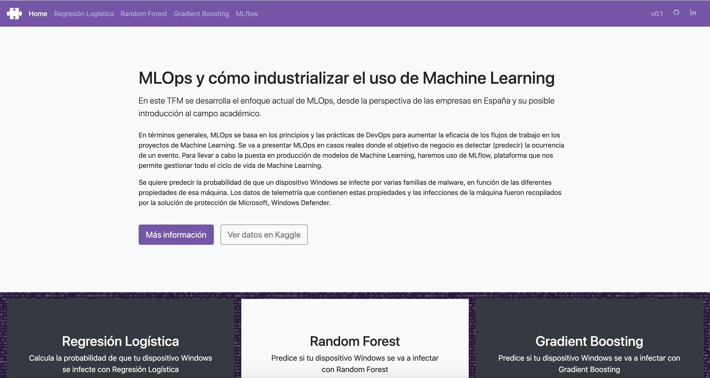
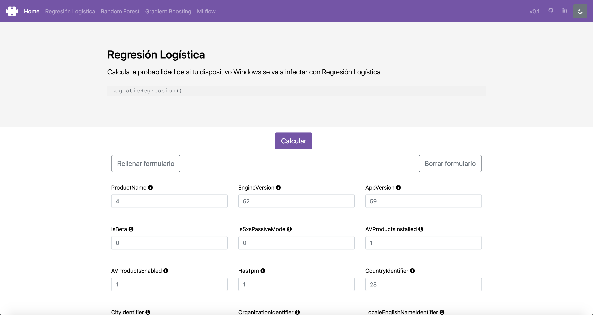
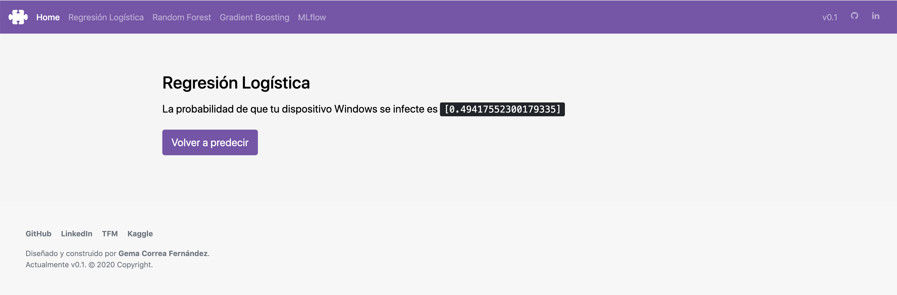
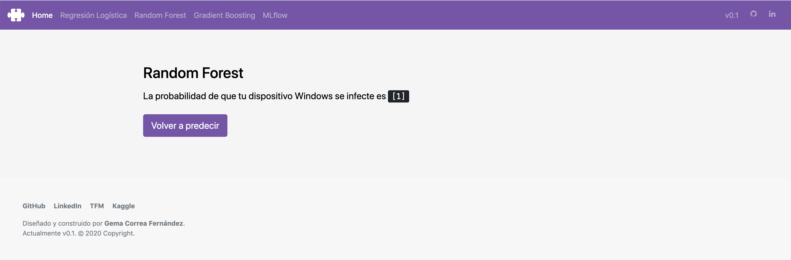
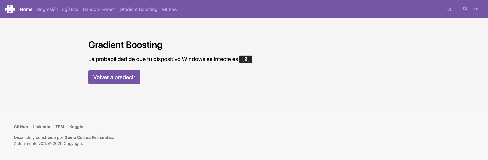
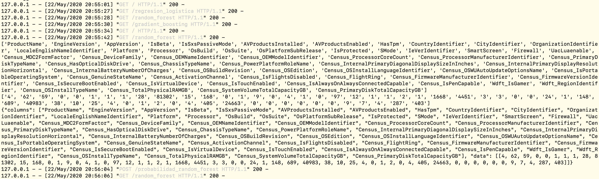

## Funcionamiento de la aplicación Web

El funcionamiento de la aplicación Web es el mismo independiente de que la puesta en producción sea en local o en el cloud, simplemente se necesita acceso a la API del modelo o URI para poner realizar las diversas peticiones o consultas. El código ha sido realizado con el lenguaje de programación Python, el framework [Flask](https://flask.palletsprojects.com/en/1.1.x/) y [Bootstrap](https://getbootstrap.com).

~~~python
# app.py

...

# Hacemos la petición, y nos quedamos con la salida (probabilidad)
url = 'http://localhost:8001/invocations'
headers = {"content-type": "application/json; format=pandas-split"}
r = requests.post(url, data=data, headers=headers)

return render_template("probabilidad_random_forest.html", malware = r.text)
~~~

Para acceder a la API del modelo, es necesario desplegarlo creando una instancia para cada modelo con Docker, donde podremos acceder a la API de dicho modelo. Para ello, es necesario ejecutar en el terminal:

~~~
# Poner en producción modelo RF (http://0.0.0.0:8001/invocations)
mlflow models serve -m /Users/gema/Desktop/TFM/codigo/mlruns/0/72fd515589624214b2c41bcfa44aef17/artifacts/RFmodel01 -h 0.0.0.0 -p 8001

# Poner en producción modelo RL (http://0.0.0.0:8002/invocations)
mlflow models serve -m /Users/gema/Desktop/TFM/codigo/mlruns/0/aac82aa84f6d4b82adafd19fc2975050/artifacts/RLmodel01 -h 0.0.0.0 -p 8002

# Poner en producción modelo GB (http://0.0.0.0:8003/invocations)
mlflow models serve -m /Users/gema/Desktop/TFM/codigo/mlruns/0/326a8d2080934288afe93177737d3844/artifacts/GBmodel -h 0.0.0.0 -p 8003
~~~

**(1)** Página de inicio de la aplicación

  

**(2)** Página para realizar la petición POST a la API del modelo de Regresión Logística (rellenar formulario)

  

**(3)** Página que devuelve la probabilidad de que un sistema Windows se infecte haciendo uso del modelo de Regresión Logística

  

**(4)** Página que devuelve la probabilidad de que un sistema Windows se infecte haciendo uso del modelo de Random Forest (para ello se ha tenido que completar el formulario que realiza la petición POST a la API del modelo de Random Forest)

  

**(5)** Página que devuelve la probabilidad de que un sistema Windows se infecte haciendo uso del modelo de Gradient Boosting (para ello se ha tenido que completar el formulario que realiza la petición POST a la API del modelo de Gradient Boosting)

  

**(6)** Salida en terminal de las peticiones realizadas a través de la aplicación

  

**Vídeo demostrativo del funcionamiento de la aplicación Web:**

